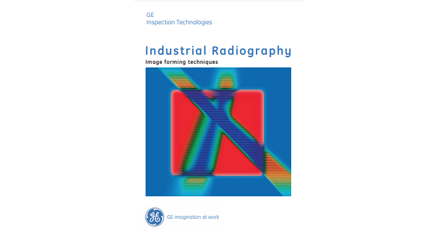
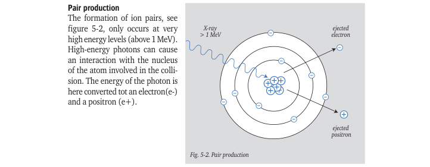
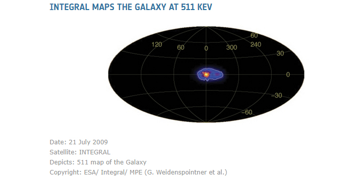
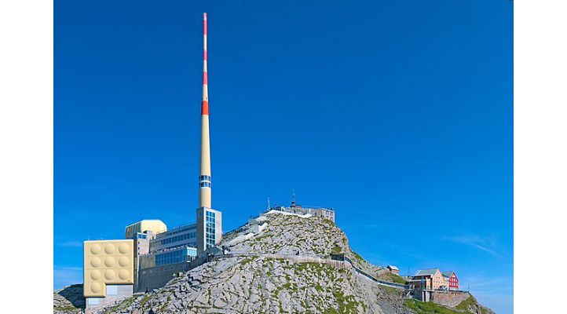

**[Pair production](https://en.wikipedia.org/wiki/Pair_production)** is the creation of a [subatomic particle](https://en.wikipedia.org/wiki/Subatomic_particle) and its [antiparticle](https://en.wikipedia.org/wiki/Antiparticle) from a [neutral](https://en.wikipedia.org/wiki/Electric_charge) [boson](https://en.wikipedia.org/wiki/Boson). Examples include creating an [electron](https://en.wikipedia.org/wiki/Electron) and a [positron](https://en.wikipedia.org/wiki/Positron), and below some my notes about this.
<!--more-->
If you have a LINAC in your hands and are working on NDT application with very high energies like gamma rays, then you probably know that during the interaction of x-rays or gamma rays with material, in addition to Photoelectric and Compton effects, you also have the well-known Pair production occurring inside your object under inspection. Refer to the 'Industrial Radiography — Image forming techniques' brochure, which is still available online:

Then on page 24 you will see an illustration:

Here I would like to add some remarks. First of all, the electron and positron are not 'ion pairs.' Ion pairs generally consist of positively and negatively charged ions created through ionization processes. In contrast, pair production creates a particle-antiparticle pair — the electron (which is a negatively charged elementary particle) and the positron (which is the electron's antimatter counterpart with a positive charge). While both particles are charged with opposite signs, they are not ions in the traditional sense.

If you take a look at the picture, you might get the wrong impression that positrons are 'ejected' from the nucleus. This is not the case. There are no positrons inside the nucleus; the nucleus of an atom consists of protons and neutrons. The protons are indeed positively charged, therefore marked '+' on the picture above, but protons and positrons are not the same at all. The term 'pair' in pair production refers to the simultaneous creation of two new particles, which are born from pure energy. Pair production does not occur within the nucleus or involve the electrons already present in an atom. Instead, the photon interacts with the strong electric field surrounding the nucleus, not the nucleus itself.

The required minimum photon energy level (stated as 'X-ray > 1 MeV' in Fig. 5-2) must be greater than 1.022 MeV, to be exact (you will understand why later). Also, there is no strict boundary between 'X-rays' and 'gamma rays', but generally everything above 1 MeV is considered gamma radiation. However, below this energy, I will use the term 'X-ray' for lower energies like 511 keV.

The most interesting question is — what happens with the positron and electron after that? As you have read in many science fiction books, when antimatter collides with matter, a 'boom' occurs, releasing a huge amount of energy. For example, the USS Enterprise from Star Trek uses antimatter as fuel for its warp drive:

And this is exactly what happens here in High Energy System — this process is called electron-positron annihilation. The annihilation results in the creation of two new energetic photons, each with an energy of 511 keV. So, your part under inspection in general acts as a secondary 511 keV X-Ray source, fueled by antimatter.

If you have a curious mind, you might ask yourself — why exactly 511 keV? Is it always 511? Why not less or more?

Don't worry, there is not so much math, it is simply because of 
$$
E=mc^2
$$
Indeed, mass of the electron (or positron, they have the same mass) is 
$$
9.10938356 \times 10^{-31} \text{ kg}
$$
speed of the light in the vacuum is
$$
2.99792458 \times 10^{8} \text{ m/s}
$$
Now just using Einstein's Equation, this will give us Energy in Joules:
$$
E = (9.10938356 \times 10^{-31} \text{ kg}) \times (2.99792458 \times 10^{8} \text{ m/s})^2 = 8.18710565 \times 10^{-14} \text{ J}
$$

Relationship between one Joule and eV is 
$$
6.241509074461 \times 10^{18} \text{ eV/J}
$$
And finally multiply both together
$$
(8.18710565 \times 10^{-14} \text{ J}) \times (6.24150907 \times 10^{18} \text{ eV/J}) = 5,10998942 \times 10^{5} \text{ eV} \approx 511 \text{ keV}
$$

This is exactly how E=mc² works and provides a great practical proof. Albert Einstein was a genius — he wrote this equation in 1905 (just ten years after the X-ray discovery). Unbelievable!

By the way, the 511 keV annihilation radiation is not strictly monoenergetic because it is affected by Doppler broadening, but this effect is another story.

Anyway, now you can understand why you need at least 1.022 MeV (twice the rest mass of an electron) — it's because two particles are produced and then both annihilate, therefore double the energy is required, and the energy must obviously be preserved.

Technically, you have only rare incidents of pair production at the minimum required photon energy of 1.022 MeV, but it becomes more significant at energies around 10 MeV, like Power|scan High Energy CT Scanner, equipped with LINAC which has a 9 MeV maximum. 

What happens with the rest of the energy? This is why pair production requires the presence of an atomic nucleus — to conserve momentum. The photon must be near a nucleus in order to satisfy conservation of momentum, as an electron–positron pair produced in free space cannot satisfy conservation of both energy and momentum simultaneously. Because of this, when pair production occurs, the atomic nucleus receives some recoil. But this shake is not large — the protons inside the nucleus are much, much heavier than electrons or positrons, they are
$$
1.67262193 \times 10^{-27} \text{ kg}
$$

You might ask — can we create other particles in the same way? Yes, we can, but you need much higher energies. For example, the threshold energy needed for muon-antimuon pair production is approximately 211 MeV; for tau-antitau pair production, you will need about 1.777 GeV. Protons can also be created, and the incoming energy sufficient to create both a proton and an antiproton, as well as conserve momentum in the reaction, will be 2.814 GeV. This is what happened in the Super Proton-Antiproton Synchrotron (SppS) at CERN, which operated from 1981 to 1991. Someday we will be able to perform synthesis of any kind of atoms, to be sure.

Back to 511 keV — this is also called characteristic annihilation radiation, which happens everywhere in our Universe. This 511 keV x-ray line is prominently associated with the annihilation of positrons in the Milky Way, particularly concentrated towards the Galactic center. This emission was first detected in the early 1970s and has been confirmed by numerous observations, including those from the INTEGRAL satellite and other gamma-ray observatories.

511 keV emissions can also occur in thunderstorms, known as Terrestrial Gamma-Ray Flashes (TGFs). Thunderstorms can produce TGFs, which are intense bursts of gamma or x-ray rays, including emissions around 511 keV. These flashes occur when electrons are accelerated to nearly the speed of light in the strong electric fields created within storm clouds. When these high-energy electrons collide with air molecules like natural 'targets', they can produce gamma rays above 10 MeV. These gamma rays will then initiate pair production and finally produce annihilation radiation from positrons created in the process described above. Such flashes (which last approximately 0.2 seconds only) have been registered by meteorological satellites as well as by the Säntis tower, a beautiful science station in the Swiss Alps, which is equipped with an x-ray detector:

Just one more thing about Einstein's Equation:

As you can see, the mass of an electron is very small. However, when multiplied by the square of the speed of light, it produces a significant energy of 511 keV (which could be considered "high" in the context of NDT compared to heavy 450 kV tubes) during the conversion of rest mass to pure energy. This immense energy was practically demonstrated in Japan on August 6, 1945. On that day, approximately 0.7 grams of matter from about 64 kilograms of highly enriched uranium-235 was converted into explosive energy. Just remember, it was less than one gram.

Originally posted on [LinkedIn](https://www.linkedin.com/pulse/some-notes-pair-production-effect-andrey-dmitriev-yoc6e/).