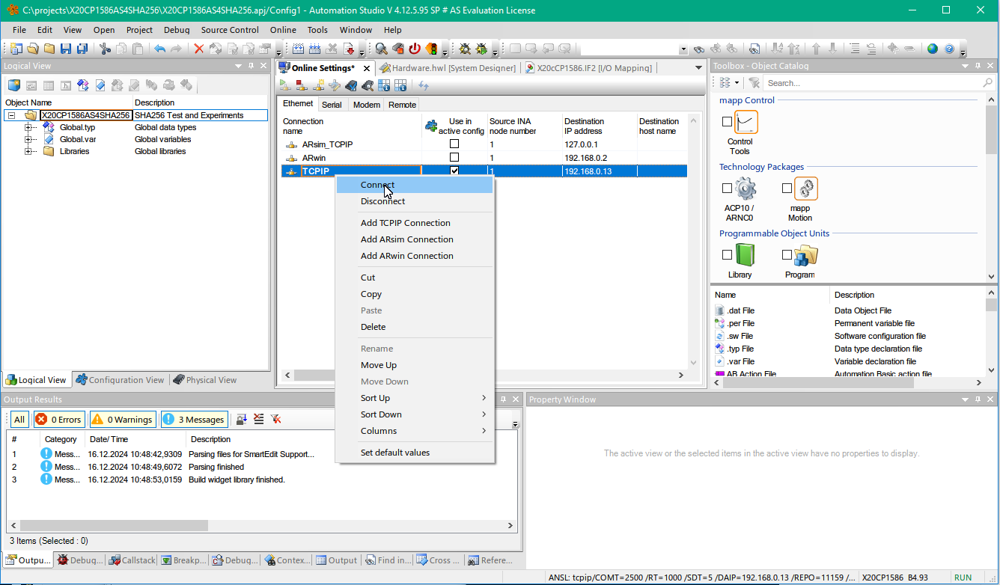
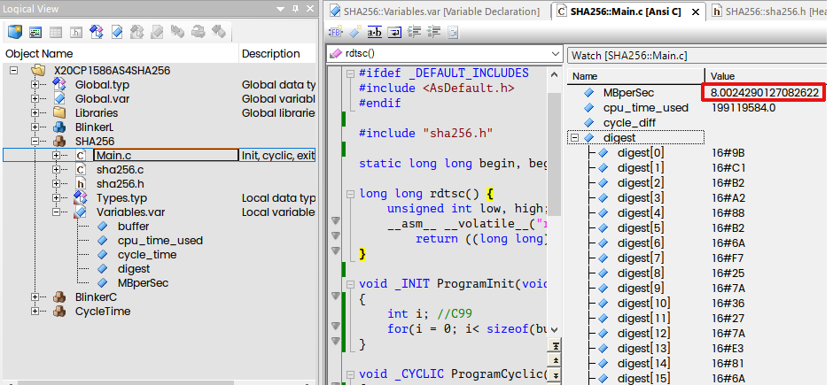
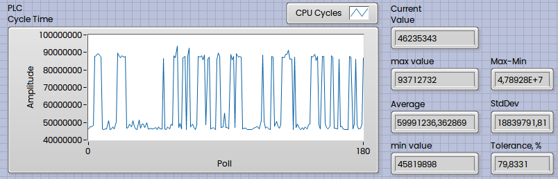

B&R PLC could be programmed with C and C++. In simple exercise we will add SHA256 to the PLC and perform some experiments and benchmarks.
<!--more-->

For this experiment I will take [X20CP1586](https://www.br-automation.com/en/products/plc-systems/x20-system/x20-plc/x20cp1586/). This is pretty old obsolete PLC (not supported in Automation Studio 6), therefore I will take AS4 for experiments. 


This PLC equipped with Intel Atom 1.6 GHz CPU with an additional I/O processor. More exactly this is 45 nm [Atom E680T](https://www.intel.com/content/www/us/en/products/sku/52498/intel-atom-processor-e680t-512k-cache-1-60-ghz/specifications.html) processor inside (Tunnel Creek from 2010). Not very powerful, the only 1.6 GHz with 24 kB Data L1 Cache and 32 kB Instructions Cache, plus 512 kB L2 Cache. But real time and with FPU. The shortest task class cycle time is 100µs. TDP is 4.5 W only, therefore fanless. PLC equipped with 512 MB DDR2 SDRAM.

Using Automation Studio v.4.12.5.95 released December 2023:


Start from the scratch:


New project:


CPU:


I have one DI Module:


and on DO Module:


This PLC was already preconfigured for DHCP, now it is on the 192.168.0.13:


Setup according Port Scanner:


Everything is up and running:



Now time to create simple blinker. I will create C Program with one boolean variable called LED12 and invert on every cycle:


Map this variable to the output:


### Cycle Time Measurement

To measure PLC Cycle Time I will prepare small program in C.

Below complete code:

```c
#include <bur/plctypes.h>
#include <inttypes.h>

#ifdef _DEFAULT_INCLUDES
	#include <AsDefault.h>
#endif

static uint64_t cycles, cycles_saved;

uint64_t rdtsc() {
	uint32_t low, high;
	__asm__ __volatile__(
		"rdtsc" 
		: "=a" (low), 
		"=d" (high)
	);
	return ((uint64_t)high << 32) | low;
}

void _INIT ProgramInit(void)
{
	cycles_saved = rdtsc();

}

void _CYCLIC ProgramCyclic(void)
{
	cycles = rdtsc();
	CycleTimeTicks = (LREAL)(cycles - cycles_saved);
	cycles_saved = cycles;
}

void _EXIT ProgramExit(void)
{

}
```

I will take Time Stamp from CPU with rdtsc. Take a note about __volatile__ modifier (this was explained in previous note).

Variable CycleTimeTicks added:


and mapped to OPC UA:


Now I can read it in any OPC UA Cloent like UA Expert:


For me an easiest way to get this value from PLC is LabVIEW with OPC UA Toolkit:


Now I will place this Program into different Cyclics - 1s. 100 ms, 10 ms, 1 ms and 100 µs:


This is how it looks when running for 1 s:


The values I've got on this 1.6 GHz CPU when this test program runs on different cycles:

| Cycle  Time |     Ticks Min | Ticks Average |  Ticks Max | Max - Min | Tolerance, % |
| ----------: | ------------: | ------------: | ---------: | --------: | -----------: |
|         1 s | 1 593 424 768 |    1593439983 | 1593455360 |     30592 |   0,00191987 |
|      100 ms |   159 329 424 |   159344123,6 |  159363440 |     34016 |    0,0213475 |
|       10 ms |    15 907 808 |   15930917,55 |   15941240 |     33432 |     0,209856 |
|        1 ms |     1 580 640 |   1596454,496 |    1611104 |     30464 |      1,90823 |
|      100 µs |       146 008 |   159078,4218 |     176976 |     30968 |      19,4671 |

So, we have around 30000 ticks deviation from cycle to cycle, which is really not so bad. The values fully matched CPU's speed, which is 1.6 GHz.

And these "30000 ticks" spikes are seldom, in long term perspective it looks like this:


### SHA256 Performance Benchmark

Now we can do SHA256 performance test. Did you try to implement SHA256 in old Siemens PLC? Quite amount of work, but here is much easier with help of C support.

For this test I will take [SHA256 implementation](https://github.com/B-Con/crypto-algorithms/blob/master/sha256.c) written by Brad Conte from GitHub and add to B&R Project.

Whole code as simple as following:

```c
#include <bur/plctypes.h>

#ifdef _DEFAULT_INCLUDES
#include <AsDefault.h>
#endif

#include "sha256.h"
 
static long long begin, begin_saved, end;

long long rdtsc() {
	unsigned int low, high;
	__asm__ __volatile__("rdtsc" : "=a" (low), "=d" (high));
		return ((long long)high << 32) | low;
}

void _INIT ProgramInit(void)
{
	int i; //C99
	for(i = 0; i< sizeof(buffer); i++) buffer[i] = 'a';
}

void _CYCLIC ProgramCyclic(void)
{
	SHA256_CTX ctx;

	begin = rdtsc();
	cycle_time = (LREAL)(begin - begin_saved);
	begin_saved = begin;
	
	sha256_init(&ctx);
	sha256_update(&ctx, buffer, sizeof(buffer));
	sha256_final(&ctx, digest);

	end = rdtsc();
	cpu_time_used = ((LREAL)(end - begin));

	MBperSec = cycle_time / cpu_time_used;
}

void _EXIT ProgramExit(void) {}
```

Obviously if I will put this into 1 Second cyclic, then ratio between cycle ticks and execution ticks will give me MB/s reading in assumption that I have 1MB Buffer (filled with "a" chars):


And this will give me performance, which is 8 MiB per second:



Now I can map this reading to the OPC UA as well:


And get it in UA Expert:


Or in LabVIEW Code:


Result:


Now from 1 593 438 336 Ticks available in 1 second cyclic we using 199 131 088, which is roughly 12.5% of the available cycle.

A very interesting result happened if I will put this program into 100 ms Cyclic.


In theory here we have the only 160 000 000 ticks available, and it means Cycle Time violation should happened (because we need 200 000 000 cycles), but not. The cycle time was increased twice to 320 000 000 cycles and counter tell me that the cycle time was switched to 200 ms instead of 100 ms. This happened because you have not the only Duration, but also the Tolerance.


If your code exceed the limit given by Duration, then Tolerance will be added (like second chance) and the cycle time will be doubled (depends on the Tolerance value, which cannot be lower than Duration, at least in Automation Studio 4). Take a note, that the Tolerance should have fuAnd only if your code will exceed Duration+Tolerance, then Time Violation Exception will be thrown (will happen if I will place SHA256 into 1 ms Cyclic.

From B&R Help:


This is also true in Simulation Mode, for example, if I will set Duration close to execution time of SHA256 (on my PC it is around 4,8 ms), then Cycle Time will be switched between both:



Lower values are where SHA256 computation fits into singe cycle ("Duration only"), but higher values are where Tolerance was added.

This is graph for execution time of the SHA256 in ARsim:


On my Desktop PC I have around 120 MiB/s under ARsim:


Happy coding!

