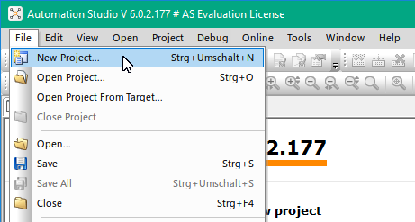
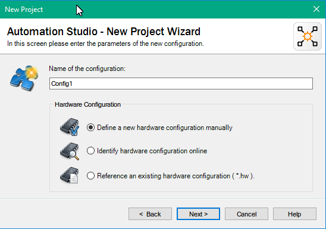
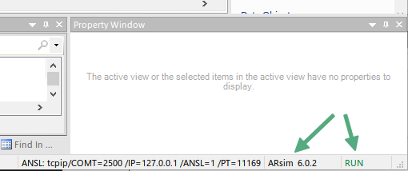
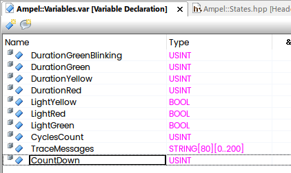
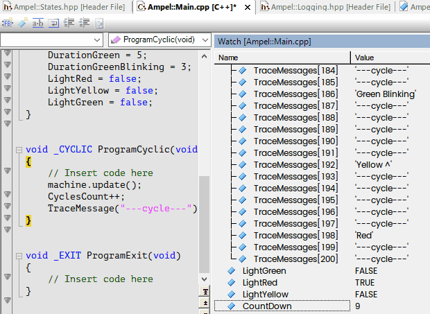
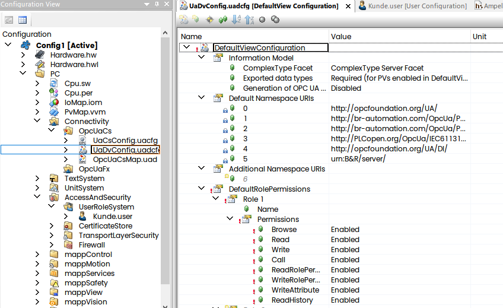
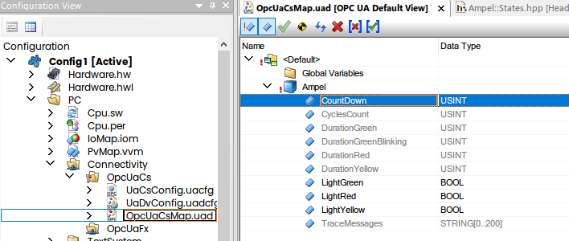
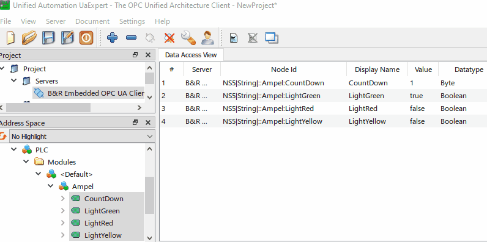
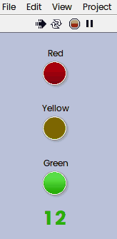

B&R PLC could be programmed with C++. State Machine is common used pattern. There are lot of examples of how to implement State Machines in C++. One of the example was taken and turned to B&R State Machine
<!--more-->

In this exercise I'll use latest available AS v.6.0.2.177 (25-Jun-2024):


### Start with new Project




Step by step:


Everything by default



Select Standard PC here:


By default it won't to go online automatically:


So, I have so select ArSim


Now we are online:



As first step I'll add C++ Program (I prefer all in one):


Add some local variables (later some these Variable will be mapped to OPC UA Nodes):



Duration Variables will hold how long our traffic light will emit the red/yellow/green ligths, boolen variables are just outputs, trace messages will be explained later.

### State Machine

As "Template" I will take [High-Performance Hierarchical Finite State Machine](https://github.com/andrew-gresyk/HFSM2) written by Andrew Gresyk.

It is single header heriarchical FSM framework in C++11, with fully statically-defined structure (no dynamic allocations), built with variadic templates and "compatible" with B&R.

All what we need is just to copy machine.hpp to the project.

Whole main.cpp as simple as following:

```cpp
#include <bur/plctypes.h>

#ifdef _DEFAULT_INCLUDES
	#include <AsDefault.h>
#endif

// amount of memory to be allocated for heap storage must be specified 
// for every ANSI C++ program with the bur_heap_size variable
unsigned long bur_heap_size = 0xFFFF;

#include "machine.hpp"
#include "Logging.hpp"
#include "States.hpp"

//////////////////////////////////////////////////////////////////////////////// 

// shared data storage instance
Context context;
FSM::Instance machine{context};

void _INIT ProgramInit(void)
{
	// Insert code here
	CyclesCount = 0;
	ClearTraceLog();
	DurationRed = 5;
	DurationYellow = 3;
	DurationGreen = 5;
	DurationGreenBlinking = 3;
	LightRed = false;
	LightYellow = false;
	LightGreen = false;
}


void _CYCLIC ProgramCyclic(void)
{
	// Insert code here 
	machine.update();
	CyclesCount++;
	TraceMessage("---cycle---");
}


void _EXIT ProgramExit(void)
{
	// Insert code here 
}

```

The only difference is that the original example requires while loop in the main() function:

```
int main() {
	// shared data storage instance
	Context context;

	FSM::Instance machine{context};

	while (machine.isActive<Off>() == false)
		machine.update();

	return 0;
}
```

But on B&R PLC this high-level loop is replaced by CYCLIC program, therefore not needed - the PLC will call it in the loop again and again.

All states placed into states.cpp

```cpp
#include "machine.hpp"

// data shared between FSM states and outside code
struct Context {
	unsigned cycleCount = 0;
	unsigned countGreenBlinking = 0;
	unsigned countGreen = 0;
	unsigned countYellow = 0;
	unsigned countRed = 0;
};

// convenience typedef
using M = hfsm2::MachineT<hfsm2::Config::ContextT<Context>>;

// macro magic invoked to simplify FSM structure declaration
#define S(s) struct s

// State machine structure
using FSM = M::PeerRoot<
	// sub-machine ..
	M::Composite<S(On),
	// .. with 5 sub-states
	S(Red),
	S(YellowDownwards),
	S(YellowUpwards),
	S(GreenBlinking),
	S(Green)
	>,
				S(Off)
			>;
#undef S

//------------------------------------------------------------------------------

static_assert(FSM::regionId<On>()			  ==  1, "");

static_assert(FSM::stateId<On>()			  ==  1, "");
static_assert(FSM::stateId<Red>()			  ==  2, "");
static_assert(FSM::stateId<YellowDownwards>() ==  3, "");
static_assert(FSM::stateId<YellowUpwards>()	  ==  4, "");
static_assert(FSM::stateId<GreenBlinking>()	  ==  5, "");
static_assert(FSM::stateId<Green>()			  ==  6, "");
static_assert(FSM::stateId<Off>()			  ==  7, "");

////////////////////////////////////////////////////////////////////////////////

// top-level region in the hierarchy
struct On
	: FSM::State // necessary boilerplate!
{
	// called on state entry
	void enter(Control& control) {
		control.context().cycleCount = 0;
		TraceMessage("On");
	}
};

//------------------------------------------------------------------------------

// sub-states
struct Red
	: FSM::State
{
	void enter(Control& control) {
		++control.context().cycleCount;
		LightRed = true;
		LightYellow = false;
		LightGreen = false;
		control.context().countRed = 0;
		CountDown = DurationRed + DurationYellow + 2;
		TraceMessage("Red");
		
	}

	// state can initiate transitions to _any_ other state
	void update(FullControl& control) {

		// multiple transitions can be initiated, can be useful in a hierarchy
		if (control.context().cycleCount > 10)
			control.changeTo<Off>();
		else {
			if (control.context().countRed++ >= DurationRed){
				control.changeTo<YellowDownwards>();
			}
		}
		CountDown--;
	}
};

// - - - - - - - - - - - - - - - - - - - - - - - - - - - - - - - - - - - - - - -

struct YellowDownwards
	: FSM::State
{
	void enter(Control& control) {
		TraceMessage("Yellow v");
		LightYellow = true; //Keep Red On
		control.context().countYellow = 0;
	}

	void update(FullControl& control) {
		if (control.context().countYellow++ > DurationYellow) { //was 3
			control.changeTo<Green>();
		}
		CountDown--;
	}
};

// - - - - - - - - - - - - - - - - - - - - - - - - - - - - - - - - - - - - - - -

struct YellowUpwards
	: FSM::State
{
	void enter(Control& control) {
		TraceMessage("Yellow ^");
		LightGreen = false;
		LightYellow = true;
		control.context().countYellow = 0;
	}

	void update(FullControl& control) {
		if (control.context().countYellow++ > DurationYellow) {
			control.changeTo<Red>();
		}
	}
};

// - - - - - - - - - - - - - - - - - - - - - - - - - - - - - - - - - - - - - - -

struct GreenBlinking
	: FSM::State
{
	void enter(Control& control) {
		TraceMessage("Green Blinking");
		control.context().countGreenBlinking = 0;
	}

	void update(FullControl& control) {
		LightGreen = !LightGreen; // Blinking
		if ((control.context().countGreenBlinking++ > DurationGreenBlinking) && !LightGreen) {
			control.changeTo<YellowUpwards>();
		}
		CountDown--;
	}
};


// - - - - - - - - - - - - - - - - - - - - - - - - - - - - - - - - - - - - - - -

struct Green
	: FSM::State
{
	void enter(Control& control) {
		TraceMessage("Green");
		control.context().countGreen = 0;
		LightRed = false;
		LightYellow = false;
		LightGreen = true;
		CountDown = DurationGreen + DurationGreenBlinking + 4;
	}

	void update(FullControl& control) {
		if (control.context().countGreen++ > DurationGreen){
			control.changeTo<GreenBlinking>();
		}
		CountDown--;
	}
};

//------------------------------------------------------------------------------

// another top-level state
struct Off
	: FSM::State
{
	void enter(Control&) {
		TraceMessage("Off");
	}
};

```

Trace log is very simple:

```cpp
#define MAX_LOG_ENTRIES 200 // ca 16KB Log - Default 200 Entries. 
							// Can be increased, but don't forget to allocate TraceMessages Variable!

void ClearTraceLog()
{
	for (int i=0; i<MAX_LOG_ENTRIES; i++) strcpy(TraceMessages[i], "");
}

void TraceMessage(const char* Message)
{
	for (int i=0; i<MAX_LOG_ENTRIES; i++){
		strcpy(TraceMessages[i], TraceMessages[i+1]);
	}
	strcpy(TraceMessages[MAX_LOG_ENTRIES], Message);
}
```

This is how it works:



Very simple.

### OPC UA

To get traffic light visualized I will map variables to OPC UA Server.

In AS 6 the setings for OPC UA was moved to the following location:


I will enable everything. Strange, I wasn't able to get connected to the OPC UA anonymously, therefore added one user here:


Second part of the Config:



Mapping is trivial:



(you have to add DefaultView first to get this in the Project).

These appeared now in UA Expert:



Finally I will create simple LabVIEW VI using OPC UA Toolkit to get simple SCADA:


This is how it works:



[GitHub Project](https://github.com/AndrDm/AmpelBR).

Happy coding!
