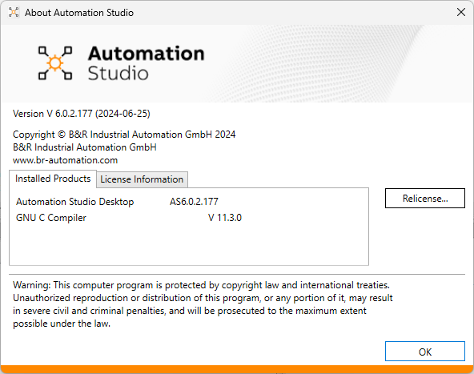
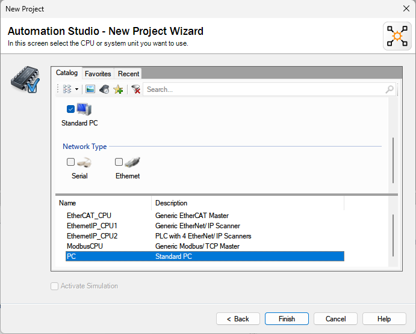
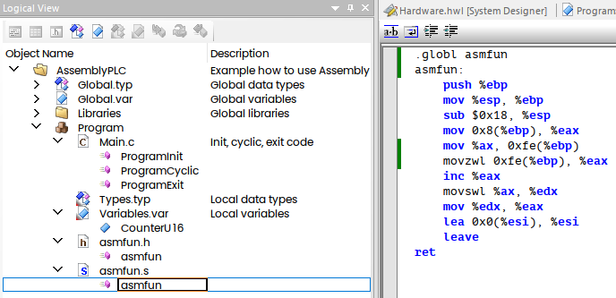
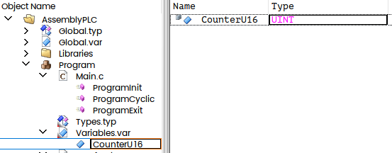
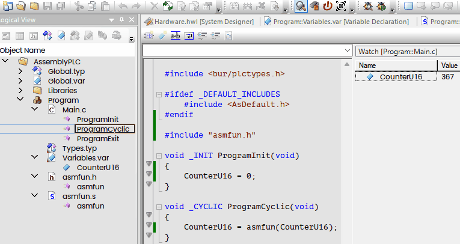
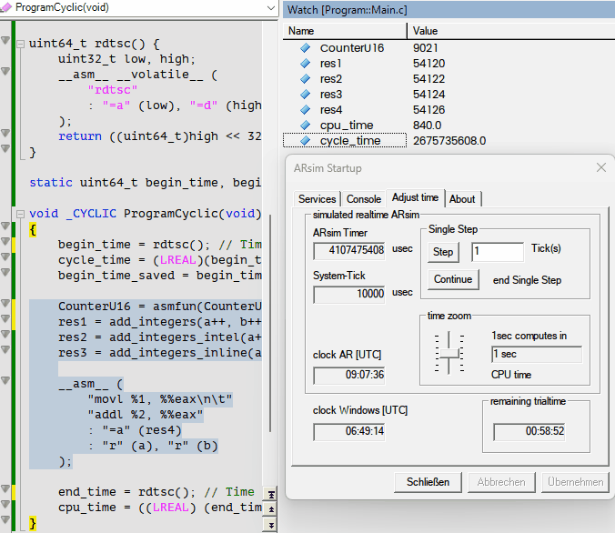
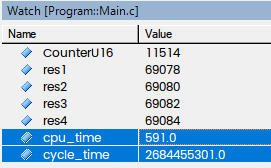
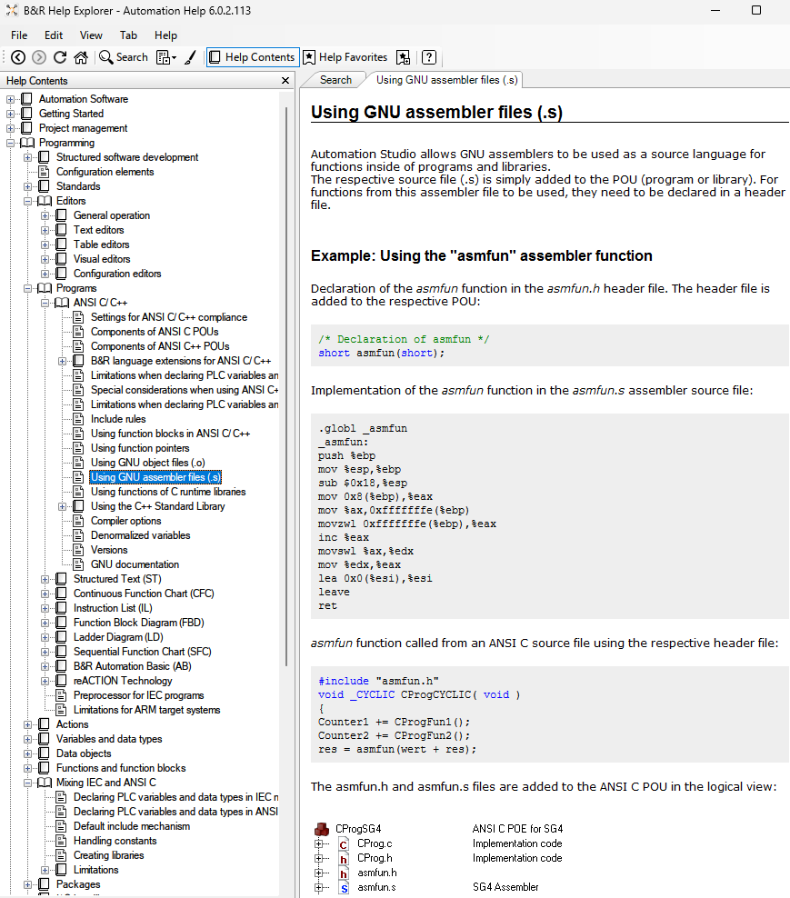

B&R PLC could be programmed with C and C++. But you can also use Assembly. Below short instruction how to do that.
<!--more-->

In this exercise I'll use latest available AS v.6.0.2.177 (25-Jun-2024):




### Start with new Project

Using Standard PC as start point:



We will start with simple example from B&R Help (slightly modified):



This is content of asmfun.s Assembly file:

```assembly
.globl asmfun
asmfun:
	push %ebp
	mov %esp, %ebp
	sub $0x18, %esp
	mov 0x8(%ebp), %eax
	mov %ax, 0xfe(%ebp)
	movzwl 0xfe(%ebp), %eax
	inc %eax
	movswl %ax, %edx
	mov %edx, %eax
	lea 0x0(%esi), %esi
	leave 
ret 
```

and the header:

```c
/* Declaration of asmfun */
short asmfun(short);
```

short Variable added:

 

And this is how this code used in Main.c:

```c
#include <bur/plctypes.h>

#ifdef _DEFAULT_INCLUDES
	#include <AsDefault.h>
#endif

#include "asmfun.h"

void _INIT ProgramInit(void)
{
	CounterU16 = 0;
}

void _CYCLIC ProgramCyclic(void)
{
	CounterU16 = asmfun(CounterU16);
}

void _EXIT ProgramExit(void)
{

}
```

The Assembly code above is just increment and yes, it works:



Take a note about calling convention.

For example, if we will pass two integer parameters and add both together in the Assembly code:

```assembly
.globl add_integers
.type add_integers, @function

add_integers:
    push %ebp
    mov %esp, %ebp
    
    mov 8(%ebp), %eax   # Load first integer argument into eax
    add 12(%ebp), %eax  # Add second integer argument to eax
    
    mov %ebp, %esp
    pop %ebp
    ret
```

Header:

```c
/* Declaration of asmint */
int add_integers(int, int);
```

And how its used:

```c
#include "asmadd.h"

void _INIT ProgramInit(void)
{
	CounterU16 = 0; a = b = 0;
}

void _CYCLIC ProgramCyclic(void)
{
	CounterU16 = asmfun(CounterU16);
	res1 = add_integers(a++, b++);
}
```

#### Using Intel Assembly Syntax

As you have seen, we've use GNU Assembly syntax above. What if you prefer Intel syntax instead?

No problem just add appropriate option ".intel_syntax noprefix":

```assembly
.globl add_integers_intel
.type add_integers_intel, @function
.intel_syntax noprefix

add_integers_intel:
    push ebp
    mov ebp, esp
    
    mov eax, [ebp+8]   # Load first integer argument into eax
    add eax, [ebp+12]  # Add second integer argument to eax
    
    mov esp, ebp
    pop ebp
    ret
```

#### Using inline assembly

You can also using inline assembly and put your code directly into *.c file:

This is how it works:

```c
int add_integers_inline(int a, int b) {
	int result;
	__asm__ (
		"movl %1, %%eax\n\t"
		"addl %2, %%eax"
		: "=a" (result)
		: "r" (a), "r" (b)
	);
	return result;
}

void _CYCLIC ProgramCyclic(void)
{
	//...
	res3 = add_integers_inline(a++, b++);
}
```

Or directly into ProgramCyclic(), this will work as well:

```c
void _CYCLIC ProgramCyclic(void)
{
	//...
	
	__asm__ (
		"movl %1, %%eax\n\t"
		"addl %2, %%eax"
		: "=a" (res4)
		: "r" (a), "r" (b)
	);
}
```

#### Practical usage — rdtsc

Nowadays rewriting c code into Assembly makes not much sense, because the compilers (gcc in our case) are efficient enough, its hard to beat performance, especially if you not using SIMD commands (and unfortunately you can't in B&R PLC).

But you can read read time-stamp counter and make "fine" profiling of the code.

This can be done with following function:

```assembly
uint64_t rdtsc() {
	uint32_t low, high;
	__asm__ __volatile__ (
		"rdtsc" 
		: "=a" (low), "=d" (high)
	);
	return ((uint64_t)high << 32) | low;
}
```

Now I would like to "profile" piece of the code and measure cycle time as well:

```c
static uint64_t begin_time, begin_time_saved, end_time;

void _CYCLIC ProgramCyclic(void)
{
	begin_time = rdtsc(); // Time Stamp - begin
	cycle_time = (LREAL)(begin_time - begin_time_saved);
	begin_time_saved = begin_time;
	
	CounterU16 = asmfun(CounterU16); // original B&R Example
	res1 = add_integers(a++, b++);   // two params example
	res2 = add_integers_intel(a++, b++);
	res3 = add_integers_inline(a++, b++);
	
	__asm__ (
		"movl %1, %%eax\n\t"
		"addl %2, %%eax"
		: "=a" (res4)
		: "r" (a), "r" (b)
	);
		
	end_time = rdtsc(); // Time Stamp - end
	cpu_time = ((LREAL) (end_time - begin_time));
}
```

Take a note, that here is  __volatile__ modifier used, because the `__volatile__` modifier on an `__asm__` block forces the compiler's optimizer to execute the code as-is. Without it, the optimizer may think it can be either removed outright, or lifted out of a loop and cached. This is especially useful for the `rdtsc` instruction.

This is how it works:



The code need around 600 clocks to execute and cycle time is 2700000000 clocks:



Source Code on GitHub — **[BR_UsingAssembly](https://github.com/AndrDm/BR_UsingAssembly)**

Help Topic in B&R Help:

