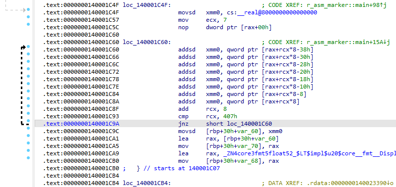

From time to time, it’s useful to inspect the assembly output generated from Rust code. A common problem is locating a specific piece of Rust code inside the assembly listing. Below is a simple trick to make this much easier.
<!--more-->

Let’s say we have a trivial example that fills a vector with random values and prints their sum:

```rust
use rand::RngExt;

fn main() {
    let mut rng = rand::rng();

    let values: Vec<f64> = (0..1024)
        .map(|_| rng.random::<f64>())
        .collect();

    let sum: f64 = values.iter().sum();
    println!("sum = {}", sum);
}
```
cargo.toml:
```toml
[dependencies]
rand = "0.10.1"
```

How to get the code behind of `let sum: f64 = values.iter().sum();` statement?

The easiest way to find the relevant section in the assembly output is to insert markers using Rust’s inline `asm!` macro:

```rust
//...

    unsafe {
        asm!(
            "// === Prolog ===",
            "nop",
            "// === values.iter().sum():  ===",
        );
    }

    let sum: f64 = values.iter().sum();

    unsafe {
        asm!(
            "// === Epilog ===",
        );
    }
//...
```

To avoid repeating boilerplate, we can wrap the marker logic in a small macro:

```rust
use rand::RngExt;
use std::arch::asm;

macro_rules! mark {
    ($name:expr) => {
        unsafe {
            asm!(concat!("// === ", $name, " ==="));
        }
    };
}

fn main() {
    let mut rng = rand::rng();

    let values: Vec<f64> = (0..1024)
        .map(|_| rng.random::<f64>())
        .collect();

	mark!("Prolog - before values.iter().sum()");
    let sum: f64 = values.iter().sum();
	mark!("Epilog - after values.iter().sum()");

    println!("sum = {}", sum);
}
```

Now it must be compiled with following command, the output assembly will be in target:

```bash
cargo rustc --release -- --emit asm -C opt-level=3 -C "llvm-args=-x86-asm-syntax=intel"
copy target\release\deps\r_asm_marker.s r_asm_marker.s
```

(I prefer Intel syntax)

Now you can easily find according assembly code in the generated listing:

```assembly
	#APP

	# === Prolog - before values.iter().sum() ===

	#NO_APP
	movsd	xmm0, qword ptr [rip + __real@8000000000000000]
	mov	ecx, 7
	.p2align	4
.LBB0_18:
	addsd	xmm0, qword ptr [rax + 8*rcx - 56]
	addsd	xmm0, qword ptr [rax + 8*rcx - 48]
	addsd	xmm0, qword ptr [rax + 8*rcx - 40]
	addsd	xmm0, qword ptr [rax + 8*rcx - 32]
	addsd	xmm0, qword ptr [rax + 8*rcx - 24]
	addsd	xmm0, qword ptr [rax + 8*rcx - 16]
	addsd	xmm0, qword ptr [rax + 8*rcx - 8]
	addsd	xmm0, qword ptr [rax + 8*rcx]
	add	rcx, 8
	cmp	rcx, 1031
	jne	.LBB0_18
	movsd	qword ptr [rbp + 56], xmm0
	#APP

	# === Epilog - after values.iter().sum() ===

	#NO_APP
```

In IDA this code looks like this:



As you can see, Rust does a solid job here: the loop is unrolled, and SIMD instructions are used. (Interesting detail: the loop walks the array backwards.)

## Links

[Inline assembly - The Rust Reference](https://doc.rust-lang.org/reference/inline-assembly.html).

[Inline assembly - Rust By Example](https://doc.rust-lang.org/rust-by-example/unsafe/asm.html)

[Rust and Assembly : r/rust](https://www.reddit.com/r/rust/comments/tifa4v/rust_and_assembly/)

