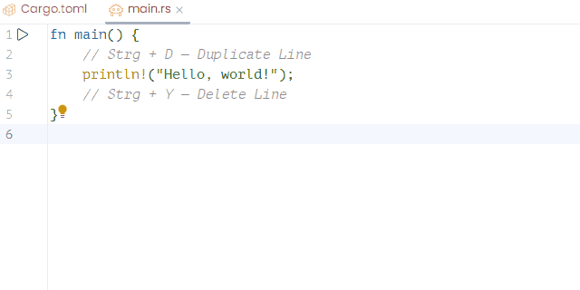
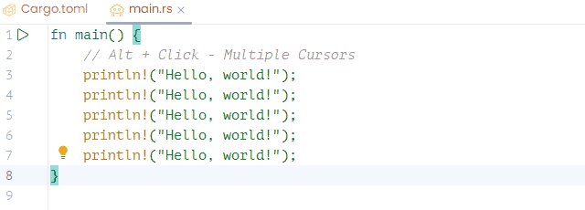
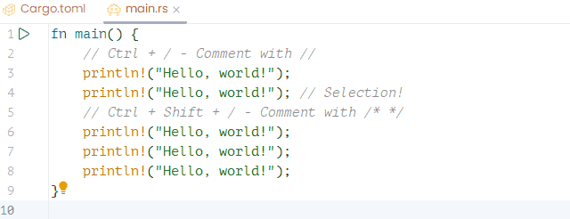
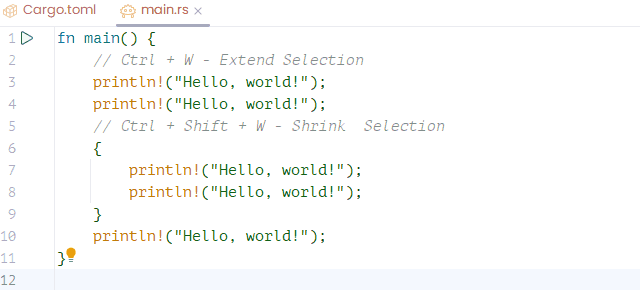

A curated list of RustRover hotkeys that help me code faster and stay focused. This is a living collection — I’ll continue updating it as I discover new and useful shortcuts.

<!--more-->

## Duplicate / Delete Line — D / Y

<kbd>Strg</kbd>+<kbd>D</kbd> / <kbd>Strg</kbd>+<kbd>Y</kbd>

## Edit Multiple Lines

<kbd>Alt</kbd> + Click:

## Comments / uncomments — /

<kbd>Strg</kbd> + <kbd>/</kbd> / <kbd>Strg</kbd> + <kbd>Shift</kbd> + <kbd>/</kbd>

<kbd>Strg</kbd> + <kbd>÷</kbd> / <kbd>Strg</kbd> + <kbd>Shift</kbd> + <kbd>÷</kbd>

## Extend / Shrink Selection — W

<kbd>Strg</kbd> + <kbd>W</kbd> / <kbd>Strg</kbd> + <kbd>Shift</kbd> + <kbd>W</kbd>

## Useful Link

[Keyboard Shortcuts PDF](https://resources.jetbrains.com/storage/products/rustrover/docs/RustRoverKeymapReferenceCard.pdf).
