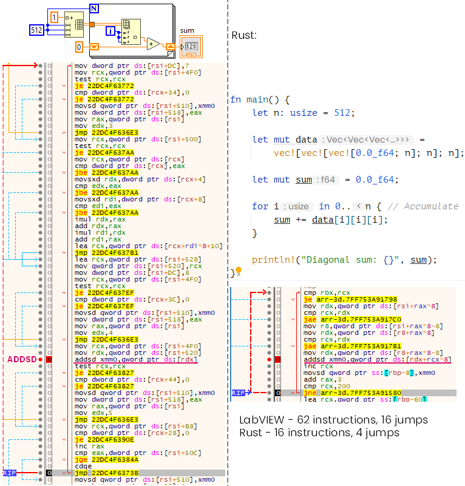

When iterating diagonals of a 3D array, the performance differences between LabVIEW and Rust become very noticeable. Even with a straightforward implementation, the generated machine code tells a story about what’s happening under the hood.

<!--more-->

If we compare LabVIEW-generated machine code side by side with equivalent Rust code (even a non-optimal implementation like a triple Vec<Vec<Vec<T>>>), the difference becomes clear. In the debugger, we can see that the core computation is relatively simple (e.g., ADDSD accumulating values in xmm0), but LabVIEW introduces significantly more surrounding instructions.
The reason lies in bounds checking. LabVIEW effectively performs triple bounds checks for 3D arrays, which results in roughly 4× more machine instructions, a high number of conditional branches and reduced instruction pipeline efficiency.

Screenshot from [NI Forum Post](https://forums.ni.com/t5/LabVIEW/Replacing-a-2D-array-section-of-a-3D-array/m-p/4477124#M1322921):

This overhead dominates the actual computation, especially in tight nested loops such as diagonal traversal.

