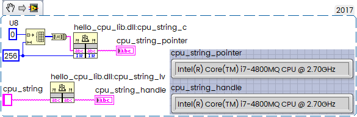

A simple exercise — how to obtain the CPU brand string using CPUID in Rust and pass it to LabVIEW.

<!--more-->

Basic Rust code:

```rust
use raw_cpuid::CpuId;

fn main() {
    let cpuid = CpuId::new();

    if let Some(vf) = cpuid.get_processor_brand_string() {
        println!("{:?}", vf);
    }
}
```

Output:

ProcessorBrandString { as_str: "Intel(R) Core(TM) i7-4800MQ CPU @ 2.70GHz" }

or a little bit more elegant:

```rust
use raw_cpuid::CpuId;

fn main() {
    let cpuid = CpuId::new();

    if let Some(vf) = cpuid.get_processor_brand_string() {
        let s = vf.as_str()
            .replace("(R)", "®")
            .replace("(TM)", "™");
        println!("CPU: {}", s);
    }
}
```

Output:

CPU: Intel® Core™ i7-4800MQ CPU @ 2.70GHz

cargo.toml same for both:

```toml
[package]
name = "hello_cpu"
version = "0.1.0"
edition = "2024"

[dependencies]
raw-cpuid = "11.6.0"
```

---

### Passing the CPU string to LabVIEW

There are two ways to pass the string:

1. **As a C string pointer**  
    Requires preallocating the buffer in LabVIEW. Works, but not elegant.
2. **As a LabVIEW string handle (`LStrHandle`)**  
    The Rust function resizes the handle internally using LabVIEW’s memory manager.
    This is the preferred method.

#### C function prototypes

```c
/* Call Library source file */

#include "extcode.h"

void funcName_c_ptr(char cpu_string_pointer[], int32_t length)
{
	/* Insert code here */
}

void funcName_str_handle(LStrHandle cpu_string_handle)
{
	/* Insert code here */
}
```

First we need cargo.toml:

```toml
[package]
name = "hello_cpu_lib"
version = "0.1.0"
edition = "2024"

# Cargo.toml

[lib]
crate-type = ["cdylib"]

[dependencies]
raw-cpuid = "11.6.0"
```

Then src\lib.rs:

```rust
// src/lib.rs
use raw_cpuid::CpuId;
use std::ffi::c_void;
use std::os::raw::{c_char, c_int};
use std::ptr::copy_nonoverlapping;
//
// LabVIEW LStr definition (from extcode.h)
//
#[repr(C)]
pub struct LStr {
    pub cnt: i32,     // number of bytes
    pub str: [u8; 1], // flexible array member
}

pub type LStrPtr = *mut LStr;
pub type LStrHandle = *mut LStrPtr;

//
// LabVIEW Memory Manager
//
#[link(name = "labview")]
unsafe extern "C" {
    fn DSSetHandleSize(handle: *mut c_void, new_size: usize) -> i32;
}

//
// Helper: get CPU brand string
//
fn get_cpu_brand_string() -> String {
    let cpuid = CpuId::new();
    cpuid
        .get_processor_brand_string()
        .map(|b| b.as_str().trim_end_matches('\0').to_string())
        .unwrap_or_else(|| "Unknown CPU".to_string())
}

//
// 1) Fill preallocated C string buffer
//
#[unsafe(no_mangle)]
pub extern "C" fn cpu_string_c(buffer: *mut c_char, length: c_int) {
    if buffer.is_null() || length <= 0 {
        return;
    }

    let s = get_cpu_brand_string();
    let bytes = s.as_bytes();

    let max = (length - 1) as usize; // leave room for null terminator
    let n = bytes.len().min(max);

    unsafe {
        copy_nonoverlapping(bytes.as_ptr(), buffer as *mut u8, n);
        *buffer.add(n) = 0; // null terminate
    }
}

//
// 2) Fill LabVIEW LStrHandle (auto-resize)
//
#[unsafe(no_mangle)]
pub extern "C" fn cpu_string_lv(h: LStrHandle) -> i32 {
    if h.is_null() {
        return 1; // mgArgErr
    }

    let s = get_cpu_brand_string();
    let bytes = s.as_bytes();
    let size = bytes.len() as usize;

    unsafe {
        // Resize handle: size = length + sizeof(int32)
        let err = DSSetHandleSize(h as *mut c_void, size + 4);
        if err != 0 {
            return err;
        }

        let ptr = *h;
        if ptr.is_null() {
            return 1;
        }

        (*ptr).cnt = size as i32;

        let dst = (*ptr).str.as_mut_ptr();
        copy_nonoverlapping(bytes.as_ptr(), dst, size);
    }

    0 // mgNoErr
}
```

And called from LabVIEW:



So simple. And that’s it — clean, simple, and fully LabVIEW‑compatible.
