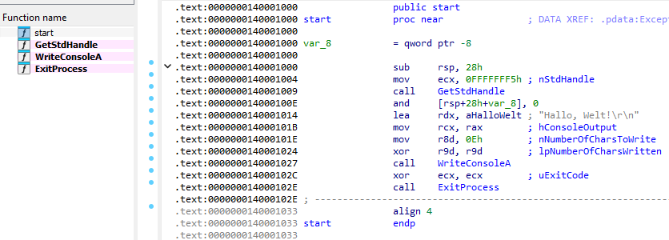

A simple exercise — how to develop the smallest possible *Hello World* application.

<!--more-->

Basic Rust code:

```
cargo new r-hello
```

Code:

```rust
fn main() {
    println!("Hello, world!");
}
```

When built in Release mode, the executable is **125 440 bytes**.

We can rewrite this in assembly with minimal optimization and place the data in the `.rdata` section:

```assembly
hello PROGRAM Format=PE, Entry=Start, IconFile=

[.rdata]
Msg D "Hallo, Welt!",10,13,0

INCLUDE winapi.htm

[.text]
Start:   nop
    WinAPI GetStdHandle, 0FFFFFFF5h
    WinAPI WriteConsoleA, eax, Msg, 0Fh
    WinAPI ExitProcess 0
ENDPROGRAM
```

This produces a **1 564‑byte** executable (in theory it could be **1 536 bytes** with some PE header tricks).

Now we can achieve the same in **Rust without** `std`:

```Rust
#![no_std]
#![no_main]

use core::panic::PanicInfo;

// WinAPI declarations must be inside an unsafe extern block
unsafe extern "system" {
    fn GetStdHandle(nStdHandle: i32) -> isize;
    fn WriteConsoleA(
        hConsoleOutput: isize,
        lpBuffer: *const u8,
        nNumberOfCharsToWrite: u32,
        lpNumberOfCharsWritten: *mut u32,
        lpReserved: *mut core::ffi::c_void,
    ) -> i32;
    fn ExitProcess(uExitCode: u32) -> !;
}

const STD_OUTPUT_HANDLE: i32 = -11;

// Message
static MSG: &[u8] = b"Hallo, Welt!\r\n";

#[unsafe (no_mangle)]
pub extern "C" fn mainCRTStartup() -> ! {
    unsafe {
        let handle = GetStdHandle(STD_OUTPUT_HANDLE);

        WriteConsoleA(
            handle,
            MSG.as_ptr(),
            MSG.len() as u32,
            core::ptr::null_mut(),
            core::ptr::null_mut(),
        );

        ExitProcess(0);
    }
}

#[panic_handler]
fn panic_handler(_info: &PanicInfo) -> ! {
    loop {}
}
```

Cargo.toml:

```toml
[package]
name = "r-hello-nostd"
version = "0.1.0"
edition = "2024"

[dependencies]

[profile.release]
panic = "abort"
lto = true
codegen-units = 1
opt-level = "z"
strip = true
```

.cargo\config.toml:

```toml
[target.x86_64-pc-windows-msvc]
rustflags = [
    "-C", "link-arg=/ENTRY:mainCRTStartup",
    "-C", "link-arg=/SUBSYSTEM:CONSOLE",
    "-C", "panic=abort",
]
```

and build.rs:

```rust
fn main() {
    println!("cargo:rustc-link-lib=kernel32");
}
```

**Result:** only **3 072 bytes**.

Disassembled:



Enjoy!
