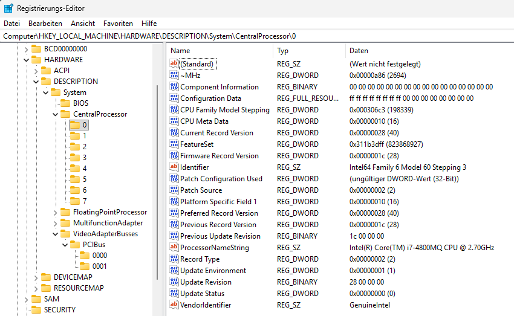
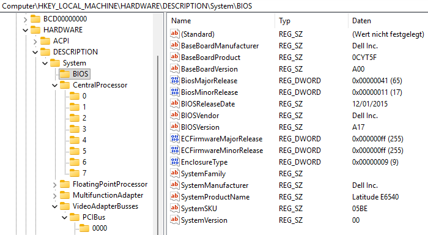

An easiest way — from registry.

<!--more-->

```
fn collect_cpu_name_from_registry() -> Option<String> {
    read_registry_string(
        "HARDWARE\\DESCRIPTION\\System\\CentralProcessor\\0",
        "ProcessorNameString",
    )
    .map(|value| value.trim().to_string())
    .filter(|value| !value.is_empty())
}
```

Registry:



BIOS



Originally from https://github.com/TX230/winproc-tui

