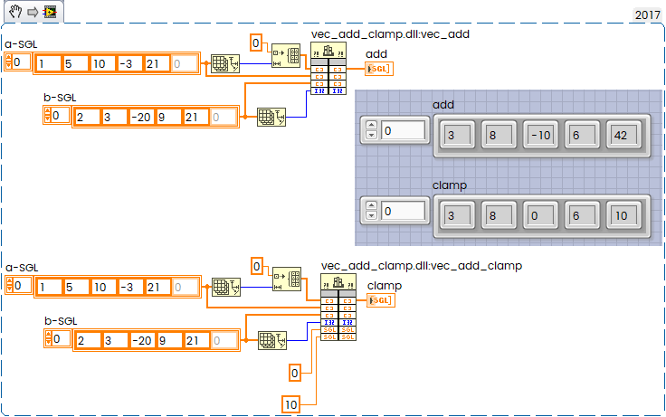
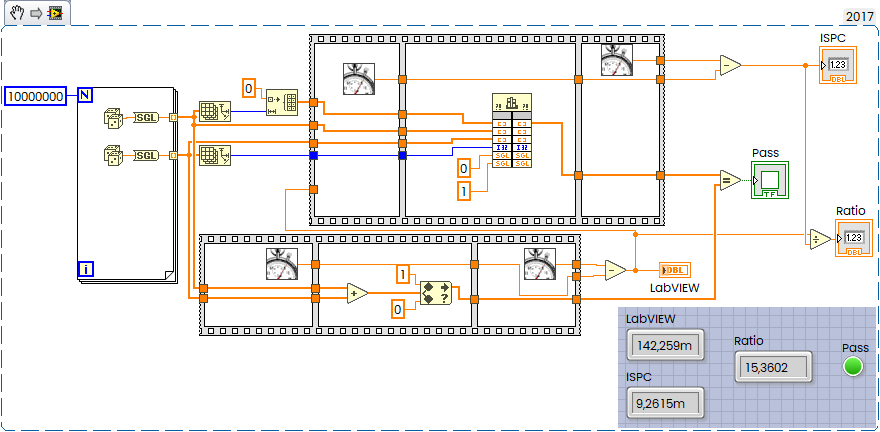

This note documents a practical experiment with ISPC on Windows: compiling a simple SIMD kernel, exporting it from a DLL, generating an import library, and calling it from Rust and LabVIEW. The goal is to compare ISPC’s generated AVX2 code with native Rust and LabVIEW implementations and to examine the generated assembly.

<!--more-->

As a long‑time enthusiast of high‑performance CPU computing, I spent last weekend experimenting with ISPC. Until now, I mostly used the Intel OneAPI compiler, which is great for SIMD optimization of C code. ISPC, however, is something I hadn’t touched before — and it turned out to be surprisingly interesting.

If you want to fully utilize CPU vector units, you can do it in several ways:

- Write pure assembly with AVX2/AVX‑512 (powerful but difficult)
- Use intrinsics in C or Rust (easier, but still low‑level, and different compilers generate slightly different code)
- Write high‑level C or Rust and rely on compiler auto‑vectorization (results vary)
- Or use ISPC, which provides a different and very effective approach

ISPC stands for **Intel® Implicit SPMD Program Compiler**:

- Website: https://ispc.github.io
- GitHub: https://github.com/ispc/ispc
- Releases: https://github.com/ispc/ispc/releases

The latest release as of 28 June 2026 is **v1.31.0**: https://github.com/ispc/ispc/releases/download/v1.31.0/ispc-v1.31.0-windows.zip

ISPC uses a C‑like syntax. For example, here is a simple function that adds two float vectors:

```c
export void vec_add_ispc(uniform float* uniform dst,
                         uniform const float* uniform a,
                         uniform const float* uniform b,
                         uniform int n)
{
    foreach (i = 0 ... n) {
        dst[i] = a[i] + b[i];
    }
}
```

Now let’s look at a slightly more interesting example with conditional logic:

```c
export void vec_add_clamp_ispc(
    uniform float* uniform dst,
    uniform const float* uniform a,
    uniform const float* uniform b,
    uniform int n,
    uniform float min_val,
    uniform float max_val)
{
    foreach (i = 0 ... n) {
        float v = a[i] + b[i];

        // conditional logic inside SIMD loop
        if (v < min_val)
            v = min_val;
        else if (v > max_val)
            v = max_val;

        dst[i] = v;
    }
}
```

Save this as **vec_add_clamp.ispc**.

Compile it:

```console
ispc vec_add_clamp.ispc -o vec_add_clamp.obj -h vec_add_clamp.h --target=avx2
```

This produces `vec_add_clamp.obj` and `vec_add_clamp.h`.

Next, create **vec_add_clamp_wrapper.c**:

```c
#include "vec_add_clamp.h"

__attribute__((dllexport))
void vec_add(float* dst, const float* a, const float* b, int n)
{
    vec_add_ispc(dst, a, b, n);
}

__attribute__((dllexport))
void vec_add_clamp(
    float* dst,
    const float* a,
    const float* b,
    int n,
    float min_val,
    float max_val)
{
    vec_add_clamp_ispc(dst, a, b, n, min_val, max_val);
}
```

Now compile and link both together:

```console
objcopy --remove-section .drectve vec_add_clamp.obj
gcc -shared -o vec_add_clamp.dll vec_add_clamp_wrapper.c vec_add_clamp.obj -Wl,--out-implib,libvec_add_clamp.a
```

The first command removes the `.drectve` section so GCC (especially UCRT64) can link the object file cleanly without warnings about .drectve.

To generate an MSVC‑compatible `.lib` file:

```console
dumpbin /EXPORTS vec_add_clamp.dll > vec_add_clamp.exports
lib /def:vec_add_clamp.def /out:vec_add_clamp.lib /MACHINE:X64
```

Now trivial Rust code example

```rust
#[link(name = "vec_add_clamp")]   // without .dll or .lib
unsafe extern "C" {
    // Simple add
    fn vec_add(
        dst: *mut f32,
        a: *const f32,
        b: *const f32,
        n: i32,
    );

    // Add + clamp
    fn vec_add_clamp(
        dst: *mut f32,
        a: *const f32,
        b: *const f32,
        n: i32,
        min_val: f32,
        max_val: f32,
    );
}

fn main() {
    println!("Hello, ISPC!");
    // Example data
    let a = vec![1.0, 5.0, 10.0, -3.0, 21.0];
    let b = vec![2.0, 3.0, -20.0, 9.0, 21.0];

    let mut out_add = vec![0.0; a.len()];
    let mut out_clamp = vec![0.0; a.len()];

    unsafe {
        // Call simple add
        vec_add(
            out_add.as_mut_ptr(),
            a.as_ptr(),
            b.as_ptr(),
            a.len() as i32,
        );

        // Call add + clamp
        vec_add_clamp(
            out_clamp.as_mut_ptr(),
            a.as_ptr(),
            b.as_ptr(),
            a.len() as i32,
            0.0,   // min clamp
            10.0,  // max clamp
        );
    }

    println!("vector a:             {:?}", a);
    println!("vector b:             {:?}", b);
    println!("vec_add result:       {:?}", out_add);
	println!("clamp min/max: {:?}...{:?}", 0.0, 10.0);
    println!("vec_add_clamp result: {:?}", out_clamp);
}
```

And works:

```console
>cargo run -r
   Compiling bin v0.1.0 (C:\Users\Andrey\Desktop\ispc-v1.31.0-windows\bin)
    Finished `release` profile [optimized] target(s) in 0.45s
     Running `C:\Users\Andrey\Desktop\ispc-v1.31.0-windows\bin\target\release\bin.exe`
Hello, ISPC!
vector a:             [1.0, 5.0, 10.0, -3.0, 21.0]
vector b:             [2.0, 3.0, -20.0, 9.0, 21.0]
vec_add result:       [3.0, 8.0, -10.0, 6.0, 42.0]
clamp min/max: 0.0...10.0
vec_add_clamp result: [3.0, 8.0, 0.0, 6.0, 10.0]
```

Can be same in LabVIEW:



### SIMD Internals

Now interesting question how it looks inside

Add hot loop - just classical SIMD loop with vectored add of 8 elements in 256 bit register:

```nasm
loc_1D5B51590: ; CODE XREF: vec_add_ispc+37↓j
	vmovups ymm0, ymmword ptr [rdx+rax*4]
	vaddps  ymm0, ymm0, ymmword ptr [r8+rax*4]
	vmovups ymmword ptr [rcx+rax*4], ymm0
	add     rax, 8 ; 8 AVX2 Lanes
	cmp     rax, r10
	jb      short loc_1D5B51590
```

The clamp loop is more complex because it handles divergence:

```nasm
loc_1D5B51640: ; CODE XREF: vec_add_clamp_ispc+72↓j
    vmovups ymmword ptr [rcx+rax*4], ymm4
    add     rax, 8 ; ; Advance index by 8 elements!
    cmp     rax, r10
    jnb     short loc_1D5B51687

loc_1D5B5164E:
    vmovups ymm4, ymmword ptr [rdx+rax*4]
    vaddps  ymm4, ymm4, ymmword ptr [r8+rax*4]
    vcmpltps ymm5, ymm4, ymm2 ; Compare (ymm4 < min_val)
    vmovmskps r11d, ymm5 ; Move the sign bits of the mask in r11d
    test    r11d, r11d
    jz      short loc_1D5B5166B
    vmaxps  ymm4, ymm2, ymm4 ; Clamp: ymm4 = max(min_val, ymm4)

loc_1D5B5166B:
    cmp     r11d, 0FFh
    jz      short loc_1D5B51640 ; HOT Loop
;-------------------------------
    vcmpnltps ymm6, ymm3, ymm4
    vorps   ymm5, ymm5, ymm6
    vblendvps ymm4, ymm3, ymm4, ymm5
    jmp     short loc_1D5B51640
loc_1D5B51685:
    xor     eax, eax
```

Here is important that ISPC handles divergence efficiently.

It means that ISPC executes our `foreach` loop using **SIMD lanes** (AVX2 = 8 lanes for float). All lanes normally run the *same instruction* at the *same time*. But if our code contains a **branch**:

```c
if (v < min_val)
    v = min_val;
else
    v = max_val;
```

But the problem is that some lanes may want to go into the `if` block, others into the `else` block.

This situation is called **divergence**.

- Lane 0: v < min_val → take IF
- Lane 1: v > min_val → take ELSE
- Lane 2: v < min_val → take IF
- Lane 3: v > min_val → take ELSE
- …

The SIMD unit cannot split itself into two separate instruction streams. So ISPC must **simulate** the branching. ISPC uses **masking**, not scalarization. Here’s what happens internally - compute a mask for the IF condition, so each SIMD lane evaluates the condition independently, and ISPC uses masks to apply the correct branch result per lane.

Example mask for `v < min_val`:

```
Lane: 0 1 2 3 4 5 6 7
Mask: 1 0 1 0 0 1 0 1
```

Then execute the IF block **only for lanes where mask = 1** and other lanes are temporarily disabled, and finally ISPC automatically writes the correct values back to each lane.

What about speed?

Trivial benchmark:



15x faster than LabVIEW.

Rust code on this trivial example will show almost the same performance.
