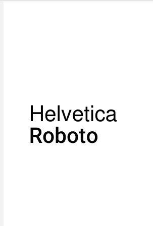
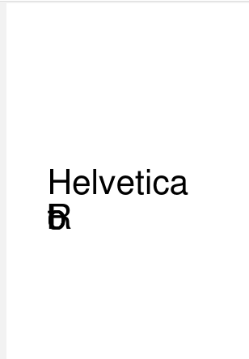
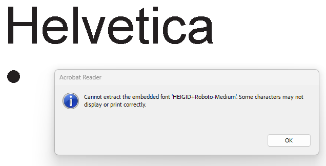
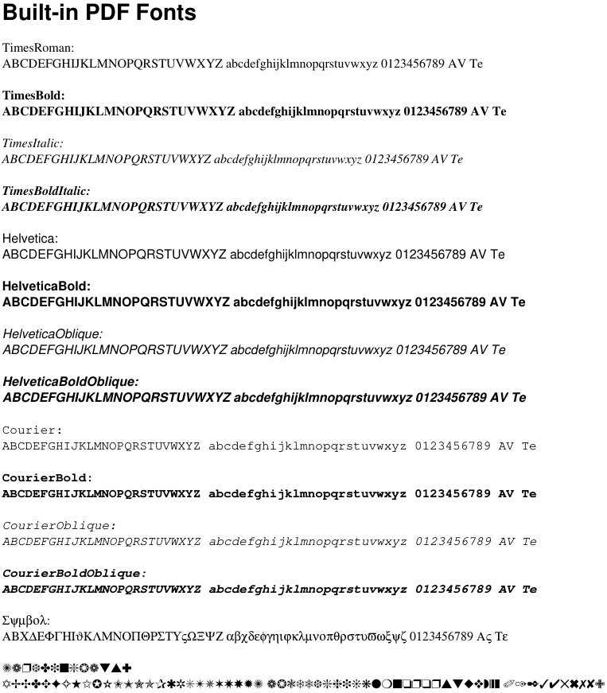
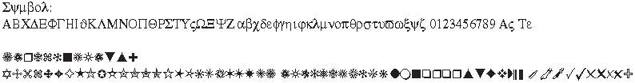

For a recent project, I needed to generate PDF files directly from Rust code. While experimenting with the excellent printpdf crate, I ran into an issue with embedded TrueType fonts.

<!--more-->

The problem appears to affect printpdf version 0.10.0. Font embedding works correctly in 0.9.1, but the generated PDF becomes corrupted when using 0.10.0.
For now, the simplest workaround is to downgrade to 0.9.1.

cargo.toml:

```toml
[package]
name = "fonts-issue-min"
version = "0.1.0"
edition = "2024"

[dependencies]
printpdf = "0.9.1" # OK
# printpdf = "0.10.0" # NOK, some attempts
# printpdf = { version = "0.10.0", default-features = false, feature = "text_layout" }
# printpdf = { version = "0.10.0", default-features = true }
# printpdf = { version = "0.10.0", feature = "text_layout" }
```

### Minimal Reproducible Example
The following example demonstrates the issue:

```rust
use printpdf::*;

fn main() {
    let mut doc = PdfDocument::new("TEST PDF");

    let roboto_bytes = include_bytes!("./fonts/RobotoMedium.ttf");
    println!("Font size: {}", roboto_bytes.len());
    let font_index = 0;
    let mut warnings = Vec::new();
    let font = ParsedFont::from_bytes(roboto_bytes, font_index, &mut warnings)
        .expect("Failed to parse font");
    let num = font.num_glyphs();
    println!("Glyph count: {}", num);

    for w in &warnings {
        println!("->{w:?}");
    }

    let font_id = doc.add_font(&font);

    let text_pos = Point {
        x: Mm(10.0).into(),
        y: Mm(250.0).into(),
    }; // from bottom left

    let page_contents = vec![
        Op::StartTextSection,
        Op::SetLineHeight { lh: Pt(24.0) },
        Op::SetWordSpacing { pt: Pt(24.0) },
        Op::SetCharacterSpacing { multiplier: 0.0 },
        Op::SetTextCursor { pos: text_pos },
        Op::SetFont {
            font: PdfFontHandle::Builtin(BuiltinFont::Helvetica),
            size: Pt(24.0),
        },
        Op::ShowText {
            items: vec![TextItem::Text("Helvetica".to_string())],
        },
        Op::AddLineBreak,
        Op::SetFont {
            font: PdfFontHandle::External(font_id.clone()),
            size: Pt(24.0),
        },
        Op::ShowText {
            items: vec![TextItem::Text("Roboto".to_string())],
        },
        Op::EndTextSection,
    ];

    let save_options = PdfSaveOptions {
        subset_fonts: false, // auto-subset fonts on save
        optimize: false,
        ..Default::default()
    };

    let page = PdfPage::new(Mm(210.0), Mm(297.0), page_contents);
    let mut warnings = Vec::new();
    let pdf_bytes: Vec<u8> = doc
        .with_pages(vec![page])
        .save(&save_options, &mut warnings);

    for w in &warnings {
        println!("=>{w:?}");
    }
    println!("pdf size = {}", pdf_bytes.len());

    std::fs::write("font-test.pdf", &pdf_bytes).expect("Failed to write PDF");

    // ===================== CHECK
    // Now try to parse the PDF back
    let mut warnings = Vec::new();
    let opts = PdfParseOptions {
        fail_on_error: false,
    };

    let parsed_pdf = PdfDocument::parse(&pdf_bytes, &opts, &mut warnings).unwrap();

    // Check the page operations
    assert!(!parsed_pdf.pages.is_empty(), "No pages in the parsed PDF");
    let page = &parsed_pdf.pages[0];

    // Extract text from the page (this handles both TextItem::Text and GlyphIds)
    let text_chunks = page.extract_text(&parsed_pdf.resources);
    assert!(!text_chunks.is_empty(), "No text extracted from the page");

    // Join all text chunks
    let extracted_text = text_chunks.join("");
    println!("Extracted text: {}", extracted_text);

    // Check if the font resource was loaded
    let font_resources = &parsed_pdf.resources.fonts.map;
    assert!(!font_resources.is_empty(), "No font resources loaded");
}
```

v.0.9.1:

```
>fonts-issue-min.exe
Font size: 162588
Glyph count: 1250
->FontParseWarning { severity: Info, message: "Successfully read font data" }
->FontParseWarning { severity: Info, message: "Successfully loaded font at index 0" }
->FontParseWarning { severity: Info, message: "Parsing glyph outlines via allsorts OutlineBuilder (composite-safe)" }
pdf size = 165238
Extracted text: [glyphs]
Roboto
```

And PDF looks good:



Now 0.10.0:

```
>fonts-issue-min.exe
Font size: 162588
Glyph count: 1250
pdf size = 2727
Extracted text: [glyphs]
[glyphs]

thread 'main' (48284) panicked at fonts-issue-min\src\main.rs:92:5:
No font resources loaded
note: run with `RUST_BACKTRACE=1` environment variable to display a backtrace
```

And PDF damaged:



Attempt to open in Acrobat Reader:



Check this with pdffonts.exe:

```
>pdffonts.exe font-test.pdf
Syntax Error: Embedded font file may be invalid
name                         type              encoding         emb sub uni object ID
---------------------------- ----------------- ---------------- --- --- --- ---------
HEIGID+Roboto-Medium         CID TrueType      Identity-H       yes yes yes      5  0
Helvetica                    Type 1            WinAnsi          no  no  no       6  0
```

And how it should be in 0.9.1:

```
>pdffonts.exe font-test.pdf
name                         type              encoding         emb sub uni object ID
---------------------------- ----------------- ---------------- --- --- --- ---------
HEIGID+Roboto-Medium         CID TrueType      Identity-H       yes yes yes      5  0
Helvetica                    Type 1            WinAnsi          no  no  no       6  0
```

### 14 base Fonts

Those are the **14 PDF Standard Fonts**. PDF defines a set of 14 standard fonts, often referred to as the *Base 14 Fonts*. These fonts are built into virtually every PDF viewer and therefore do not need to be embedded in the document.



One thing worth noting is that Base 14 fonts may render slightly differently between PDF viewers because modern readers are allowed to substitute equivalent local fonts. For example, Adobe Acrobat renders some of these fonts differently than SumatraPDF:



Source code "Template" to get own and base printed on two pages:

```rust
use printpdf::*;

const SAMPLE: &str = "ABCDEFGHIJKLMNOPQRSTUVWXYZ \
abcdefghijklmnopqrstuvwxyz \
0123456789 \
AV Te";

struct ExternalFont {
    name: &'static str,
    bytes: &'static [u8],
}

macro_rules! font {
    ($name:expr, $file:expr) => {
        ExternalFont {
            name: $name,
            bytes: include_bytes!(concat!("./fonts/", $file)),
        }
    };
}

fn create_page_ops(title: &str) -> Vec<Op> {
    vec![
        Op::StartTextSection,
        Op::SetLineHeight { lh: Pt(10.0) },
        Op::SetWordSpacing { pt: Pt(0.0) },
        Op::SetCharacterSpacing { multiplier: 0.0 },
        Op::SetTextCursor {
            pos: Point {
                x: Mm(10.0).into(),
                y: Mm(280.0).into(),
            },
        },
        Op::SetFont {
            font: PdfFontHandle::Builtin(BuiltinFont::HelveticaBold),
            size: Pt(14.0),
        },
        Op::ShowText {
            items: vec![TextItem::Text(title.to_string())],
        },
        Op::AddLineBreak,
        Op::AddLineBreak,
    ]
}

fn add_font_sample(ops: &mut Vec<Op>, handle: PdfFontHandle, name: &str, size: Pt) {
    ops.push(Op::SetFont { font: handle, size });

    ops.push(Op::ShowText {
        items: vec![TextItem::Text(format!("{name}:"))],
    });

    ops.push(Op::AddLineBreak);

    ops.push(Op::ShowText {
        items: vec![TextItem::Text(SAMPLE.to_string())],
    });

    ops.push(Op::AddLineBreak);
    ops.push(Op::AddLineBreak);
}

fn main() {
    let mut doc = PdfDocument::new("Font Samples");

    let mut warnings = Vec::new();

    // ============================================================
    // External fonts
    // ============================================================

    let external_fonts = [
        font!("Roboto", "RobotoMedium.ttf"),
        font!("Poppins", "Poppins-Regular.ttf"),
        font!("Poppins Bold", "Poppins-Bold.ttf"),
        font!("Poppins UI", "PoppinsUI-Regular.ttf"),
        font!("Poppins UI Bold", "PoppinsUI-Bold.ttf"),
        font!("Tilda Regular", "TildaSans-Regular.ttf"),
        font!("Tilda Light", "TildaSans-Light.ttf"),
        font!("Tilda Medium", "TildaSans-Medium.ttf"),
        font!("Tilda Semibold", "TildaSans-Semibold.ttf"),
        font!("Tilda Bold", "TildaSans-Bold.ttf"),
        font!("Tilda Extra Bold", "TildaSans-ExtraBold.ttf"),
        font!("Tilda Black", "TildaSans-Black.ttf"),
        font!("PT Mono Regular", "PT Mono Regular.ttf"),
        font!("PT Mono Bold", "PT Mono Bold.ttf"),
    ];

    let mut ext_handles = Vec::new();

    for font in &external_fonts {
        let parsed =
            ParsedFont::from_bytes(font.bytes, 0, &mut warnings).expect("Failed to parse font");

        println!("{}: {} glyphs", font.name, parsed.num_glyphs());

        let font_id = doc.add_font(&parsed);

        ext_handles.push((font.name, font_id));
    }

    // ============================================================
    // Builtin fonts
    // ============================================================

    let builtin_fonts = [
        BuiltinFont::TimesRoman,
        BuiltinFont::TimesBold,
        BuiltinFont::TimesItalic,
        BuiltinFont::TimesBoldItalic,
        BuiltinFont::Helvetica,
        BuiltinFont::HelveticaBold,
        BuiltinFont::HelveticaOblique,
        BuiltinFont::HelveticaBoldOblique,
        BuiltinFont::Courier,
        BuiltinFont::CourierBold,
        BuiltinFont::CourierOblique,
        BuiltinFont::CourierBoldOblique,
        BuiltinFont::Symbol,
        BuiltinFont::ZapfDingbats,
    ];

    let size = Pt(8.0);

    // ============================================================
    // Page 1 - External fonts
    // ============================================================

    let mut external_ops = create_page_ops("External TTF Fonts");

    for (name, id) in &ext_handles {
        add_font_sample(
            &mut external_ops,
            PdfFontHandle::External(id.clone()),
            name,
            size,
        );
    }

    external_ops.push(Op::EndTextSection);

    let page_external = PdfPage::new(Mm(210.0), Mm(297.0), external_ops);

    // ============================================================
    // Page 2 - Builtin fonts
    // ============================================================

    let mut builtin_ops = create_page_ops("Built-in PDF Fonts");

    for font in builtin_fonts {
        add_font_sample(
            &mut builtin_ops,
            PdfFontHandle::Builtin(font),
            &format!("{:?}", font),
            size,
        );
    }

    builtin_ops.push(Op::EndTextSection);

    let page_builtin = PdfPage::new(Mm(210.0), Mm(297.0), builtin_ops);

    // ============================================================
    // Save
    // ============================================================

    let save_options = PdfSaveOptions {
        subset_fonts: false, // auto-subset fonts on save
        optimize: false,
        ..Default::default()
    };

    let mut warnings = Vec::new();
    let pdf_bytes: Vec<u8> = doc
        .with_pages(vec![page_external, page_builtin])
        .save(&save_options, &mut warnings);

    std::fs::write("all_fonts.pdf", &pdf_bytes).unwrap();
}
```

