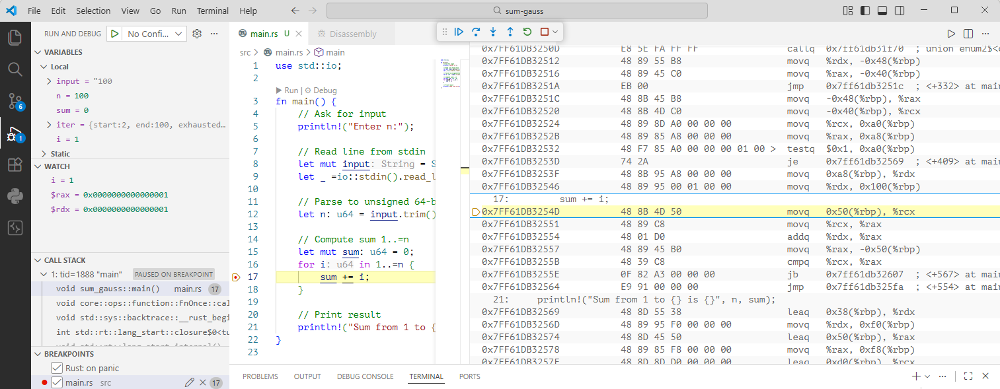

Debug Notes
<!--more-->

how to debug rust code at assembly level



You typically combine a native debugger (gdb/lldb) with Rust’s own tools to inspect optimized assembly while still relating it to your Rust source.

## Basic setup

- Build in debug mode so you get full debug info: `cargo build` (no `--release`).
- Use the wrapper scripts so the debugger understands Rust better: `rust-gdb target/debug/your_bin` or `rust-lldb target/debug/your_bin`.

## Stepping at assembly level in gdb

Once inside `rust-gdb`:

- Set a breakpoint: `break main` or `break your_module::your_fn`.
- Switch to assembly layout: `layout asm`.
- Step instruction by instruction: `si` (step into), `ni` (next instruction).
- Show current function disassembly: `disassemble`.

With recent gdb and DWARF from Rust, `layout asm` can show assembly annotated with the corresponding Rust source lines.

## Getting standalone assembly listings

For offline analysis, generate assembly text from your crate:

- Use `rustc` directly: `rustc -C opt-level=2 --emit asm -C llvm-args=-x86-asm-syntax=intel src/main.rs`.
- Or use `cargo-asm` / `cargo-binutils` to get per-function output: `cargo asm your_crate::module::function`.
- `cargo objdump --bin your_bin -- -d` (from `cargo-binutils`) disassembles the built binary.

## Workflow example

1. `cargo build`
2. `rust-gdb target/debug/your_bin`
3. In gdb: `break your_module::your_fn`, `run`, then `layout asm` and `si` through instructions.
4. In a separate shell, generate annotated assembly with `rustc --emit asm` or `cargo asm` for deeper inspection.

on windows?

On Windows you can still debug Rust at the assembly level, but the tooling depends on whether you use the MSVC or GNU toolchain.

## Option 1: MSVC toolchain + Visual Studio / VS Code

- Install Rust with the `x86_64-pc-windows-msvc` target (default on Windows) and build with debug info: `cargo build`.
- The compiler/linker produce a `.pdb` file that Visual Studio, WinDbg, and the MSVC debugger in VS Code can use.
- In VS Code, configure the C/C++ debugger to point at `target/debug/your_bin.exe`, set breakpoints, then switch the disassembly view on when you hit a breakpoint to step instruction-by-instruction.

## Option 2: GNU toolchain + GDB/LLDB

- Install the GNU toolchain: `rustup install stable-gnu` and use it via `rustup default stable-gnu` or a per-project override.
- Install MinGW-w64 or MSYS2 so that `gcc` and `gdb` are available in `PATH`.
- Build: `cargo build`. Then run `gdb target/debug/your_bin.exe`, set a breakpoint (`break main`), and use `layout asm`, `si`, `ni`, `disassemble` to inspect assembly. This mirrors the Linux workflow.

## Generating assembly listings on Windows

- You can always emit assembly without a debugger: `rustc -C opt-level=2 --emit asm src/main.rs` (from a Developer Command Prompt).
- `cargo-binutils` (`cargo install cargo-binutils`) works on Windows targets and gives you tools like `cargo objdump --bin your_bin -- -d` for disassembly and `cargo asm` for function-level assembly, though you may need MinGW/MSYS2 tools present.

how to switch syntax to intel ?

In GDB (via rust-gdb or gdb directly on Windows GNU toolchain), switch to Intel syntax with this command before viewing disassembly:

```
text
(gdb) set disassembly-flavor intel
```

Then `layout asm` or `disassemble` will show Intel syntax (e.g., `mov rax, rbx` instead of AT&T `mov %rbx, %rax`).

## Make it permanent

Add to your `~/.gdbinit` file:

```
text
echo "set disassembly-flavor intel" >> ~/.gdbinit
```

This applies every time GDB starts.

## For rustc assembly output

To generate Intel-syntax assembly files from Rust source:

```
text
rustc --emit asm -C llvm-args=-x86-asm-syntax=intel src/main.rs
```

The `.s` file will use Intel syntax.

## VS Code / Visual Studio note

MSVC debugger (used in VS Code C/C++ extension or Visual Studio) always shows Intel syntax by default—no setting needed.

how to emit asm in release mode

To emit assembly from a release build, pass `--emit asm` to rustc through Cargo:

```
text
cargo rustc --release -- --emit asm
```

Assembly files appear in `target/release/deps/` as `<crate>-<hash>.s` files (or `<crate>-<hash>-<hash>.rcgu.s` for larger crates).

## For Intel syntax in release asm

```
text
RUSTFLAGS="-C llvm-args=-x86-asm-syntax=intel" cargo rustc --release -- --emit asm
```

## Note on optimization differences

`--emit=asm` can sometimes alter codegen (less optimal than the final binary) because it changes the compilation pipeline. For exact final assembly matching the executable, use `cargo objdump --bin your_bin --release -- -d` instead.

no such command objdump

`cargo objdump` is not a built-in Cargo command—it's from the `cargo-binutils` crate.

## Install cargo-binutils first

```
text
cargo install cargo-binutils
```

On Windows (MSVC toolchain), you may also need LLVM tools:

```
text
rustup component add llvm-tools
```

## Then use it

```
text
cargo objdump --release -- -d
```

Or for a specific binary:

```
text
cargo objdump your_bin_name --release -- -d
```

The `-- -d` syntax passes `-d` (disassemble) to the underlying `llvm-objdump`. Use `--` to separate Cargo flags from objdump flags.

## Windows note

If you get "command not found", either:

- Install `cargo-binutils` (above)
- Or use `llvm-objdump.exe` directly from your Rust toolchain: `C:\Users\<you>\.rustup\toolchains\<stable-x86_64-pc-windows-msvc>\lib\Rustlib\x86_64-pc-windows-msvc\bin\llvm-objdump.exe -d target\release\your_bin.ex`