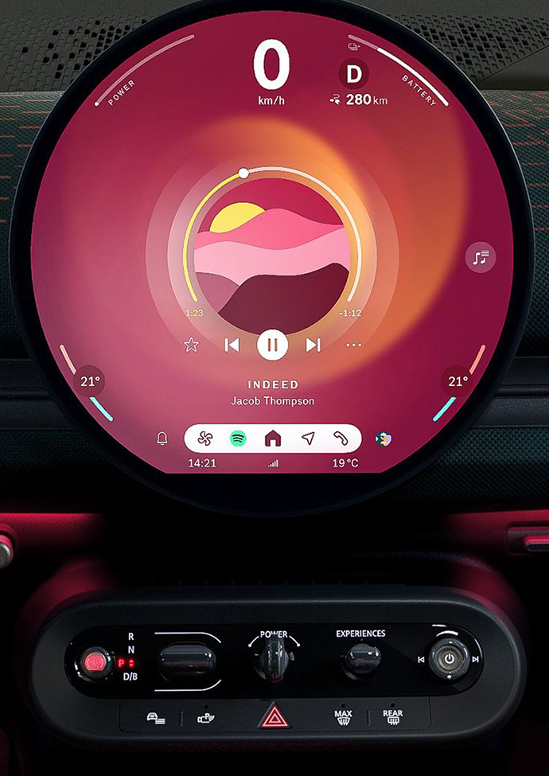
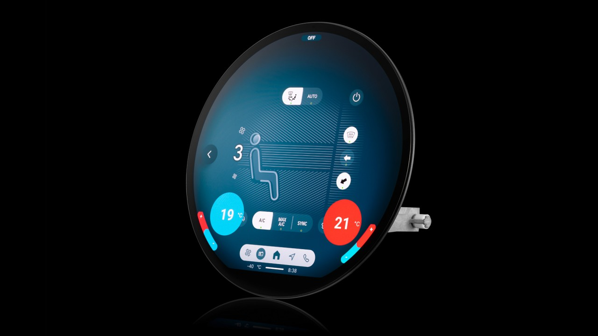
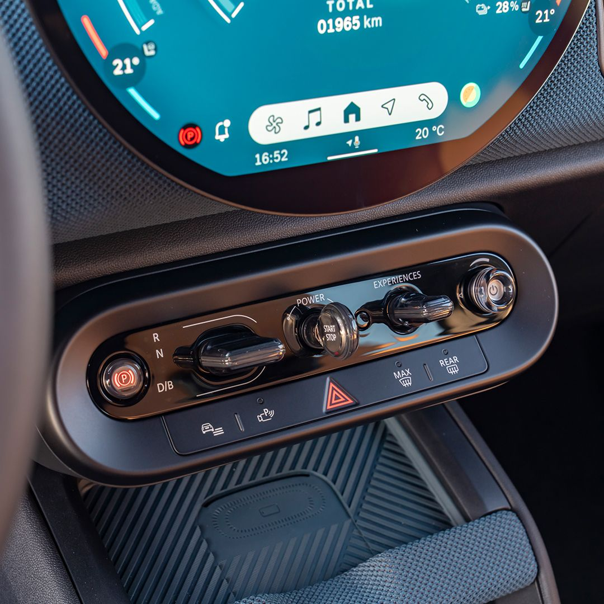
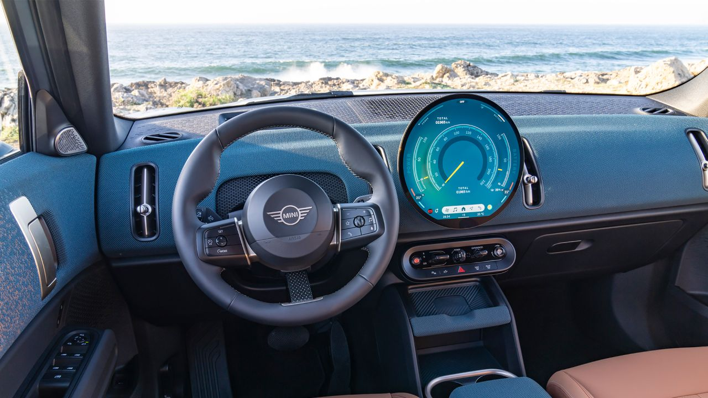
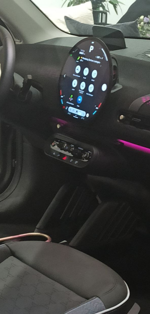

A big circular OLED display and Experience Modes to let you change the sounds, projections and vibes of your interior with just a toggle...
<!--more-->

The new design idea, under slogan "MINI-malist style; maximum tech":

Fully disagree. Circular OLED is very nice, no doubt, but a touch screen without physical buttons and knobs? 😥 One of the major reasons why I purchased my Countryman SE Hybrid was the physical buttons to control the climate and other options, and I love this (almost — there are some points that could be improved). Now it looks like the climate will be controlled from the touch screen. This works well for smart phones and tablets, but during driving it is unsafe without tactile feedback from a usability and ergonomic point of view. Volkswagen has already tried this approach and is now planning to "cut" touch-sensing controls in favor of bringing back "normal" physical buttons. Every time I drive a rental car with "almost touch" controls, I hate it, really. Probably I'm too old, but this is just my humble opinion. Please keep the "old school" control way!

Design before:

Just keep it.

Another views of the new cockpit equipped with circular OLED (seems to be designed by [Behr-Hella Thermocontrol (BHTC)](https://www.bhtc.com/en/products/hmi), which is leading HMI company):

Nice examples of the modern HMI Designs (but I'm still in humble opinion that not everything can be replaced with touch screens)

Images Sources: 

[The Center Display of The New All-Electric Mini Cooper](https://www.linkedin.com/pulse/center-display-new-all-electric-mini-cooper-bhtc/?trackingId=C4UIi8pHTgWxDcqosDxQQQ%3D%3D).

[State-of-the-art OLED technology](https://www.linkedin.com/feed/update/urn:li:activity:7195709392447557633/?updateEntityUrn=urn%3Ali%3Afs_feedUpdate%3A%28V2%2Curn%3Ali%3Aactivity%3A7195709392447557633%29).

---

Update 11-NOV-2024:

My daughter have seen this on Exhibition in Hamburg: 

