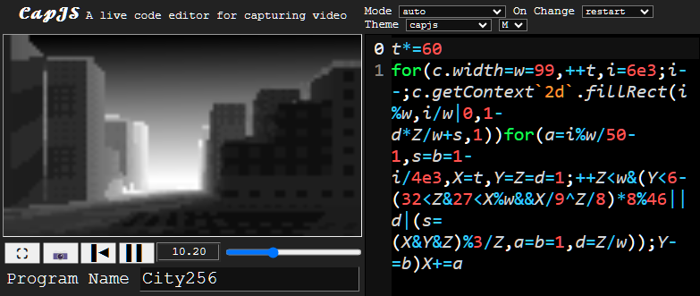
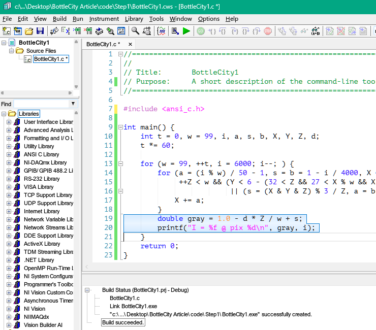
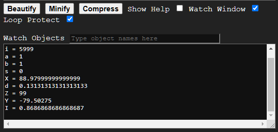
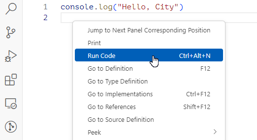
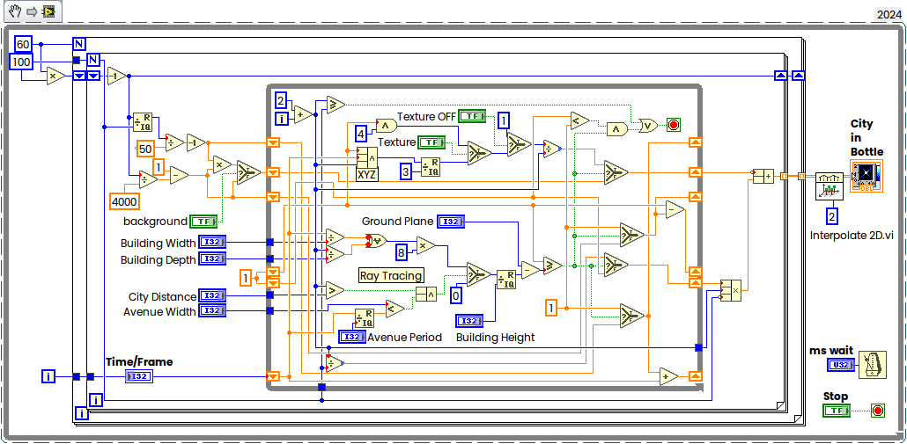

Вашему вниманию предлагается небольшой этюд выходного дня о том, как я "перекладывал" js код на Си, а затем и на LabVIEW. Увидев за чашкой кофе [пару](https://habr.com/ru/articles/815653/) [постов](https://habr.com/ru/companies/cloud4y/articles/816321/) про забавный проект, генерирующий впечатляющий ландшафт относительно несложными вычислениями, мне захотелось добавить себе в коллекцию эту игрушку (ну как мы иногда ставим бесполезных слоников на каминную полку), так что я решил потратить обеденный перерыв для наброска, но там всё оказалось не так просто. Технически удобнее перед тем, как переписывать алгоритм на LabVIEW, иметь под рукой референсный алгоритм на Си, и тут меня ждало несколько подводных камней...

---

Прежде чем продолжить, надо отметить, что я вроде не новичок в программировании, работаю уже больше двадцати пяти лет, и вроде знаю Си, меня не испугать алгоритмами и численными методами, но я в жизни своей ни строчки не написал на JavaScript, так что пост этот может быть интересен взглядом новичка на вещи, которые для для профессионалов очевидны и сами собой разумеются. С другой стороны я профи в LabVIEW, а большая часть аудитории, читающая этот пост будет смотреть на графический код ровно теми же глазами новичка, которыми я у видел js. Как заметил Козьма Прутков — "хороший специалист подобен флюсу — полнота его односторонняя". По ходу повествования я буду упоминать много других продуктов, в том числе коммерческих, но рекламной нагрузки пост не несёт.

Итак, всё, что  меня было в руках, это вот эта [ссылка](https://capjs.3d2k.com/?filename=City256&crushed=t*%3D60%0Afor%7Bc.width%3Dw%3D99%2C%2B%2Bt%2Ci%3D6e3%3Bi--%3Bc.getContext%602d%60.fillRect%7Bi%27%2Ci%28%7C0%2C1-d*Z%28%2Bs%2C1%7D%7Dfor%7Ba%3Di%27%2F50-1%2Cs%21-i%2F4e3%2CX%3Dt%2CY%3DZ%3DdA%3B%2B%2BZ%3Cw%26%7BY%3C6-%7B32%3CZ%2627%3CX%27%26%26X%2F9%5EZ%2F8%7D*8%2546%7C%7Cd%7C%7Bs%3D%7BX%26Y%26Z%7D%253%2FZ%2Ca%21%2Cd%3DZ%28%7D%7D%3BY-%29%7DX%2B%3Da%21%29A%27%25w%28%2Fw%29%3DbA%3D1%01A%29%28%27%21_).

Всё перед газами:



Поскольку я человек ленивый (а таким и должен быть в какой-то мере программист), то я решил воспользоваться ИИ для "пристрелки". Надо сказать, что технологии впечатляют — я уже довольно давно использую их для небольших фрагментов рутинного кода. Вот буквально несколько дней назад мне потребовался кусочек на Си для бинарного поиска и получить результат можно очень быстро, но как говорится — доверяй, но проверяй.

[Поехали](https://www.perplexity.ai/search?q=pending&newFrontendContextUUID=b3acbadd-e72d-4bd1-922c-d0555736aa2b): 

```c
#include <stdio.h>
#include <math.h>

int main() {
    int t = 0, w = 99, i, a, s, b, X, Y, Z, d;
    t *= 60;

    for (w = 99, ++t, i = 6000; i--; ) {
        for (a = (i % w) / 50 - 1, s = b = 1 - i / 4000, X = t, Y = Z = d = 1; 
             ++Z < w && (Y < 6 - (32 < Z && 27 < X % w && X / 9 ^ Z / 8) * 8 % 46 || d
                         || (s = (X & Y & Z) % 3 / Z, a = b = 1, d = Z / w)); Y -= b){
            X += a;
        }
    }
    return 0;
}
```

Выше я воспользовался perplexity.ai. Я в основном использую этот сервис, потому что он из немногих, не заблокированных у меня на работе, где гайки закручены — у меня там нет никаких ИИ, нет облаков, соцсетей кроме хабра да линкедина тоже нет, ну что поделать, полиси такое.

Пока что мы не будем включать мозги, а просто снабдим этот код выводом интенсивностей пикселей. ИИ, кстати забыл, что она вычисляется как 1-d*Z/w+s, нет проблем, добавляем, я покажу скриншот, как это у меня выглядит, оно даже компиляется в лёт без единого предупреждения:



Большинству листающих этот пост данная среда разработки покажется незнакомой. Это [LabWindows CVI](https://www.ni.com/en/shop/electronic-test-instrumentation/programming-environments-for-electronic-test-and-instrumentation/what-is-labwindows-cvi.html). Я использую его для несложных проектов на Си. Достоинства в том, что продукт прост как пять копеек, легковесен, не перегружен настройками, плюс тесно интегрирован с продуктами NI и вот ещё очень удобное дерево выбора библиотечных функций слева. Недостатки — это чистый незамутнённый Си, плюсплюсов туда не завезли, под капотом древний clang 3.3, соответственно генерируемый машинный код не очень эффективен, студия, а тем более интеловский обгоняют его по производительности, и платный к тому же — стоит не то, чтобы как крыло от боинга, но близко к тому — почти две тысячи долларов. В год. Но он идет "в нагрузку" к LabVIEW, чем я и пользуюсь. Ну вот просто знайте, что не только Студия да gcc есть.

Ладно, запускаем:

```
I = 0.000000 @ pix 5999
I = 0.000000 @ pix 5998
I = 0.000000 @ pix 5997
I = 0.000000 @ pix 5996
I = 0.000000 @ pix 5995
I = 0.000000 @ pix 5994
I = 0.000000 @ pix 5993
I = 0.000000 @ pix 5992
I = 0.000000 @ pix 5991
I = 0.000000 @ pix 5990
```

Ну кто бы сомневался.

Погодите, а какой первый пиксел должен быть?

Первым делом я вкорячил в код вывод прямо в окошко:


Но потом уже разул глаза — там же внизу есть Watch Window:



Удобно. Теперь мы знаем, что нулевой пиксел должен быть 0,868686...

В принципе понятно — все переменные объявлены как целые, по другому и быть не может.

Поскольку мозги мы всё ещё не хотим включать, попробуем chatGPT

(SPOILER)

```c
#include <stdio.h>
#include <stdlib.h>
#include <string.h>
#include <math.h>

#define WIDTH 99
#define HEIGHT 60

void fillRect(int canvas[HEIGHT][WIDTH], int x, int y, int w, int h, int value) {
    for (int i = 0; i < h; ++i) {
        for (int j = 0; j < w; ++j) {
            if (x + j < WIDTH && y + i < HEIGHT && x + j >= 0 && y + i >= 0) {
                canvas[y + i][x + j] = value;
            }
        }
    }
}

void drawCanvas(int canvas[HEIGHT][WIDTH]) {
    for (int i = 0; i < HEIGHT; ++i) {
        for (int j = 0; j < WIDTH; ++j) {
            putchar(canvas[i][j] ? '#' : ' ');
        }
        putchar('\n');
    }
}

int main() {
    int t = 0;
    int canvas[HEIGHT][WIDTH];

    while (++t) {
        memset(canvas, 0, sizeof(canvas));
        
        for (int i = 6000; i--; ) {
            double a = i % WIDTH / 50.0 - 1;
            double s = 1 - i / 4000.0;
            double b = s;
            double X = t, Y = 1, Z = 1;
            int d = 1;

            for (; ++Z < WIDTH &&
                (Y < 6 - ((32 < Z && 27 < X % WIDTH && X / 9 ^ Z / 8) * 8 % 46) ||
                d || (s = (X & (int)Y & (int)Z) % 3 / Z, a = b = 1, d = Z / WIDTH)); ) {
                X += a;
                Y -= b;
            }

            fillRect(canvas, i % WIDTH, i / WIDTH, 1 - d * Z / WIDTH + s, 1, 1);
        }

        drawCanvas(canvas);
        break;  // Comment this line out if you want to continuously update t.
    }

    return 0;
}

```

О, как, он даже сделал попытку вывода в псевдографике, но нет, результат по-прежнему неверный.

Тут я подумал, что не может быть, чтобы хоть кто-то да не разобрался в этом несложном скрипте, и точно, ссылка в одном из постов была приведена — вот этот код "разложенный" по полочкам — [Decoding A City In A Bottle](https://observablehq.com/@darabos/decoding-a-city-in-a-bottle).

Тут я подумал, что на отладочном выводе в окошко рендеринга я далеко не уеду, и хотя в Visual Studio можно доставить Node.js, но это чересчур тяжеловесное решение для столь простенькой задачки, так что я поискал возможности запускать JavaScript в VScode, и набрёл на расширение [CodeRunner](https://marketplace.visualstudio.com/items?itemName=formulahendry.code-runner). Всё, что ему требуется — это установленный [Node.js](https://nodejs.org/en/download/prebuilt-installer). Горячо рекомендую. Написание "Привет, мир" ещё не было столь простым:




Код рисования, слегка почищенный выглядит вот так:

```js
function verboseDraw(t) {
  const w = 99;
  for(let i=6000;i--;) { // World space coordinates.
    let X=t;
    let Y=1;
    let Z; // Ray direction in world space.
    let a=i%w/50-1;
    let b=1-i/4000;
    let d=1; // Light.
    let s = b; // Background
    // Ray tracing!
    for (Z=2; Z<w; ++Z) {
      if (isThereAnythingAt(X, Y, Z)) { // We hit the model.
        const last_d = d;
        // The texture.
        s = (X&Y&Z)%3; //  TEXTURE==='Striped'? Y&4: //0 - None
        s/=Z; // Fog.
        a=b=1; // New direction, toward the light.
        d=Z/w;
        if (last_d < 1) break; // Effectively the same as the ||d|(...) part.
      }
      X+=a;
      Y-=b;
    }
    let darkness = s+1-d*Z/w; // Texture + lighting.
    console.log(strip(darkness))
  }
}
```

Самая главная функция

```js
function isThereAnythingAt(X, Y, Z) { // The random building height comes from (X^Z)*8.
      return Y>=GROUND_PLANE-(CITY_DISTANCE<Z&AVENUE_WIDTH<X%AVENUE_PERIOD&&X/BUILDING_WIDTH^Z/BUILDING_DEPTH)*8%(BUILDING_HEIGHT+1);
}
```

Вообще я был изначально уверен, что дело в приоритетах операций, поэтому пробовал расставлять скобочки и так и сяк, но на самом деле там два виновника торжества.

Давайте перепишем код вот так (на самом деле нам это поможет легче переложить его на LabVIEW, ниже вы увидите почему):

```js
function isThereAnythingAt(X, Y, Z) { // The random building height comes from (X^Z)*8.
    let temp1 = X / BUILDING_WIDTH;
    let temp2 = Z / BUILDING_DEPTH;
    let temp3 = temp1 ^ temp2;
    let temp4 = X % AVENUE_PERIOD;
    let temp5 = CITY_DISTANCE < Z;
    let temp6 = AVENUE_WIDTH < temp4;
    let temp7 = temp5 & temp6;
    let temp8 = temp7 && temp3;
    let temp9 = temp8 * 8;
    let temp10 = BUILDING_HEIGHT + 1;
    let temp11 = temp9 % temp10;
    let Hit = GROUND_PLANE - temp11;
    
    return Y>= Hit
}
```

Теперь просто сравнивая значения временных переменных можно легко увидеть, в каком месте результат начинает отличаться от референсного. Вот эквивалентный Си код:

```cpp
bool isThereAnythingAt(double X, double Y, int Z) 
{
    int temp1 = X / BUILDING_WIDTH;
    int temp2 = Z / BUILDING_DEPTH;
    int temp3 = temp1 ^ temp2;
    double temp4 = fmod(X, (double)AVENUE_PERIOD); //double temp4 = (int)X%AVENUE_PERIOD;
    bool temp5 = CITY_DISTANCE < Z;
    bool temp6 = AVENUE_WIDTH < temp4;
    int temp7 = temp5 & temp6;
    int temp8 = temp7 ? temp3 : 0; //int temp8 = temp7&&temp3;
    int temp9 = temp8 * 8;
    int temp10 = BUILDING_HEIGHT + 1;
    int temp11 = temp9 % temp10;
    int Hit = GROUND_PLANE - temp11;

    return (Y >= Hit);
}
```

Вот полный LabVIEW код:



Выглядит ли это спагетти нагляднее, чем текстовый код? Не думаю.

Если вы хотите поиграть с ним самостоятельно, то можете скачать LabVIEW Comunity Edition. 

На этом можно было бы и закончить, но у нас остался рабочий Си код, и хотя мавр сделал своё дело, но жалко же выбрасывать, давайте оформим его во-что-то более работоспособное, разве что минимально причешем перед этим, хотя бы вот так:

```cpp
bool isThereAnythingAt(double X, double Y, int Z)
{ // The random building height comes from (X^Z)*8.
    int temp1 = (int)(X / BUILDING_WIDTH) ^ (Z / BUILDING_DEPTH);
    int temp2 = (CITY_DISTANCE < Z) & (AVENUE_WIDTH < fmod(X, (double)AVENUE_PERIOD));
    int temp3 = temp2 ? temp1 : 0;     //int temp8 = temp7&&temp3;
    int Hit = GROUND_PLANE - (temp3 * 8) % (BUILDING_HEIGHT + 1);
    return (Y >= Hit);
}

void verboseDraw(int t, float* data) {
    const int w = 99;
    for (int i = 6000; i--;) { // World space coordinates.
        double X = t;
        double Y = 1.0;
        int Z; // Ray direction in world space.
        double a = i % w / 50.0 - 1.0;
        double b = 1.0 - (double)i / 4000.0;
        double d = 1.0; // Light.
        double s = b; // Background
        for (Z = 2; Z < w; ++Z) { // Ray tracing!
            if (isThereAnythingAt(X, Y, Z)) { // We hit the model, ray tracing...
                double last_d = d;
                s = ((int)X & (int)Y & Z) % 3; // The texture.
                s /= (double)Z; // Fog.
                a = b = 1.0; // New direction, toward the light.
                d = (double)Z / w;
                if (last_d < 1) break; // Effectively the same as the ||d|(...) part.
            }
            X += a;
            Y -= b;
        }
        double darkness = d * Z / w - s; // Texture + lighting.
        data[i] = (float)darkness;
    }
}
```


### Прикручиваем OpenCV и Nuklear

Основной вопрос тут в том, как наиболее простым способом показать картинку на экране, и поскольку у нас в руках массив из пикселей, то, вероятно самое прростое решение — воспользоваться OpenCV, эта библиотека умеет отображать в том числе изображения в формате с плавающей точкой, даже преобразовывать в диапазон 0...255 не потребуется, тем же OpenCV удобно будет увеличить размер картинки с интерполяцией.

Всего-то кода надо будет:

```c++
#include "opencv2/opencv.hpp"
using namespace cv;

int main()
{
    float* city;

    city = (float*)malloc(6000 * sizeof(float));
    Mat City = Mat(60, 99, CV_32F, city);
    Mat Display = Mat(240, 400, CV_32F);

    namedWindow("City", 1);

    int t = 0;
    while (true) {
        verboseDraw(t++, city);
        resize(City, Display, Size(600, 360), INTER_LINEAR);
        imshow("City", Display);
        if(waitKey(33) == 27) break; //Wait for Esc
    }
    free(city);
}
```

Выше на LabVIEW у нас ещё были ползунки для тонкой настройки параметров. Есть куча способов сделать такой приложение, хоть на WinForms, хоть на C#/WPF, я воспользуюсь легковесной Nuklear.

Чтобы всё было поаккуратнее, переложим код рендеринга в отдельный поток:

```cpp
DWORD WINAPI ThreadFunc(void* data) {
    float* city = (float*)malloc(6000 * sizeof(float));
    if (!city) { running = 0; return 0; }
    Mat City = Mat(60, 99, CV_32F, city);
    Mat Display = Mat(240, 400, CV_32F);

    namedWindow("City");
    moveWindow("City", 20, 10);

    int t = 0;
    while (getWindowProperty("City", 0) != -1) {
        verboseDraw(t++, city);
        resize(City, Display, Size(600, 360), INTER_LINEAR);
        imshow("City", Display);
        if (waitKey(33) == 27) break; //Wait for Esc
    }
    free(city);

    running = 0;

    return 0;
}
```

Который запустим перед входом в цикл опроса слайдеров:

```cpp
    HANDLE thread = CreateThread(NULL, 0, ThreadFunc, NULL, 0, NULL);

    while (running)
    {
        /* Input */
        MSG msg;
        nk_input_begin(ctx);
        if (needs_refresh == 0) {
            if (GetMessageW(&msg, NULL, 0, 0) <= 0) running = 0;
            else {
                TranslateMessage(&msg);
                DispatchMessageW(&msg);
            }
            needs_refresh = 1;
        } else needs_refresh = 0;

        while (PeekMessageW(&msg, NULL, 0, 0, PM_REMOVE)) {
            if (msg.message == WM_QUIT) running = 0;
            TranslateMessage(&msg);
            DispatchMessageW(&msg);
            needs_refresh = 1;
        }
        nk_input_end(ctx);

        /* GUI */
        if (nk_begin(ctx, "Demo", nk_rect(0, 0, 600, 600), 0)) {

            nk_layout_row_dynamic(ctx, 32, 1);

            nk_label(ctx, "Ground Plane :", NK_TEXT_LEFT);
            nk_slider_int(ctx, 1, &GROUND_PLANE, 100, 1);

            nk_label(ctx, "Distance to the City:", NK_TEXT_LEFT);
            nk_slider_int(ctx, 1, &CITY_DISTANCE, 100, 1);
...
```

Полный код лежит на гитхабе.

### Rust

В принципе имея на руках работоспособный Си-код можно переложить эту игрушку на что угодно, вот, например на Раст. Прелесть раста заключается в том, что для отображения картинки на экране у нас есть крейт [show_image](https://crates.io/crates/show-image), который как раз то, что нам надо и нет необходимости в OpenCV.

Из ингредиентов нам понадобятся следующие зависимости:

```rust
use image::GrayImage;
use ndarray::Array1;
use show_image::{ImageView, ImageInfo, create_window};
use std::{thread, time};
```

Основной цикл:

```Rust
#[show_image::main]
fn main() -> Result<(), Box<dyn std::error::Error>> {

	let window = create_window("City", Default::default())?;
	let width = 100;
	let height = 60;
	let mut t = 0;
	let w = 99;

	println!("Hello, City, Hit Ctrl+C to Quit");
	loop {
		let mut array: Array1<u8> = Array1::zeros(6000); // 100x60
		let mut i = 6000;
		for _row in 0..height {
			for _col in 0..width {
				i -= 1;
				let mut x = t as f64;
				let mut y = 1.0;
				let mut last_z: i32 = 0;
				let mut a: f64 = (i % w) as f64 / 50.0 - 1.0;
				let mut b: f64 = 1.0 - (i as f64) / 4000.0;
				let mut  d = 1.0; // Light.
				let mut  s = b; // Background
				for z in 2..w { // Ray tracing!
					last_z = z + 1;
					if is_there_anything_at(x, y, z) { // We hit the model
						let last_d = d;
						s = (((x as i32) & (y as i32) & z) % 3) as f64; // Texture.
						s /= z as f64; // Fog.
						a = 1.0; // New direction, toward the light.
						b = 1.0; // New direction, toward the light.
						d = (z as f64) / (w as f64);       
						if last_d < 1.0 {
							last_z = z;
							break; // Effectively the same as the ||d|(...) part.
						}
					}
					x += a;
					y -= b;
				}
				let darkness = (d * last_z as f64 / w as f64 - s) * 255.0; // Texture + light.
				array[i as usize] = darkness as u8;
			} // cols
		} // rows

		let image = array_to_image(array, width-1, height);
		let image_display = ImageView::new(ImageInfo::mono8((width-1) as u32, height as u32), &image);
		window.set_image("City", image_display)?;
		thread::sleep(time::Duration::from_millis(33));
		t += 1;
	} // loop
} //fn main
```

Ну а пара функций для переброса массива в картинку да самая главная для трейсинга:

```rust
fn array_to_image(arr: Array1<u8>, width: usize, height: usize) -> GrayImage {
	let raw = arr.into_raw_vec();
	GrayImage::from_raw(width as u32, height as u32, raw).expect("correct size")
}

fn is_there_anything_at(x: f64, y: f64, z: i32) -> bool {

	let ground_plane = 6;
	let city_distance = 32;
	let avenue_width = 27.0;
	let avenue_period = 99.0;
	let building_width = 9.0;
	let building_depth = 8;
	let building_height = 45;

	let temp1 = (x / building_width) as i32 ^ (z / building_depth);	
	let temp2 = (city_distance < z) & (avenue_width < x % avenue_period);
	let mut temp3 = 0;
	if temp2 {temp3 = temp1};
	let hit = ground_plane - (temp3 * 8) % (building_height + 1);

	y >= hit as f64 
}
```

В принципе там выше можно немного пооптимизировать (убрать два цикла и т.д.), но результат в общем и так достигнут.

В принципе можно прикрутить и интерфейс по вкусу для изменения параметров (есть [egui](https://www.egui.rs), либо [iced](https://iced.rs) или [tauri](https://tauri.app)), но данное упражнение выходит за рамки статьи.
