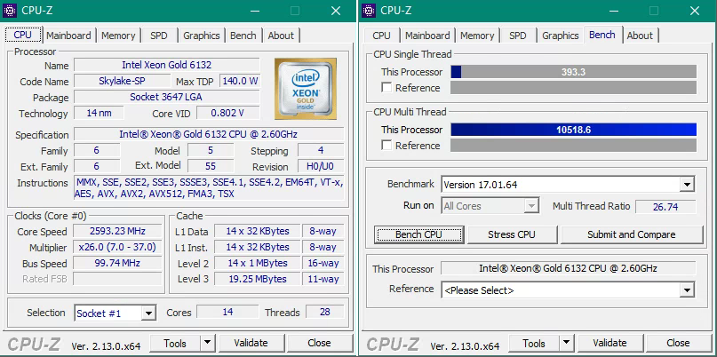
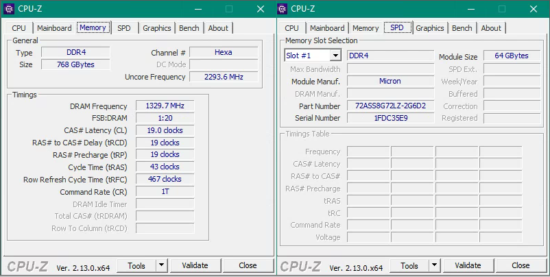
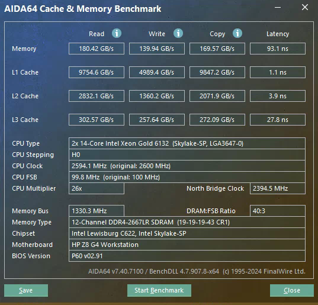
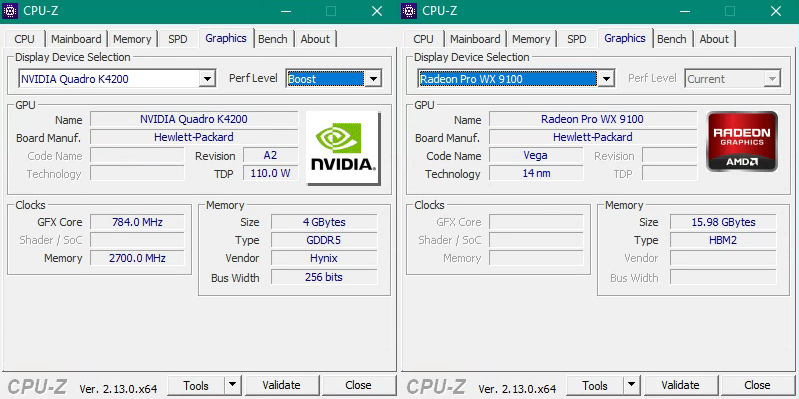
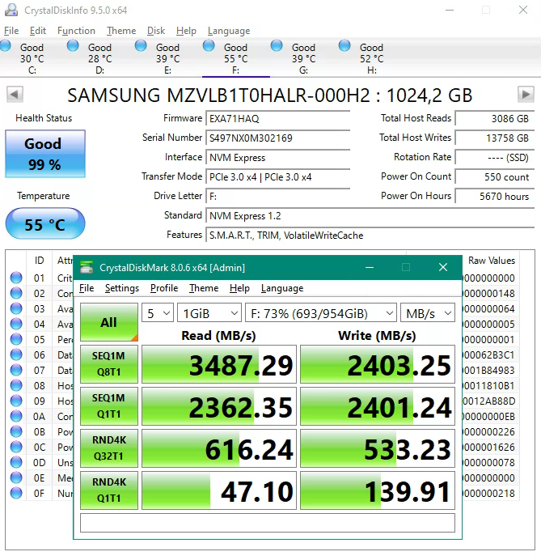
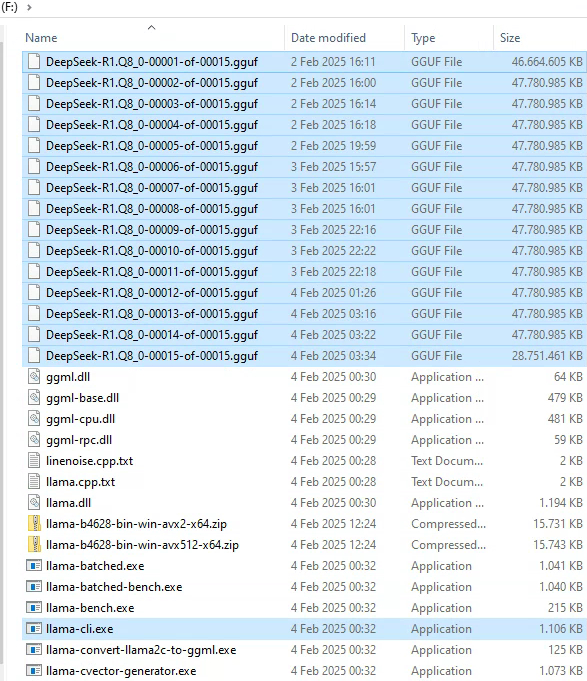
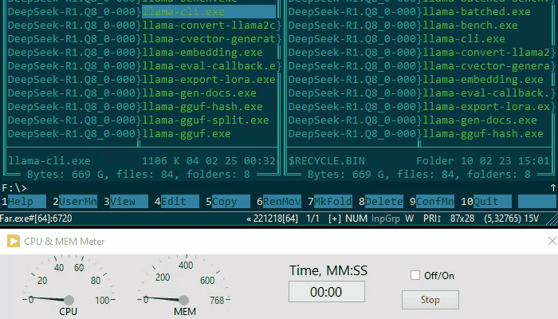
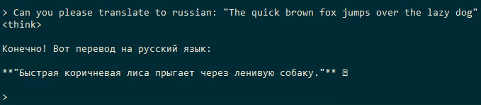
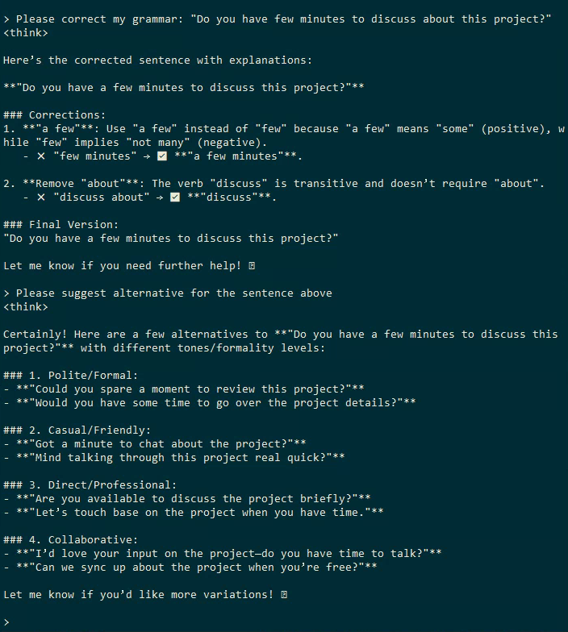
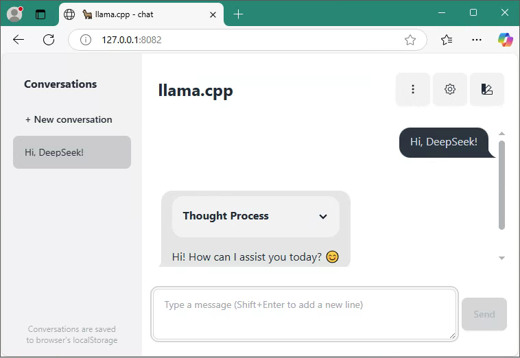

Привер, Хабр!

В копилку постов про DeepSeek, о котором не писал разве что совсем ленивый хочу забросить ещё пять копеек в виде практического отчёта о инсталляции на Xeon, о котором меня попросили в комментариях. Кому любопытно - может заглянуть под кат, ну а тем, кто уже выполнил упражнение по установке - будет совершенно неинтересно.

Прикоснуться к ИИ.

Спойлер для экономии времени читающих - я просто скачаю DeepSeek и запущу его через llama.cpp, на какую-либо научную новизну этот пост совершенно не претендует. Зачем это на хабре? Просто в комментариях к посту "" я спросил "имеете ли смысл попробовать на том железе, что у меня есть", и некоторое количество "плюсиков" говорит о том, что кому-нибудь это будет интересно, ну а раз паззл сложился - о том и пост, просто развёрнутое продолжение к предыдущему. И да, я абсолютный дилетант в LLM, это первая "пристрелка", так что "туториалом" оформлять пост не буду.

Второй спойлер - да это работает. Но очень медленно. Но работает.

### Железо

Упражняться я буду вот на такой конфигурации:

HP z8 G4 рабочая станция примерно пятилетней давности в практически стоковом варианте.

Два процессора Xeon Gold 6132, 768 GB памяти DDR4, терабайтный NVMe SSD Samsung. 

CPU-z выдаёт мне 10000+ попугаев:



Память набрана плашками по 64 ГБ, их там двенадцать штук:



Бенчмарк памяти и кеша я уже в комментах показывал, вынесу сюда тоже:



Видеокарт там две - NVidia Quadro K4200 да AMD Radeon Pro WX 9100, но использоваться как GPU они не будут (смысла в общем нет).



Диск:



Вообще их там четыре таких, но в рейд объединять не буду, модель один раз грузится в память, в принципе и так норм.

Комп остался как тестовый от одного проекта,  в котором надо было быстро обрабатывать полтерабайта картинок, прилетающих от нескольких скоростных камер, теперь просто пылится под столом и эпизодически используется для упражнений.

### Скачиваем DeepSeek R0

Я бы мог просто написать "скачайте DeepSeek", но тут есть небольшой нюанс. Дело в том, что на работе у меня все искусственные интеллекты старательно заблокированы злым админом, охраняющим интеллектуальную собственность. У меня нет онлайн доступа ни к ChatGPT, ни к Perplexity, ни к DeepSeek, равно как все дропбоксы, гуглодрайвы, онлайн заметочники - блокировано решительно всё. Причём не только на уровне прокси, но также фактически осуществляется MITM подменой сертификатов, поэтому скачать с huggingface я ничего не могу, получая отлуп 500. Издержки работы в большой компании. Так что качать я буду дома. А дома у меня всего-навсего 100 Мбит (хоть и оптоволокно), так что процесс не быстрый (планируйте больше суток).

Поскольку репозиторий содержит несколько моделей, то я решил, что я самый умный, и слегка погуглив нашёл способ выдернуть через гит отдельную папку, а не всю репу.

Вот так это делается:

```
git ...
```

Я включил старый комп с файлопомойкой , проверил там свободное место, выполнил команды выше и пошёл спать. Наутро я обнаружил, что туда прилетели обновления и он перезагрузился. Ну, бывает.

Лирическое отступление - если вы хотите временно отказаться от обновлений, то просто включите Metered Network для сетевого адаптера, это самый наипростейший способ.

Я это сделал, и выполнив команды второй раз, обнаружил, что "докачки" там нет и в помине, git начал качать с нуля (это видно в lfs кеше, там сначала файлы складываются во временную папку). Тут я вспомнил, что у меня валяется древний QNAP NAS, там есть качалка, но тут меня ждала другая засада - раз в сутки провайдер сбрасывает соединение, при этом NAS вываливал ошибку и начинал скачку снова. С торрентами он худо-бедно справлялся, а вот с https нет. Я уже хотел было отказаться от затеи, но вы же понимаете — если я во всеуслышание напишу здесь, что не смог скачать шестьсот гиг, то надо мной будет ржать весь хабр, и я буду подвергнут публичному остракизму, так что пришлось расчехлить  менеджер закачек, которым я не пользовался уже много лет.

Я это всё к тому, что если захотите скачать на слабом канале — заранее проверьте, что вы можете уверенно докачивать при обрыве соединения.

Как бы то ни было, вот репозиторий, вот модель, а под спойлером - прямые ссылки на список файлов, которые можно скормить любому менеджеру, я пользовался [JDownloader 2](https://jdownloader.org/download/index). 

```
список
```

Плюс использования менеджера ещё и в том, что днём я могу уменьшить скорость, чтобы не доставлять неудобств домашним, а ночью открывать кран на всю катушку.

Пока идёт скачивание, чтоб было не скучно — могу предложить загадку.

Во второй половине девяностых, мы, новоиспечённые выпускники - физики, подрабатывающие программистами, иногда собирались вместе, распивали крепкие спиртные напитки и иногда смотрели фильмы на видеокассетах. В числе наиболее популярных был фильм, который мы ласково называли не иначе как "это наше кино, про эти, про ГИГАБАЙТЫ!" Угадайте, о каком фильме, выпущенном в середине девяностых, шла речь? Потом спросим у DeepSeek.

Как бы то ни было, через пару дней и ночей на терабайтном диске у меня лежали пятнадцать заветных GGUF файлов. Неся их на работу, испытал странное ощущение — это что же, у меня в руках почти весь взвешенный запас знаний человечества?!

### Запускаем.

Вообще говоря существует несколько способов "запустить" DeepSeek - LM Studio, Ollama, llama.ccp и OpenVINO, часть из них я почерпнул из комментов. Я попробовал навскидку все, но без фанатизма.

Самый наипростейший — LM Studio. Актуальная версия 3.9.6. Я попробовал поставить дома, всё без проблем, как демка скачивается простенькая DeepSeek R1 Distilled (Qwen 7B) на 4 с половиной гига, что позволяет запустить это дело даже на моём древнем ноуте (32 ГБ, процессор i7-4940MX). Я попробовал — даже работает, но очень медленно. Файлы моделей по умолчанию лежат в %USERPROFILE%\\.lmstudio\models\lmstudio-community\, там они в поддиректориях типа \\DeepSeek-R1-Distill-Qwen-7B-GGUF.

Я закинул на диск инсталлятор, но вот на hp z8 меня ждал облом - "тестовая" Qwen 7B хоть и загружалась, но вываливалась в "неизвестную ошибку" после первого же промпта, а с таким трудом выкачанная Q0 отказалась загружаться вовсе, сославшись на нехватку ресурсов. Дальше я пробовать пока не стал и отложил красивую игрушку в сторону.

Ollama в основном рассчитана на то, что скачивать модель вы будете через неё же (что невозможно в моём случае, а перекачивать дома всё ещё раз — тут уж извините), 

```
Welcome to Ollama!

Run your first model:

        ollama run llama3.2

PS C:\Windows\System32> ollama run deepseek-r1:1.5b
pulling manifest
pulling aabd4debf0c8... 100% ▕████████████████████████████████████████▏ 1.1 GB
pulling 369ca498f347... 100% ▕████████████████████████████████████████▏  387 B
pulling 6e4c38e1172f... 100% ▕████████████████████████████████████████▏ 1.1 KB
pulling f4d24e9138dd... 100% ▕████████████████████████████████████████▏  148 B
pulling a85fe2a2e58e... 100% ▕████████████████████████████████████████▏  487 B
verifying sha256 digest
writing manifest
success
>>> hi!
<think>

</think>

Hello! How can I assist you today? 😊
```

так то оно работает, а вот как "подоткнуть" ей уже скачанные файлы GGUF — тут чуть сложнее. То есть место-то где они должны лежать я знаю %USERPROFILE%\\.ollama\models, но там модель надо кидать в папку \blobs, при этом переименовать файл в sha256-<хеш>, кроме того,  надо добавить конфигурационный файл в \manifests\registry\\.ollama.ai\library\deepseek-r1, в общем тут надо "приготовить" модель через 

\> ollama create <your-model-name-here> -f Modelfile, но перед этим вам придётся смержить все пятнадцать файлов вместе через gguf-split --merge infile-00001-of-0000N.gguf outfile.gguf, и в общем ну его в топку такие упражнения.

А вот с llama.ccp всё получилось, и очень просто. Я было приготовился долго и нудно собирать это дело из исходников, но делать это не надо, там есть готовые сборки под Windows. Поскольку у меня железка на Xeon с поддержкой AVX512, вот эту версию я и скачал.

Короче, тупо забрасываем файлы модели и содержимое архива с утилитами в одну папку (прямо в корень диска F:\ в моём случае)



да запускаем:

```
F:\>llama-cli.exe -h
```

Все параметры командной строки (на английском, под спойлером). их там овердофига:

```
----- common params -----

-h,    --help, --usage                  print usage and exit
--version                               show version and build info
--verbose-prompt                        print a verbose prompt before generation (default: false)
-t,    --threads N                      number of threads to use during generation (default: -1)
                                        (env: LLAMA_ARG_THREADS)
-tb,   --threads-batch N                number of threads to use during batch and prompt processing (default:
                                        same as --threads)
-C,    --cpu-mask M                     CPU affinity mask: arbitrarily long hex. Complements cpu-range
                                        (default: "")
-Cr,   --cpu-range lo-hi                range of CPUs for affinity. Complements --cpu-mask
--cpu-strict <0|1>                      use strict CPU placement (default: 0)
--prio N                                set process/thread priority : 0-normal, 1-medium, 2-high, 3-realtime
                                        (default: 0)
--poll <0...100>                        use polling level to wait for work (0 - no polling, default: 50)
-Cb,   --cpu-mask-batch M               CPU affinity mask: arbitrarily long hex. Complements cpu-range-batch
                                        (default: same as --cpu-mask)
-Crb,  --cpu-range-batch lo-hi          ranges of CPUs for affinity. Complements --cpu-mask-batch
--cpu-strict-batch <0|1>                use strict CPU placement (default: same as --cpu-strict)
--prio-batch N                          set process/thread priority : 0-normal, 1-medium, 2-high, 3-realtime
                                        (default: 0)
--poll-batch <0|1>                      use polling to wait for work (default: same as --poll)
-c,    --ctx-size N                     size of the prompt context (default: 4096, 0 = loaded from model)
                                        (env: LLAMA_ARG_CTX_SIZE)
-n,    --predict, --n-predict N         number of tokens to predict (default: -1, -1 = infinity, -2 = until
                                        context filled)
                                        (env: LLAMA_ARG_N_PREDICT)
-b,    --batch-size N                   logical maximum batch size (default: 2048)
                                        (env: LLAMA_ARG_BATCH)
-ub,   --ubatch-size N                  physical maximum batch size (default: 512)
                                        (env: LLAMA_ARG_UBATCH)
--keep N                                number of tokens to keep from the initial prompt (default: 0, -1 =
                                        all)
-fa,   --flash-attn                     enable Flash Attention (default: disabled)
                                        (env: LLAMA_ARG_FLASH_ATTN)
-p,    --prompt PROMPT                  prompt to start generation with
                                        if -cnv is set, this will be used as system prompt
--no-perf                               disable internal libllama performance timings (default: false)
                                        (env: LLAMA_ARG_NO_PERF)
-f,    --file FNAME                     a file containing the prompt (default: none)
-bf,   --binary-file FNAME              binary file containing the prompt (default: none)
-e,    --escape                         process escapes sequences (\n, \r, \t, \', \", \\) (default: true)
--no-escape                             do not process escape sequences
--rope-scaling {none,linear,yarn}       RoPE frequency scaling method, defaults to linear unless specified by
                                        the model
                                        (env: LLAMA_ARG_ROPE_SCALING_TYPE)
--rope-scale N                          RoPE context scaling factor, expands context by a factor of N
                                        (env: LLAMA_ARG_ROPE_SCALE)
--rope-freq-base N                      RoPE base frequency, used by NTK-aware scaling (default: loaded from
                                        model)
                                        (env: LLAMA_ARG_ROPE_FREQ_BASE)
--rope-freq-scale N                     RoPE frequency scaling factor, expands context by a factor of 1/N
                                        (env: LLAMA_ARG_ROPE_FREQ_SCALE)
--yarn-orig-ctx N                       YaRN: original context size of model (default: 0 = model training
                                        context size)
                                        (env: LLAMA_ARG_YARN_ORIG_CTX)
--yarn-ext-factor N                     YaRN: extrapolation mix factor (default: -1.0, 0.0 = full
                                        interpolation)
                                        (env: LLAMA_ARG_YARN_EXT_FACTOR)
--yarn-attn-factor N                    YaRN: scale sqrt(t) or attention magnitude (default: 1.0)
                                        (env: LLAMA_ARG_YARN_ATTN_FACTOR)
--yarn-beta-slow N                      YaRN: high correction dim or alpha (default: 1.0)
                                        (env: LLAMA_ARG_YARN_BETA_SLOW)
--yarn-beta-fast N                      YaRN: low correction dim or beta (default: 32.0)
                                        (env: LLAMA_ARG_YARN_BETA_FAST)
-dkvc, --dump-kv-cache                  verbose print of the KV cache
-nkvo, --no-kv-offload                  disable KV offload
                                        (env: LLAMA_ARG_NO_KV_OFFLOAD)
-ctk,  --cache-type-k TYPE              KV cache data type for K
                                        allowed values: f32, f16, bf16, q8_0, q4_0, q4_1, iq4_nl, q5_0, q5_1
                                        (default: f16)
                                        (env: LLAMA_ARG_CACHE_TYPE_K)
-ctv,  --cache-type-v TYPE              KV cache data type for V
                                        allowed values: f32, f16, bf16, q8_0, q4_0, q4_1, iq4_nl, q5_0, q5_1
                                        (default: f16)
                                        (env: LLAMA_ARG_CACHE_TYPE_V)
-dt,   --defrag-thold N                 KV cache defragmentation threshold (default: 0.1, < 0 - disabled)
                                        (env: LLAMA_ARG_DEFRAG_THOLD)
-np,   --parallel N                     number of parallel sequences to decode (default: 1)
                                        (env: LLAMA_ARG_N_PARALLEL)
--rpc SERVERS                           comma separated list of RPC servers
                                        (env: LLAMA_ARG_RPC)
--mlock                                 force system to keep model in RAM rather than swapping or compressing
                                        (env: LLAMA_ARG_MLOCK)
--no-mmap                               do not memory-map model (slower load but may reduce pageouts if not
                                        using mlock)
                                        (env: LLAMA_ARG_NO_MMAP)
--numa TYPE                             attempt optimizations that help on some NUMA systems
                                        - distribute: spread execution evenly over all nodes
                                        - isolate: only spawn threads on CPUs on the node that execution
                                        started on
                                        - numactl: use the CPU map provided by numactl
                                        if run without this previously, it is recommended to drop the system
                                        page cache before using this
                                        see https://github.com/ggerganov/llama.cpp/issues/1437
                                        (env: LLAMA_ARG_NUMA)
-dev,  --device <dev1,dev2,..>          comma-separated list of devices to use for offloading (none = don't
                                        offload)
                                        use --list-devices to see a list of available devices
                                        (env: LLAMA_ARG_DEVICE)
--list-devices                          print list of available devices and exit
-ngl,  --gpu-layers, --n-gpu-layers N   number of layers to store in VRAM
                                        (env: LLAMA_ARG_N_GPU_LAYERS)
-sm,   --split-mode {none,layer,row}    how to split the model across multiple GPUs, one of:
                                        - none: use one GPU only
                                        - layer (default): split layers and KV across GPUs
                                        - row: split rows across GPUs
                                        (env: LLAMA_ARG_SPLIT_MODE)
-ts,   --tensor-split N0,N1,N2,...      fraction of the model to offload to each GPU, comma-separated list of
                                        proportions, e.g. 3,1
                                        (env: LLAMA_ARG_TENSOR_SPLIT)
-mg,   --main-gpu INDEX                 the GPU to use for the model (with split-mode = none), or for
                                        intermediate results and KV (with split-mode = row) (default: 0)
                                        (env: LLAMA_ARG_MAIN_GPU)
--check-tensors                         check model tensor data for invalid values (default: false)
--override-kv KEY=TYPE:VALUE            advanced option to override model metadata by key. may be specified
                                        multiple times.
                                        types: int, float, bool, str. example: --override-kv
                                        tokenizer.ggml.add_bos_token=bool:false
--lora FNAME                            path to LoRA adapter (can be repeated to use multiple adapters)
--lora-scaled FNAME SCALE               path to LoRA adapter with user defined scaling (can be repeated to use
                                        multiple adapters)
--control-vector FNAME                  add a control vector
                                        note: this argument can be repeated to add multiple control vectors
--control-vector-scaled FNAME SCALE     add a control vector with user defined scaling SCALE
                                        note: this argument can be repeated to add multiple scaled control
                                        vectors
--control-vector-layer-range START END
                                        layer range to apply the control vector(s) to, start and end inclusive
-m,    --model FNAME                    model path (default: `models/$filename` with filename from `--hf-file`
                                        or `--model-url` if set, otherwise models/7B/ggml-model-f16.gguf)
                                        (env: LLAMA_ARG_MODEL)
-mu,   --model-url MODEL_URL            model download url (default: unused)
                                        (env: LLAMA_ARG_MODEL_URL)
-hf,   -hfr, --hf-repo <user>/<model>[:quant]
                                        Hugging Face model repository; quant is optional, case-insensitive,
                                        default to Q4_K_M, or falls back to the first file in the repo if
                                        Q4_K_M doesn't exist.
                                        example: unsloth/phi-4-GGUF:q4_k_m
                                        (default: unused)
                                        (env: LLAMA_ARG_HF_REPO)
-hfd,  -hfrd, --hf-repo-draft <user>/<model>[:quant]
                                        Same as --hf-repo, but for the draft model (default: unused)
                                        (env: LLAMA_ARG_HFD_REPO)
-hff,  --hf-file FILE                   Hugging Face model file. If specified, it will override the quant in
                                        --hf-repo (default: unused)
                                        (env: LLAMA_ARG_HF_FILE)
-hfv,  -hfrv, --hf-repo-v <user>/<model>[:quant]
                                        Hugging Face model repository for the vocoder model (default: unused)
                                        (env: LLAMA_ARG_HF_REPO_V)
-hffv, --hf-file-v FILE                 Hugging Face model file for the vocoder model (default: unused)
                                        (env: LLAMA_ARG_HF_FILE_V)
-hft,  --hf-token TOKEN                 Hugging Face access token (default: value from HF_TOKEN environment
                                        variable)
                                        (env: HF_TOKEN)
--log-disable                           Log disable
--log-file FNAME                        Log to file
--log-colors                            Enable colored logging
                                        (env: LLAMA_LOG_COLORS)
-v,    --verbose, --log-verbose         Set verbosity level to infinity (i.e. log all messages, useful for
                                        debugging)
-lv,   --verbosity, --log-verbosity N   Set the verbosity threshold. Messages with a higher verbosity will be
                                        ignored.
                                        (env: LLAMA_LOG_VERBOSITY)
--log-prefix                            Enable prefx in log messages
                                        (env: LLAMA_LOG_PREFIX)
--log-timestamps                        Enable timestamps in log messages
                                        (env: LLAMA_LOG_TIMESTAMPS)


----- sampling params -----

--samplers SAMPLERS                     samplers that will be used for generation in the order, separated by
                                        ';'
                                        (default: penalties;dry;top_k;typ_p;top_p;min_p;xtc;temperature)
-s,    --seed SEED                      RNG seed (default: -1, use random seed for -1)
--sampling-seq, --sampler-seq SEQUENCE
                                        simplified sequence for samplers that will be used (default: edkypmxt)
--ignore-eos                            ignore end of stream token and continue generating (implies
                                        --logit-bias EOS-inf)
--temp N                                temperature (default: 0.8)
--top-k N                               top-k sampling (default: 40, 0 = disabled)
--top-p N                               top-p sampling (default: 0.9, 1.0 = disabled)
--min-p N                               min-p sampling (default: 0.1, 0.0 = disabled)
--xtc-probability N                     xtc probability (default: 0.0, 0.0 = disabled)
--xtc-threshold N                       xtc threshold (default: 0.1, 1.0 = disabled)
--typical N                             locally typical sampling, parameter p (default: 1.0, 1.0 = disabled)
--repeat-last-n N                       last n tokens to consider for penalize (default: 64, 0 = disabled, -1
                                        = ctx_size)
--repeat-penalty N                      penalize repeat sequence of tokens (default: 1.0, 1.0 = disabled)
--presence-penalty N                    repeat alpha presence penalty (default: 0.0, 0.0 = disabled)
--frequency-penalty N                   repeat alpha frequency penalty (default: 0.0, 0.0 = disabled)
--dry-multiplier N                      set DRY sampling multiplier (default: 0.0, 0.0 = disabled)
--dry-base N                            set DRY sampling base value (default: 1.75)
--dry-allowed-length N                  set allowed length for DRY sampling (default: 2)
--dry-penalty-last-n N                  set DRY penalty for the last n tokens (default: -1, 0 = disable, -1 =
                                        context size)
--dry-sequence-breaker STRING           add sequence breaker for DRY sampling, clearing out default breakers
                                        ('\n', ':', '"', '*') in the process; use "none" to not use any
                                        sequence breakers
--dynatemp-range N                      dynamic temperature range (default: 0.0, 0.0 = disabled)
--dynatemp-exp N                        dynamic temperature exponent (default: 1.0)
--mirostat N                            use Mirostat sampling.
                                        Top K, Nucleus and Locally Typical samplers are ignored if used.
                                        (default: 0, 0 = disabled, 1 = Mirostat, 2 = Mirostat 2.0)
--mirostat-lr N                         Mirostat learning rate, parameter eta (default: 0.1)
--mirostat-ent N                        Mirostat target entropy, parameter tau (default: 5.0)
-l,    --logit-bias TOKEN_ID(+/-)BIAS   modifies the likelihood of token appearing in the completion,
                                        i.e. `--logit-bias 15043+1` to increase likelihood of token ' Hello',
                                        or `--logit-bias 15043-1` to decrease likelihood of token ' Hello'
--grammar GRAMMAR                       BNF-like grammar to constrain generations (see samples in grammars/
                                        dir) (default: '')
--grammar-file FNAME                    file to read grammar from
-j,    --json-schema SCHEMA             JSON schema to constrain generations (https://json-schema.org/), e.g.
                                        `{}` for any JSON object
                                        For schemas w/ external $refs, use --grammar +
                                        example/json_schema_to_grammar.py instead


----- example-specific params -----

--no-display-prompt                     don't print prompt at generation (default: false)
-co,   --color                          colorise output to distinguish prompt and user input from generations
                                        (default: false)
--no-context-shift                      disables context shift on inifinite text generation (default:
                                        disabled)
                                        (env: LLAMA_ARG_NO_CONTEXT_SHIFT)
-ptc,  --print-token-count N            print token count every N tokens (default: -1)
--prompt-cache FNAME                    file to cache prompt state for faster startup (default: none)
--prompt-cache-all                      if specified, saves user input and generations to cache as well
--prompt-cache-ro                       if specified, uses the prompt cache but does not update it
-r,    --reverse-prompt PROMPT          halt generation at PROMPT, return control in interactive mode
-sp,   --special                        special tokens output enabled (default: false)
-cnv,  --conversation                   run in conversation mode:
                                        - does not print special tokens and suffix/prefix
                                        - interactive mode is also enabled
                                        (default: auto enabled if chat template is available)
-no-cnv, --no-conversation              force disable conversation mode (default: false)
-i,    --interactive                    run in interactive mode (default: false)
-if,   --interactive-first              run in interactive mode and wait for input right away (default: false)
-mli,  --multiline-input                allows you to write or paste multiple lines without ending each in '\'
--in-prefix-bos                         prefix BOS to user inputs, preceding the `--in-prefix` string
--in-prefix STRING                      string to prefix user inputs with (default: empty)
--in-suffix STRING                      string to suffix after user inputs with (default: empty)
--no-warmup                             skip warming up the model with an empty run
-gan,  --grp-attn-n N                   group-attention factor (default: 1)
                                        (env: LLAMA_ARG_GRP_ATTN_N)
-gaw,  --grp-attn-w N                   group-attention width (default: 512)
                                        (env: LLAMA_ARG_GRP_ATTN_W)
--jinja                                 use jinja template for chat (default: disabled)
                                        (env: LLAMA_ARG_JINJA)
--chat-template JINJA_TEMPLATE          set custom jinja chat template (default: template taken from model's
                                        metadata)
                                        if suffix/prefix are specified, template will be disabled
                                        only commonly used templates are accepted (unless --jinja is set
                                        before this flag):
                                        list of built-in templates:
                                        chatglm3, chatglm4, chatml, command-r, deepseek, deepseek2, deepseek3,
                                        exaone3, falcon3, gemma, gigachat, glmedge, granite, llama2,
                                        llama2-sys, llama2-sys-bos, llama2-sys-strip, llama3, megrez, minicpm,
                                        mistral-v1, mistral-v3, mistral-v3-tekken, mistral-v7, monarch,
                                        openchat, orion, phi3, phi4, rwkv-world, vicuna, vicuna-orca, zephyr
                                        (env: LLAMA_ARG_CHAT_TEMPLATE)
--chat-template-file JINJA_TEMPLATE_FILE
                                        set custom jinja chat template file (default: template taken from
                                        model's metadata)
                                        if suffix/prefix are specified, template will be disabled
                                        only commonly used templates are accepted (unless --jinja is set
                                        before this flag):
                                        list of built-in templates:
                                        chatglm3, chatglm4, chatml, command-r, deepseek, deepseek2, deepseek3,
                                        exaone3, falcon3, gemma, gigachat, glmedge, granite, llama2,
                                        llama2-sys, llama2-sys-bos, llama2-sys-strip, llama3, megrez, minicpm,
                                        mistral-v1, mistral-v3, mistral-v3-tekken, mistral-v7, monarch,
                                        openchat, orion, phi3, phi4, rwkv-world, vicuna, vicuna-orca, zephyr
                                        (env: LLAMA_ARG_CHAT_TEMPLATE_FILE)
--simple-io                             use basic IO for better compatibility in subprocesses and limited
                                        consoles

example usage:

  text generation:     llama-cli.exe -m your_model.gguf -p "I believe the meaning of life is" -n 128

  chat (conversation): llama-cli.exe -m your_model.gguf -p "You are a helpful assistant" -cnv


```

### "Работаем"

Ну вот прям "работой" это назвать сложно, потому что это всё отчаянно медленно.

Сразу после запуска модель целиком в память не грузится, она как бы "догружается" при общении.

При первом "холодном" старте до появления приглашения проходит почти две минуты.

Я смастерил такую вот несложную оснастку, показывающую загрузку памяти и процессора, ну и таймер до кучи, что б вы прочувствовали эту боль (я ещё вырезал примерно минуту, пока часть модели грузилась с диска в память, остальное оставлю в реальном времени как есть):



Как видите, память заполнилась примерно на треть.

Если вводить следующие вопросы, то модель будет догружаться. Нет смысла мучить вас медленным выводом, я буду снимать кадр в секунду, проигрывая гифку с примерно двадцатикратным ускорением. Попросим у неё Рунге-Кутта, хорошо видно, как она на ходу заполняет семьсот гигабайт памяти почти под завязку:


На всё про всё у неё ушло десять минут реального времени. Процессор был занят чуть больше чем на половину, тут возможно либо гипертрединг, либо то, что мы упираемся в пропускную способность памяти — как отметили в комментах к изначальному посту с точки зрения эффективности не очень хорошо иметь два процессора, конкурирующих за общую память.

Полный вывод:

> Hi, DeepSeek!
> <think>

Hi! How can I assist you today?

> Can you please provide C code of Runge Kutta Method for (x-y)/(x+y)?
> <think>

Certainly! The Runge-Kutta method is a numerical technique used to solve ordinary differential equations (ODEs). For the differential equation dy/dx = (x - y)/(x + y), we can apply the 4th-order Runge-Kutta method (RK4). Here's a C code implementation:

```c
#include <stdio.h>
#include <math.h>

// Define the differential equation dy/dx = (x - y)/(x + y)
double f(double x, double y) {
    return (x - y) / (x + y);
}

// 4th-order Runge-Kutta method
void rungeKutta4(double x0, double y0, double h, double x_target) {
    double x = x0;
    double y = y0;
    double k1, k2, k3, k4;

    printf("Initial conditions: x = %lf, y = %lf\n", x, y);

    while (x < x_target) {
        if (x + h > x_target) {
            h = x_target - x; // Adjust step to reach x_target exactly
        }

        k1 = h * f(x, y);
        k2 = h * f(x + h/2, y + k1/2);
        k3 = h * f(x + h/2, y + k2/2);
        k4 = h * f(x + h, y + k3);

        y = y + (k1 + 2*k2 + 2*k3 + k4)/6;
        x = x + h;

        printf("x = %lf, y = %lf\n", x, y);
    }
}

int main() {
    double x0 = 1.0;   // Initial x
    double y0 = 0.0;   // Initial y
    double h = 0.1;    // Step size
    double x_target = 2.0; // Target x value

    rungeKutta4(x0, y0, h, x_target);
    return 0;
}
```

**Important Notes:**
1. **Initial Conditions:** The current example uses `x0=1.0`, `y0=0.0`, step size `h=0.1`, and integrates up to `x_target=2.0`. Adjust these values as needed.
2. **Division by Zero:** The function `f(x,y)` will have a division by zero if `x + y = 0`. Ensure your initial conditions and step size avoid this scenario.
3. **Adaptive Step Size:** For better accuracy, you might want to implement adaptive step size control, but this example uses a fixed step size for simplicity.
4. **Output:** The code prints the solution at each step. Modify the `printf` statements as needed for your use case.

Let me know if you need further clarification! 

>

Есть как минимум два способа запустить DeepSeek. Выше я показал режим "text generation:"

Второй режим называется  "chat (conversation)", включается флагом -cnv

```
llama-cli.exe -m DeepSeek-R1.Q8_0-00001-of-00015.gguf -p "You are a helpful assistant" -cnv
```

В этом режиме она чуть более "разговорчива", но и занимает это раза в полтора больше времени. Кроме того она формулы выдала красиво оформленными.

А, стоп, я ж могу её саму спросить про отличие этих режимов:

#### Разница между режимами «генерация текста» и «чат (диалог)» в llama.cpp
Основные отличия связаны с форматом ввода, специализацией модели и сценариями использования. Разберём подробно:

1. Режим генерации текста

  * Цель: Свободное продолжение текста (например, рассказы, код, эссе).
  * Формат ввода:

  * Произвольный текст без разметки диалога.

  * Пример: ./main -m model.bin -p "Будущее ИИ — это"
    Совместимость с моделями:
    Подходит для базовых моделей (не адаптированных для чата, например, llama-7b).
    Воспринимает ввод как самостоятельный промпт, без учёта контекста диалога.
    Вывод:
    Длинный непрерывный текст до условия остановки (максимум токенов, стоп-слово).
    Примеры задач: Креативное письмо, суммаризация, генерация кода.

2. Чат-режим
    Цель: Имитация диалога (например, боты, ассистенты).
    Формат ввода:
    Структурированные реплики с метками (например, [INST], <<SYS>>).
    Пример:
    📋 Copy
    [INST] <<SYS>>Ты полезный ассистент.<</SYS>> Что такое квантовый компьютер? [/INST]
    Используется флаг --chat или шаблоны для автоматического форматирования.
    Совместимость с моделями:
    Оптимизирован для чат-моделей (например, llama-2-7b-chat).
    Использует обучение на диалогах для улучшения ответов.
    Вывод:
    Короткие реплики, останавливается на токенах конца диалога (например, </s>).
    История диалога:
    Автоматически сохраняет контекст (в пределах лимита токенов).
    Примеры задач: Вопрос-ответ, поддержка клиентов, ролевые сценарии.
    Ключевые различия
    Особенность	Генерация текста	Чат-режим
    Структура ввода	Произвольный текст	Разметка с репликами пользователя и ассистента
    Тип модели	Базовые модели (без чат-дообучения)	Чат-модели (названия с -chat)
    Условия остановки	Макс. токены, стоп-слова	Токены конца реплики (например, </s>)
    Контекст	Управляется вручную	Автоматически добавляется история
    Флаг в команде	По умолчанию	--chat
    Примеры команд
    Генерация текста:
    📋 Copy
    ./main -m llama-7b.bin -p "Объясни машинное обучение:" -n 512
    Чат-режим:
    📋 Copy
    ./main -m llama-2-7b-chat.bin --chat -p "Пользователь: Привет\nАссистент:"
    Полезные советы
    Используйте чат-режим только с моделями, дообученными для диалогов (например, llama-2-chat).
    Для базовых моделей избегайте флага --chat, чтобы не нарушить форматирование.
    Специальные токены (например, system или user) помогают улучшить ответы чат-моделей.
    Если нужны дополнительные пояснения, спрашивайте! 😊

  

> Hi, DeepSeek!
> <think>

Hi! How can I assist you today? �

> Can you please provide C code of Runge Kutta Method for (x-y)/(x+y)?
> <think>

Certainly! To implement the Runge-Kutta method (specifically the 4th order, RK4) for solving the differential equation \( \frac{dy}{dx} = \frac{x - y}{x + y} \), here's a C code example. This code will approximate the solution at a specified point given an initial condition.

```c
#include <stdio.h>
#include <math.h>

// Define the differential equation dy/dx = (x - y)/(x + y)
double f(double x, double y) {
    return (x - y) / (x + y);
}

// Runge-Kutta 4th Order Method
void rungeKutta4(double x0, double y0, double h, double x_target) {
    double x = x0;
    double y = y0;
    double k1, k2, k3, k4;

    printf("Initial point: x = %.4f, y = %.4f\n", x, y);

    while (x < x_target) {
        // Ensure step size doesn't exceed the target
        if (x + h > x_target) {
            h = x_target - x;
        }

        k1 = h * f(x, y);
        k2 = h * f(x + h/2, y + k1/2);
        k3 = h * f(x + h/2, y + k2/2);
        k4 = h * f(x + h, y + k3);

        y = y + (k1 + 2*k2 + 2*k3 + k4)/6;
        x = x + h;

        printf("x = %.4f, y = %.4f\n", x, y);
    }
}

int main() {
    double x0 = 1.0;  // Initial x
    double y0 = 0.0;  // Initial y
    double h = 0.2;    // Step size
    double x_target = 2.0; // Target x to approximate y

    rungeKutta4(x0, y0, h, x_target);

    return 0;
}
```

### Explanation:
1. **Function `f`**: Implements the differential equation \( \frac{dy}{dx} = \frac{x - y}{x + y} \).
2. **RK4 Method**:
   - Takes initial conditions `(x0, y0)`, step size `h`, and target `x_target`.
   - Iteratively computes the next y using the RK4 formulas:
     [
     k_1 = h \cdot f(x_n, y_n),
     ]
     [
     $$
     k_2 = h \cdot f(x_n + \frac{h}{2}, y_n + \frac{k_1}{2}),
     $$
     ]
     [
     k_3 = h \cdot f(x_n + \frac{h}{2}, y_n + \frac{k_2}{2}),
     ]
     [
     k_4 = h \cdot f(x_n + h, y_n + k_3),
     ]
     [
     y_{n+1} = y_n + \frac{1}{6}(k_1 + 2k_2 + 2k_3 + k_4).
     ]
   - Adjusts the step size near the target to avoid overshooting.

### Usage:
- Modify `x0`, `y0`, `h`, and `x_target` in `main()` as needed.
- Compile with `gcc -o rk4 rk4.c -lm` (ensure math library linkage).

Let me know if you need further adjustments! �

>

Русский понимает:



Грамматику правит, альтернативы предлагает:



В стихах тоже может. Похоже, моя деловая корреспонденция станет несколько разнообразнее.

Короче у меня под столом завёлся личный секретарь, хоть и чутка тормознутый. При завершении работы выдаёт статистику, около одного токена в секунду:

llama_perf_sampler_print:    sampling time =      52.33 ms /   209 runs   ( 0.25 ms per token,  3993.66 tokens per second)
llama_perf_context_print:        load time =   89790.30 ms
llama_perf_context_print: prompt eval time =   87115.12 ms /   112 tokens (  777.81 ms per token,     1.29 tokens per second)
llama_perf_context_print:        eval time = 1883493.69 ms /  1777 runs   ( 1059.93 ms per token,     0.94 tokens per second)
llama_perf_context_print:       total time = 3136520.40 ms /  1889 tokens

Кому не нравится консоль, можно запустить и вот так:

```
llama-server.exe -m DeepSeek-R1.Q8_0-00001-of-00015.gguf --port 8082
```

Эта штука поднимет веб сервер (по умолчанию на порту 8080, но он у меня занят, так что 8082):



Но впечатляет, даже несмотря на низкую скорость.