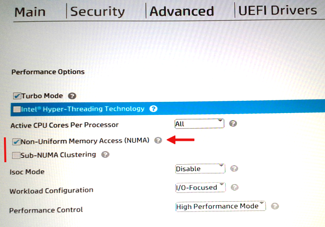

Спойлер для экономии времени читающих - я просто скачаю DeepSeek и запущу его через llama.cpp, на какую-либо научную новизну этот пост совершенно не претендует. Зачем это на хабре? Просто в комментариях к посту "Мануал по запуску полной модели DeepSeek-R1 локально" я спросил "имеете ли смысл попробовать на том железе, что у меня есть", и некоторое количество "плюсиков" говорит о том, что кому-нибудь это будет интересно, ну а раз паззл сложился — о том и пост, просто развёрнутое продолжение к предыдущему. И да, я абсолютный дилетант в LLM, это первая "пристрелка", так что "туториалом" оформлять пост не буду.

Второй спойлер - да это работает. Но очень медленно. Но работает.

## Железо

Упражняться я буду вот на такой конфигурации:
HP z8 G4 рабочая станция примерно пятилетней давности в практически стоковом варианте.
Два процессора [Xeon Gold 6132](https://www.intel.de/content/www/de/de/products/sku/123541/intel-xeon-gold-6132-processor-19-25m-cache-2-60-ghz/specifications.html), 768 GB памяти DDR4, терабайтный NVMe SSD Samsung. 
. 
CPU-z выдаёт мне 10000+ попугаев:

Память набрана плашками по 64 ГБ, их там двенадцать штук:

Бенчмарк памяти и кеша я уже в комментах показывал, вынесу сюда тоже:

Видеокарт там две - NVidia Quadro K4200 да AMD Radeon Pro WX 9100, но использоваться как GPU они не будут (смысла в общем нет).

Диск:

Вообще их там четыре таких, но в рейд объединять не буду, модель один раз грузится в память, в принципе и так норм.

Комп остался как тестовый от одного проекта,  в котором надо было быстро обрабатывать полтерабайта картинок, прилетающих от нескольких скоростных камер, теперь просто пылится под столом и эпизодически используется для упражнений.

## Скачиваем DeepSeek 

Я бы мог просто написать "скачайте DeepSeek R1 Q8_0", но тут есть небольшой нюанс. Дело в том, что на работе у меня все искусственные интеллекты старательно заблокированы злым админом, охраняющим интеллектуальную собственность. У меня нет онлайн доступа ни к ChatGPT, ни к Perplexity, ни к DeepSeek, равно как все дропбоксы, гуглодрайвы, онлайн заметочники - блокировано решительно всё. Причём не только на уровне прокси, но также фактически осуществляется MITM подменой сертификатов, поэтому скачать с [Hugging Face/Unsloth AI](https://huggingface.co/unsloth) я ничего не могу, получая отлуп 500. Издержки работы в большой компании. Так что качать я буду дома. А дома у меня всего-навсего 100 Мбит (хоть и оптоволокно), так что процесс не быстрый (планируйте как минимум сутки).

Поскольку репозиторий содержит несколько моделей, то я решил, что я самый умный, и слегка погуглив нашёл способ выдернуть через гит отдельную папку, а не всю репу.

Вот так это делается:

Я включил старый комп с файлопомойкой, проверил там свободное место, выполнил команды выше и пошёл спать. Наутро я обнаружил, что туда прилетели обновления и он перезагрузился. Ну, бывает, я и забыл, что незадолго до этого поставил туда свежую Windows да не настроил как следует.

Лирическое отступление — если вы хотите временно отказаться от обновлений и возможных сопутствующих перезагрузок, то просто включите Metered connection (по-немецки Getaktete Verbindung) для сетевого адаптера, это самый наипростейший способ.

Я это сделал, и выполнив команды второй раз, обнаружил, что "докачки" там нет и в помине, git начал качать с нуля (это видно в lfs кеше, там сначала файлы складываются во временную папку). Тут я вспомнил, что у меня валяется древний QNAP NAS, там есть качалка, но тут меня ждала другая засада — раз в сутки провайдер сбрасывает соединение, при этом NAS вываливал ошибку и начинал скачку снова. С торрентами он худо-бедно справлялся, а вот с https — нет. Я уже хотел было отказаться от затеи, но вы же понимаете — если я во всеуслышание напишу здесь, что не смог скачать шестьсот гиг, то надо мной будет ржать весь хабр, и я буду подвергнут публичному остракизму, так что пришлось расчехлить  менеджер закачек, которым я не пользовался уже много лет.

Я это всё к тому, что если захотите скачать на слабом канале — заранее проверьте, что вы можете уверенно докачивать при обрыве соединения.

Как бы то ни было, вот репозиторий [DeepSeek-R1-GGUF](https://huggingface.co/unsloth/DeepSeek-R1-GGUF/tree/main), вот модель [DeepSeek-R1-Q8_0](https://huggingface.co/unsloth/DeepSeek-R1-GGUF/tree/main/DeepSeek-R1-Q8_0), а под спойлером - прямые ссылки на список файлов, которые можно скормить любому менеджеру, я пользовался [JDownloader 2](https://jdownloader.org/download/index).

<spoiler title="DeepSeek-R1.Q8_0-000??-of-00015.gguf">

```

https://huggingface.co/unsloth/DeepSeek-R1-GGUF/resolve/main/DeepSeek-R1-Q8_0/DeepSeek-R1.Q8_0-00001-of-00015.gguf?download=true
https://huggingface.co/unsloth/DeepSeek-R1-GGUF/resolve/main/DeepSeek-R1-Q8_0/DeepSeek-R1.Q8_0-00002-of-00015.gguf?download=true
https://huggingface.co/unsloth/DeepSeek-R1-GGUF/resolve/main/DeepSeek-R1-Q8_0/DeepSeek-R1.Q8_0-00003-of-00015.gguf?download=true
https://huggingface.co/unsloth/DeepSeek-R1-GGUF/resolve/main/DeepSeek-R1-Q8_0/DeepSeek-R1.Q8_0-00004-of-00015.gguf?download=true
https://huggingface.co/unsloth/DeepSeek-R1-GGUF/resolve/main/DeepSeek-R1-Q8_0/DeepSeek-R1.Q8_0-00005-of-00015.gguf?download=true
https://huggingface.co/unsloth/DeepSeek-R1-GGUF/resolve/main/DeepSeek-R1-Q8_0/DeepSeek-R1.Q8_0-00006-of-00015.gguf?download=true
https://huggingface.co/unsloth/DeepSeek-R1-GGUF/resolve/main/DeepSeek-R1-Q8_0/DeepSeek-R1.Q8_0-00007-of-00015.gguf?download=true
https://huggingface.co/unsloth/DeepSeek-R1-GGUF/resolve/main/DeepSeek-R1-Q8_0/DeepSeek-R1.Q8_0-00008-of-00015.gguf?download=true
https://huggingface.co/unsloth/DeepSeek-R1-GGUF/resolve/main/DeepSeek-R1-Q8_0/DeepSeek-R1.Q8_0-00009-of-00015.gguf?download=true
https://huggingface.co/unsloth/DeepSeek-R1-GGUF/resolve/main/DeepSeek-R1-Q8_0/DeepSeek-R1.Q8_0-00010-of-00015.gguf?download=true
https://huggingface.co/unsloth/DeepSeek-R1-GGUF/resolve/main/DeepSeek-R1-Q8_0/DeepSeek-R1.Q8_0-00011-of-00015.gguf?download=true
https://huggingface.co/unsloth/DeepSeek-R1-GGUF/resolve/main/DeepSeek-R1-Q8_0/DeepSeek-R1.Q8_0-00012-of-00015.gguf?download=true
https://huggingface.co/unsloth/DeepSeek-R1-GGUF/resolve/main/DeepSeek-R1-Q8_0/DeepSeek-R1.Q8_0-00013-of-00015.gguf?download=true
https://huggingface.co/unsloth/DeepSeek-R1-GGUF/resolve/main/DeepSeek-R1-Q8_0/DeepSeek-R1.Q8_0-00014-of-00015.gguf?download=true
https://huggingface.co/unsloth/DeepSeek-R1-GGUF/resolve/main/DeepSeek-R1-Q8_0/DeepSeek-R1.Q8_0-00015-of-00015.gguf?download=true

```

</spoiler>

Плюс использования менеджера ещё и в том, что днём я могу уменьшить скорость, чтобы не доставлять неудобств домашним, а ночью "открывать кран" на всю катушку.

Пока идёт скачивание, чтоб было не скучно — могу предложить загадку.

Во второй половине девяностых, мы, новоиспечённые выпускники — физики, иногда собирались вместе, распивали крепкие спиртные напитки и иногда смотрели фильмы на видеокассетах. В числе наиболее популярных был фильм, который мы, подрабатывающие программистами, ласково называли не иначе как "это наше кино, про эти, про ГИГАБАЙТЫ!" Угадайте, о каком фильме, выпущенном в середине девяностых, шла речь? Потом спросим у DeepSeek.

Как бы то ни было, через пару дней и ночей на терабайтном диске у меня лежали пятнадцать заветных GGUF файлов. Бережно неся их на работу, испытал странное ощущение — это что же, у меня в руках почти вся взвешенная квинтэссенция знаний человечества?! Мда.

## Запускаем.

Вообще говоря существует несколько способов "запустить" DeepSeek локально — LM Studio, Ollama, llama.ccp и OpenVINO, часть из них я почерпнул из комментов, за что спасибо. Я попробовал навскидку все, но без фанатизма.

Самый наипростейший, вероятно — [LM Studio](https://lmstudio.ai). Актуальная версия на момент написания поста — [0.3.9](https://installers.lmstudio.ai/win32/x64/0.3.9-6/LM-Studio-0.3.9-6-x64.exe). Я попробовал поставить дома, всё без проблем, как демка скачивается простенькая [DeepSeek-R1-Distill-Qwen-7B-Q4_K_M.gguf](https://huggingface.co/unsloth/DeepSeek-R1-Distill-Qwen-7B-GGUF) на 4 с половиной гига, что позволяет запустить это дело даже на моём древнем ноуте (32 ГБ, процессор i7-4940MX). Я попробовал — даже работает, но очень медленно. Файлы моделей по умолчанию лежат в %USERPROFILE%\\.lmstudio\models\lmstudio-community\, там они в поддиректориях типа \\DeepSeek-R1-Distill-Qwen-7B-GGUF.

Я закинул на диск инсталлятор, но вот на hp z8 прилетела и уселась птичка обломинго — "тестовая" Qwen 7B хоть и загружалась, но вываливалась в "неизвестную ошибку" после первого же промпта, а с таким трудом выкачанная Q8_0 отказалась загружаться вовсе, сославшись на нехватку ресурсов (выгрузку в GPU я отключил, не помогло). Дальше я мучить её пока не стал и отложил красивую игрушку в сторону.

[Ollama](https://ollama.com) в основном рассчитана на то, что скачивать модель вы будете через неё же (что невозможно в моём случае, а перекачивать дома всё ещё раз — тут уж извините), 

```
Welcome to Ollama!
Run your first model:

        ollama run llama3.2

PS C:\Windows\System32> ollama run deepseek-r1:1.5b
pulling manifest
pulling aabd4debf0c8... 100% ▕████████████████████████████████▏ 1.1 GB
pulling 369ca498f347... 100% ▕████████████████████████████████▏  387 B
pulling 6e4c38e1172f... 100% ▕████████████████████████████████▏ 1.1 KB
verifying sha256 digest, writing manifest, success
>>> hi!
<think>

</think>

Hello! How can I assist you today? 😊
```
так то оно работает, а вот как "подоткнуть" ей уже заранее скачанные файлы GGUF — тут чуть сложнее. То есть место-то где они должны лежать я знаю: %USERPROFILE%\\.ollama\models, но там модель надо кидать в папку \blobs, при этом переименовать файл в sha256-<хеш>, кроме того,  надо добавить конфигурационный файл в \manifests\registry\\.ollama.ai\library\deepseek-r1, в общем тут надо "приготовить" модель через 
"ollama create <your-model-name-here> -f DeepSeek-R1.gguf", но перед этим вам придётся смержить все пятнадцать файлов вместе через "gguf-split --merge DeepSeek-R1.Q8_0-00001-of-00015.gguf DeepSeek-R1.gguf", и в общем ну его в топку такие упражнения.

А вот с llama.ccp всё получилось, и очень просто. Я было приготовился долго и нудно собирать это дело из исходников, но делать это не надо, там есть готовые сборки под Windows. Поскольку у меня железка на Xeon с поддержкой AVX512, вот эту версию я и скачал для начала.

Короче, тупо забрасываем файлы модели и содержимое архива с утилитами в одну папку (прямо в корень диска F:\ в моём случае)
Все параметры командной строки (на английском, под спойлером). их там овердофига:

<spoiler title="llama-cli.exe -h">

```
example usage:

  text generation:     llama-cli.exe -m your_model.gguf -p "Hi!" -n 128
  chat (conversation): llama-cli.exe -m your_model.gguf -p "Hello!" -cnv

----- common params -----

-h,    --help, --usage                  print usage and exit
--version                               show version and build info
--verbose-prompt                        print a verbose prompt before generation (default: false)
-t,    --threads N                      number of threads to use during generation (default: -1)
                                        (env: LLAMA_ARG_THREADS)
-tb,   --threads-batch N                number of threads to use during batch and prompt processing (default:
                                        same as --threads)
-C,    --cpu-mask M                     CPU affinity mask: arbitrarily long hex. Complements cpu-range
                                        (default: "")
-Cr,   --cpu-range lo-hi                range of CPUs for affinity. Complements --cpu-mask
--cpu-strict <0|1>                      use strict CPU placement (default: 0)
--prio N                                set process/thread priority : 0-normal, 1-medium, 2-high, 3-realtime
                                        (default: 0)
--poll <0...100>                        use polling level to wait for work (0 - no polling, default: 50)
-Cb,   --cpu-mask-batch M               CPU affinity mask: arbitrarily long hex. Complements cpu-range-batch
                                        (default: same as --cpu-mask)
-Crb,  --cpu-range-batch lo-hi          ranges of CPUs for affinity. Complements --cpu-mask-batch
--cpu-strict-batch <0|1>                use strict CPU placement (default: same as --cpu-strict)
--prio-batch N                          set process/thread priority : 0-normal, 1-medium, 2-high, 3-realtime
                                        (default: 0)
--poll-batch <0|1>                      use polling to wait for work (default: same as --poll)
-c,    --ctx-size N                     size of the prompt context (default: 4096, 0 = loaded from model)
                                        (env: LLAMA_ARG_CTX_SIZE)
-n,    --predict, --n-predict N         number of tokens to predict (default: -1, -1 = infinity, -2 = until
                                        context filled)
                                        (env: LLAMA_ARG_N_PREDICT)
-b,    --batch-size N                   logical maximum batch size (default: 2048)
                                        (env: LLAMA_ARG_BATCH)
-ub,   --ubatch-size N                  physical maximum batch size (default: 512)
                                        (env: LLAMA_ARG_UBATCH)
--keep N                                number of tokens to keep from the initial prompt (default: 0, -1 =
                                        all)
-fa,   --flash-attn                     enable Flash Attention (default: disabled)
                                        (env: LLAMA_ARG_FLASH_ATTN)
-p,    --prompt PROMPT                  prompt to start generation with
                                        if -cnv is set, this will be used as system prompt
--no-perf                               disable internal libllama performance timings (default: false)
                                        (env: LLAMA_ARG_NO_PERF)
-f,    --file FNAME                     a file containing the prompt (default: none)
-bf,   --binary-file FNAME              binary file containing the prompt (default: none)
-e,    --escape                         process escapes sequences (\n, \r, \t, \', \", \\) (default: true)
--no-escape                             do not process escape sequences
--rope-scaling {none,linear,yarn}       RoPE frequency scaling method, defaults to linear unless specified by
                                        the model
                                        (env: LLAMA_ARG_ROPE_SCALING_TYPE)
--rope-scale N                          RoPE context scaling factor, expands context by a factor of N
                                        (env: LLAMA_ARG_ROPE_SCALE)
--rope-freq-base N                      RoPE base frequency, used by NTK-aware scaling (default: loaded from
                                        model)
                                        (env: LLAMA_ARG_ROPE_FREQ_BASE)
--rope-freq-scale N                     RoPE frequency scaling factor, expands context by a factor of 1/N
                                        (env: LLAMA_ARG_ROPE_FREQ_SCALE)
--yarn-orig-ctx N                       YaRN: original context size of model (default: 0 = model training
                                        context size)
                                        (env: LLAMA_ARG_YARN_ORIG_CTX)
--yarn-ext-factor N                     YaRN: extrapolation mix factor (default: -1.0, 0.0 = full
                                        interpolation)
                                        (env: LLAMA_ARG_YARN_EXT_FACTOR)
--yarn-attn-factor N                    YaRN: scale sqrt(t) or attention magnitude (default: 1.0)
                                        (env: LLAMA_ARG_YARN_ATTN_FACTOR)
--yarn-beta-slow N                      YaRN: high correction dim or alpha (default: 1.0)
                                        (env: LLAMA_ARG_YARN_BETA_SLOW)
--yarn-beta-fast N                      YaRN: low correction dim or beta (default: 32.0)
                                        (env: LLAMA_ARG_YARN_BETA_FAST)
-dkvc, --dump-kv-cache                  verbose print of the KV cache
-nkvo, --no-kv-offload                  disable KV offload
                                        (env: LLAMA_ARG_NO_KV_OFFLOAD)
-ctk,  --cache-type-k TYPE              KV cache data type for K
                                        allowed values: f32, f16, bf16, q8_0, q4_0, q4_1, iq4_nl, q5_0, q5_1
                                        (default: f16)
                                        (env: LLAMA_ARG_CACHE_TYPE_K)
-ctv,  --cache-type-v TYPE              KV cache data type for V
                                        allowed values: f32, f16, bf16, q8_0, q4_0, q4_1, iq4_nl, q5_0, q5_1
                                        (default: f16)
                                        (env: LLAMA_ARG_CACHE_TYPE_V)
-dt,   --defrag-thold N                 KV cache defragmentation threshold (default: 0.1, < 0 - disabled)
                                        (env: LLAMA_ARG_DEFRAG_THOLD)
-np,   --parallel N                     number of parallel sequences to decode (default: 1)
                                        (env: LLAMA_ARG_N_PARALLEL)
--rpc SERVERS                           comma separated list of RPC servers
                                        (env: LLAMA_ARG_RPC)
--mlock                                 force system to keep model in RAM rather than swapping or compressing
                                        (env: LLAMA_ARG_MLOCK)
--no-mmap                               do not memory-map model (slower load but may reduce pageouts if not
                                        using mlock)
                                        (env: LLAMA_ARG_NO_MMAP)
--numa TYPE                             attempt optimizations that help on some NUMA systems
                                        - distribute: spread execution evenly over all nodes
                                        - isolate: only spawn threads on CPUs on the node that execution
                                        started on
                                        - numactl: use the CPU map provided by numactl
                                        if run without this previously, it is recommended to drop the system
                                        page cache before using this
                                        see https://github.com/ggerganov/llama.cpp/issues/1437
                                        (env: LLAMA_ARG_NUMA)
-dev,  --device <dev1,dev2,..>          comma-separated list of devices to use for offloading (none = don't
                                        offload)
                                        use --list-devices to see a list of available devices
                                        (env: LLAMA_ARG_DEVICE)
--list-devices                          print list of available devices and exit
-ngl,  --gpu-layers, --n-gpu-layers N   number of layers to store in VRAM
                                        (env: LLAMA_ARG_N_GPU_LAYERS)
-sm,   --split-mode {none,layer,row}    how to split the model across multiple GPUs, one of:
                                        - none: use one GPU only
                                        - layer (default): split layers and KV across GPUs
                                        - row: split rows across GPUs
                                        (env: LLAMA_ARG_SPLIT_MODE)
-ts,   --tensor-split N0,N1,N2,...      fraction of the model to offload to each GPU, comma-separated list of
                                        proportions, e.g. 3,1
                                        (env: LLAMA_ARG_TENSOR_SPLIT)
-mg,   --main-gpu INDEX                 the GPU to use for the model (with split-mode = none), or for
                                        intermediate results and KV (with split-mode = row) (default: 0)
                                        (env: LLAMA_ARG_MAIN_GPU)
--check-tensors                         check model tensor data for invalid values (default: false)
--override-kv KEY=TYPE:VALUE            advanced option to override model metadata by key. may be specified
                                        multiple times.
                                        types: int, float, bool, str. example: --override-kv
                                        tokenizer.ggml.add_bos_token=bool:false
--lora FNAME                            path to LoRA adapter (can be repeated to use multiple adapters)
--lora-scaled FNAME SCALE               path to LoRA adapter with user defined scaling (can be repeated to use
                                        multiple adapters)
--control-vector FNAME                  add a control vector
                                        note: this argument can be repeated to add multiple control vectors
--control-vector-scaled FNAME SCALE     add a control vector with user defined scaling SCALE
                                        note: this argument can be repeated to add multiple scaled control
                                        vectors
--control-vector-layer-range START END
                                        layer range to apply the control vector(s) to, start and end inclusive
-m,    --model FNAME                    model path (default: `models/$filename` with filename from `--hf-file`
                                        or `--model-url` if set, otherwise models/7B/ggml-model-f16.gguf)
                                        (env: LLAMA_ARG_MODEL)
-mu,   --model-url MODEL_URL            model download url (default: unused)
                                        (env: LLAMA_ARG_MODEL_URL)
-hf,   -hfr, --hf-repo <user>/<model>[:quant]
                                        Hugging Face model repository; quant is optional, case-insensitive,
                                        default to Q4_K_M, or falls back to the first file in the repo if
                                        Q4_K_M doesn't exist.
                                        example: unsloth/phi-4-GGUF:q4_k_m
                                        (default: unused)
                                        (env: LLAMA_ARG_HF_REPO)
-hfd,  -hfrd, --hf-repo-draft <user>/<model>[:quant]
                                        Same as --hf-repo, but for the draft model (default: unused)
                                        (env: LLAMA_ARG_HFD_REPO)
-hff,  --hf-file FILE                   Hugging Face model file. If specified, it will override the quant in
                                        --hf-repo (default: unused)
                                        (env: LLAMA_ARG_HF_FILE)
-hfv,  -hfrv, --hf-repo-v <user>/<model>[:quant]
                                        Hugging Face model repository for the vocoder model (default: unused)
                                        (env: LLAMA_ARG_HF_REPO_V)
-hffv, --hf-file-v FILE                 Hugging Face model file for the vocoder model (default: unused)
                                        (env: LLAMA_ARG_HF_FILE_V)
-hft,  --hf-token TOKEN                 Hugging Face access token (default: value from HF_TOKEN environment
                                        variable)
                                        (env: HF_TOKEN)
--log-disable                           Log disable
--log-file FNAME                        Log to file
--log-colors                            Enable colored logging
                                        (env: LLAMA_LOG_COLORS)
-v,    --verbose, --log-verbose         Set verbosity level to infinity (i.e. log all messages, useful for
                                        debugging)
-lv,   --verbosity, --log-verbosity N   Set the verbosity threshold. Messages with a higher verbosity will be
                                        ignored.
                                        (env: LLAMA_LOG_VERBOSITY)
--log-prefix                            Enable prefx in log messages
                                        (env: LLAMA_LOG_PREFIX)
--log-timestamps                        Enable timestamps in log messages
                                        (env: LLAMA_LOG_TIMESTAMPS)


----- sampling params -----

--samplers SAMPLERS                     samplers that will be used for generation in the order, separated by
                                        ';'
                                        (default: penalties;dry;top_k;typ_p;top_p;min_p;xtc;temperature)
-s,    --seed SEED                      RNG seed (default: -1, use random seed for -1)
--sampling-seq, --sampler-seq SEQUENCE
                                        simplified sequence for samplers that will be used (default: edkypmxt)
--ignore-eos                            ignore end of stream token and continue generating (implies
                                        --logit-bias EOS-inf)
--temp N                                temperature (default: 0.8)
--top-k N                               top-k sampling (default: 40, 0 = disabled)
--top-p N                               top-p sampling (default: 0.9, 1.0 = disabled)
--min-p N                               min-p sampling (default: 0.1, 0.0 = disabled)
--xtc-probability N                     xtc probability (default: 0.0, 0.0 = disabled)
--xtc-threshold N                       xtc threshold (default: 0.1, 1.0 = disabled)
--typical N                             locally typical sampling, parameter p (default: 1.0, 1.0 = disabled)
--repeat-last-n N                       last n tokens to consider for penalize (default: 64, 0 = disabled, -1
                                        = ctx_size)
--repeat-penalty N                      penalize repeat sequence of tokens (default: 1.0, 1.0 = disabled)
--presence-penalty N                    repeat alpha presence penalty (default: 0.0, 0.0 = disabled)
--frequency-penalty N                   repeat alpha frequency penalty (default: 0.0, 0.0 = disabled)
--dry-multiplier N                      set DRY sampling multiplier (default: 0.0, 0.0 = disabled)
--dry-base N                            set DRY sampling base value (default: 1.75)
--dry-allowed-length N                  set allowed length for DRY sampling (default: 2)
--dry-penalty-last-n N                  set DRY penalty for the last n tokens (default: -1, 0 = disable, -1 =
                                        context size)
--dry-sequence-breaker STRING           add sequence breaker for DRY sampling, clearing out default breakers
                                        ('\n', ':', '"', '*') in the process; use "none" to not use any
                                        sequence breakers
--dynatemp-range N                      dynamic temperature range (default: 0.0, 0.0 = disabled)
--dynatemp-exp N                        dynamic temperature exponent (default: 1.0)
--mirostat N                            use Mirostat sampling.
                                        Top K, Nucleus and Locally Typical samplers are ignored if used.
                                        (default: 0, 0 = disabled, 1 = Mirostat, 2 = Mirostat 2.0)
--mirostat-lr N                         Mirostat learning rate, parameter eta (default: 0.1)
--mirostat-ent N                        Mirostat target entropy, parameter tau (default: 5.0)
-l,    --logit-bias TOKEN_ID(+/-)BIAS   modifies the likelihood of token appearing in the completion,
                                        i.e. `--logit-bias 15043+1` to increase likelihood of token ' Hello',
                                        or `--logit-bias 15043-1` to decrease likelihood of token ' Hello'
--grammar GRAMMAR                       BNF-like grammar to constrain generations (see samples in grammars/
                                        dir) (default: '')
--grammar-file FNAME                    file to read grammar from
-j,    --json-schema SCHEMA             JSON schema to constrain generations (https://json-schema.org/), e.g.
                                        `{}` for any JSON object
                                        For schemas w/ external $refs, use --grammar +
                                        example/json_schema_to_grammar.py instead


----- example-specific params -----

--no-display-prompt                     don't print prompt at generation (default: false)
-co,   --color                          colorise output to distinguish prompt and user input from generations
                                        (default: false)
--no-context-shift                      disables context shift on inifinite text generation (default:
                                        disabled)
                                        (env: LLAMA_ARG_NO_CONTEXT_SHIFT)
-ptc,  --print-token-count N            print token count every N tokens (default: -1)
--prompt-cache FNAME                    file to cache prompt state for faster startup (default: none)
--prompt-cache-all                      if specified, saves user input and generations to cache as well
--prompt-cache-ro                       if specified, uses the prompt cache but does not update it
-r,    --reverse-prompt PROMPT          halt generation at PROMPT, return control in interactive mode
-sp,   --special                        special tokens output enabled (default: false)
-cnv,  --conversation                   run in conversation mode:
                                        - does not print special tokens and suffix/prefix
                                        - interactive mode is also enabled
                                        (default: auto enabled if chat template is available)
-no-cnv, --no-conversation              force disable conversation mode (default: false)
-i,    --interactive                    run in interactive mode (default: false)
-if,   --interactive-first              run in interactive mode and wait for input right away (default: false)
-mli,  --multiline-input                allows you to write or paste multiple lines without ending each in '\'
--in-prefix-bos                         prefix BOS to user inputs, preceding the `--in-prefix` string
--in-prefix STRING                      string to prefix user inputs with (default: empty)
--in-suffix STRING                      string to suffix after user inputs with (default: empty)
--no-warmup                             skip warming up the model with an empty run
-gan,  --grp-attn-n N                   group-attention factor (default: 1)
                                        (env: LLAMA_ARG_GRP_ATTN_N)
-gaw,  --grp-attn-w N                   group-attention width (default: 512)
                                        (env: LLAMA_ARG_GRP_ATTN_W)
--jinja                                 use jinja template for chat (default: disabled)
                                        (env: LLAMA_ARG_JINJA)
--chat-template JINJA_TEMPLATE          set custom jinja chat template (default: template taken from model's
                                        metadata)
                                        if suffix/prefix are specified, template will be disabled
                                        only commonly used templates are accepted (unless --jinja is set
                                        before this flag):
                                        list of built-in templates:
                                        chatglm3, chatglm4, chatml, command-r, deepseek, deepseek2, deepseek3,
                                        exaone3, falcon3, gemma, gigachat, glmedge, granite, llama2,
                                        llama2-sys, llama2-sys-bos, llama2-sys-strip, llama3, megrez, minicpm,
                                        mistral-v1, mistral-v3, mistral-v3-tekken, mistral-v7, monarch,
                                        openchat, orion, phi3, phi4, rwkv-world, vicuna, vicuna-orca, zephyr
                                        (env: LLAMA_ARG_CHAT_TEMPLATE)
--chat-template-file JINJA_TEMPLATE_FILE
                                        set custom jinja chat template file (default: template taken from
                                        model's metadata)
                                        if suffix/prefix are specified, template will be disabled
                                        only commonly used templates are accepted (unless --jinja is set
                                        before this flag):
                                        list of built-in templates:
                                        chatglm3, chatglm4, chatml, command-r, deepseek, deepseek2, deepseek3,
                                        exaone3, falcon3, gemma, gigachat, glmedge, granite, llama2,
                                        llama2-sys, llama2-sys-bos, llama2-sys-strip, llama3, megrez, minicpm,
                                        mistral-v1, mistral-v3, mistral-v3-tekken, mistral-v7, monarch,
                                        openchat, orion, phi3, phi4, rwkv-world, vicuna, vicuna-orca, zephyr
                                        (env: LLAMA_ARG_CHAT_TEMPLATE_FILE)
--simple-io                             use basic IO for better compatibility in subprocesses and limited
                                        consoles

example usage:

  text generation:     llama-cli.exe -m your_model.gguf -p "I believe the meaning of life is" -n 128

  chat (conversation): llama-cli.exe -m your_model.gguf -p "You are a helpful assistant" -cnv


```
</spoiler>

## "Работаем"

Ну вот прям "работой" это назвать сложно, потому что это всё отчаянно медленно.

Сразу после запуска модель целиком в память не грузится, она как бы "догружается" при общении.

При первом "холодном" старте до появления приглашения проходит почти две минуты.

Я смастерил такую вот несложную оснастку, показывающую загрузку памяти и процессора, ну и таймер до кучи, что б вы прочувствовали эту боль (я ещё вырезал примерно минуту, пока часть модели грузилась с диска в память, остальное оставлю в реальном времени как есть):

Как видите, память заполнилась примерно на треть после старта и чуть более чем наполовину после первого промпта.

Если вводить следующие вопросы, то модель будет догружаться. Нет смысла мучить вас медленным выводом, я буду снимать кадр в секунду, проигрывая гифку с примерно двадцатикратным ускорением. Попросим у неё [Рунге-Кутта](https://ru.wikipedia.org/wiki/%D0%9C%D0%B5%D1%82%D0%BE%D0%B4_%D0%A0%D1%83%D0%BD%D0%B3%D0%B5_%E2%80%94_%D0%9A%D1%83%D1%82%D1%82%D1%8B), хорошо видно, как она на ходу заполняет семьсот гигабайт памяти почти под завязку:


<spoiler title="Can you please provide C code of Runge Kutta Method for (x-y)/(x+y)?">

> Hi, DeepSeek!
> <think>

Hi! How can I assist you today?

> Can you please provide C code of Runge Kutta Method for (x-y)/(x+y)?
> <think>

Certainly! The Runge-Kutta method is a numerical technique used to solve ordinary differential equations (ODEs). For the differential equation dy/dx = (x - y)/(x + y), we can apply the 4th-order Runge-Kutta method (RK4). Here's a C code implementation:

```cpp
#include <stdio.h>
#include <math.h>

// Define the differential equation dy/dx = (x - y)/(x + y)
double f(double x, double y) {
    return (x - y) / (x + y);
}

// 4th-order Runge-Kutta method
void rungeKutta4(double x0, double y0, double h, double x_target) {
    double x = x0;
    double y = y0;
    double k1, k2, k3, k4;

    printf("Initial conditions: x = %lf, y = %lf\n", x, y);

    while (x < x_target) {
        if (x + h > x_target) {
            h = x_target - x; // Adjust step to reach x_target exactly
        }

        k1 = h * f(x, y);
        k2 = h * f(x + h/2, y + k1/2);
        k3 = h * f(x + h/2, y + k2/2);
        k4 = h * f(x + h, y + k3);

        y = y + (k1 + 2*k2 + 2*k3 + k4)/6;
        x = x + h;

        printf("x = %lf, y = %lf\n", x, y);
    }
}

int main() {
    double x0 = 1.0;   // Initial x
    double y0 = 0.0;   // Initial y
    double h = 0.1;    // Step size
    double x_target = 2.0; // Target x value

    rungeKutta4(x0, y0, h, x_target);
    return 0;
}
```

**Important Notes:**
1. **Initial Conditions:** The current example uses `x0=1.0`, `y0=0.0`, step size `h=0.1`, and integrates up to `x_target=2.0`. Adjust these values as needed.
2. **Division by Zero:** The function `f(x,y)` will have a division by zero if `x + y = 0`. Ensure your initial conditions and step size avoid this scenario.
3. **Adaptive Step Size:** For better accuracy, you might want to implement adaptive step size control, but this example uses a fixed step size for simplicity.
4. **Output:** The code prints the solution at each step. Modify the `printf` statements as needed for your use case.

Let me know if you need further clarification! 

>

</spoiler>
На всё про всё у неё ушло десять минут реального времени (проверку корректности решения оставим за кадром).
Процессор, как видите, был занят чуть больше чем на половину. Тут надо заметить, что у меня был включён гигпертрединг, так что сегодня утром первым делом я его отключил и повторил эксперимент, и да, отключение НТ кладёт стрелку нашего спидометра на ограничитель:


По скорости сильных изменений в производительности я не заметил, примерно тоже самое, токен в секунду или около того. Но гораздо интереснее тут другое. Шёл второй день экспериментов, я и пожелал модели доброго утра (я обычно вежливый, да). Она очень обрадовалась, просветлела (даже несмотря на то, что я ошибся в имени), и на мой стандартный вопрос про Рунге-Кутта пустилась в пространные размышления ~~о смысле жизни~~ на сорок минут (время в гифке выше). 

И вот тут как раз возник тот "ага!" момент, о котором много где упоминали, когда модель выдаёт что-то типа "Wait, but the step function can be part of the loop. Alternatively, write a function that takes x, y, h, and returns the new y..."

Вообще я считаю, что выданная простыня вполне заслуживает того, чтобы быть приведённой полностью.

<spoiler title="Очень много букв">


> Good morning, DeppSeek!

<think>
Okay, the user greeted me with "Good morning, DeppSeek!" Let me start by acknowledging their greeting and setting a friendly tone. Maybe I should respond with a cheerful good morning and ask how I can assist them today. Since they might need help with something specific, I should keep the response open-ended to encourage them to share their request. I'll make sure to keep it concise and welcoming.
</think>

Good morning! � How can I assist you today? Whether it's brainstorming ideas, solving
a problem, or just chatting, I'm here to help! Let me know what's on your mind. �

> Please provide C code for Runge Kutta method for (x-y)/(x+y)

<think>
Okay, the user is asking for C code that implements the Runge-Kutta method for the differential equation given by (x - y)/(x + y). Let me start by recalling what the Runge-Kutta method is. The fourth-order Runge-Kutta (RK4) method is a numerical technique used to solve ordinary differential equations (ODEs) with a given initial condition. It's more accurate than Euler's method because it uses multiple intermediate steps to approximate the solution over each interval.

First, I need to confirm the ODE the user wants to solve. The function provided is (x - y)/(x + y). Typically, ODEs are expressed as dy/dx = f(x, y), so I'll assume that the differential equation here is dy/dx = (x - y)/(x + y). That makes sense.

Next, I should outline the RK4 method. The RK4 method computes the next value y_{n+1} using the current value y_n and the weighted average of four increments:

k1 = h * f(x_n, y_n)
k2 = h * f(x_n + h/2, y_n + k1/2)
k3 = h * f(x_n + h/2, y_n + k2/2)
k4 = h * f(x_n + h, y_n + k3)

Then, y_{n+1} = y_n + (k1 + 2*k2 + 2*k3 + k4)/6

So, in the C code, I'll need to implement this formula.

The user wants a C program. Let me structure the code step by step. The code should include the necessary headers, define the function f(x, y) corresponding to the ODE, and implement the RK4 step as a function. Then, in the main function, set the initial conditions, step size h, number of steps, and loop through each step to compute the solution.


Wait, initial conditions are needed. Since the user didn't specify them, I should choose a default initial value, say x0, y0, and a range for x. Let's assume the user wants to start at some x0 (like 0) with y0, and compute up to a certain point. But since the user didn't specify, perhaps the code should take initial values, step size, and number of steps as inputs or define them as constants. To make it simple, maybe hardcode initial x and y, step size h, and the number of steps. Then, in the code comments, mention that these can be adjusted.

Also, need to be cautious about division by zero in the function (x + y) could be zero. The code should handle cases where x + y is zero, but since the user hasn't specified error handling, perhaps just note that in the comments.

Let me outline the code:

1. Include standard headers (stdio.h, math.h if needed, but here maybe not necessary). 2. Define the function f(x, y) which returns (x - y)/(x + y).
3. Implement the RK4 step function that takes current x, y, step h, computes k1-k4, updates y.
4. In main, set initial x0, y0, h, number of steps.
5. Loop over the steps, compute each step, print x and y.

But let's test this with an example. Suppose initial x0 is 1, y0 is 1, h=0.1, and compute a few steps. Wait, but if x0=1 and y0=1, then x + y = 2, so the function is (1-1)/2 = 0. So the first step would compute k1 to k4 based on that. However, if x and y start at 0, the denominator is zero. So need to ensure the initial values don't cause division by zero. So perhaps in the code example, choose x0=1, y0=2, just to have a safe starting point.

Alternatively, ask the user for input. But since the user didn't specify, it's better to hardcode values and mention in comments to adjust them.

Another point: in the code, when computing x, since the ODE is dy/dx = f(x,y), each step advances x by h. So in the main loop, after each step, x increases by h.

Putting it all together:

The code will have:

- Function definition for f(x, y)
- A function to perform one RK4 step
- Main function with loop

Wait, but the step function can be part of the loop. Alternatively, write a function that takes x, y, h, and returns the new y.

Yes, that's better. So:

```cpp
double rungeKuttaStep(double x, double y, double h) {
    compute k1, k2, k3, k4
    return y + (k1 + 2*k2 + 2*k3 + k4)/6;
}
```

But since each k depends on evaluations at different points, need to compute them step by step.

So here's the step-by-step code:

```cpp

#include <stdio.h>

double f(double x, double y) {
    return (x - y) / (x + y);
}

void rungeKutta4(double *x, double *y, double h) {
    double k1 = h * f(*x, *y);
    double k2 = h * f(*x + h/2, *y + k1/2);
    double k3 = h * f(*x + h/2, *y + k2/2);
    double k4 = h * f(*x + h, *y + k3);

    *y += (k1 + 2*k2 + 2*k3 + k4) / 6;
    *x += h;
}

int main() {
    double x0 = 1.0;  // Initial x
    double y0 = 2.0;  // Initial y
    double h = 0.1;    // Step size
    int steps = 10;    // Number of steps

    printf("Initial conditions: x = %f, y = %f\n", x0, y0);
    printf("Step size: %f\n", h);
    printf("Number of steps: %d\n\n", steps);

    for (int i = 0; i < steps; i++) {
        rungeKutta4(&x0, &y0, h);
        printf("Step %d: x = %f, y = %f\n", i+1, x0, y0);
    }

    return 0;
}
```

Wait, no: in each call to rungeKutta4, x is incremented by h. But the loop in main is called steps times, so after each step, x increases by h. That's correct.

Wait, in the initial code, x0 starts at 1.0. Then, after the first call to rungeKutta4, x0 becomes 1.0 + h (since *x +=h). So the first step's x is 1.1, and the y is updated. That's correct.

But in RK4, when you compute k1, you use x_n, then k2 and k3 use x_n + h/2, and k4 uses x_n + h. Then, after all, x increments by h. So that's accurate.

Now, let's check if the function f is correctly implemented. Yes, (x - y)/(x + y).

But wait, the user wrote the differential equation as (x - y)/(x + y). So dy/dx = (x - y)/(x + y). The code correctly returns that.

Potential issues: division by zero when x + y is zero. But the example initial conditions x0=1.0 and y0=2.0 avoid that. The user may need to adjust initial conditions accordingly.

Also, the code prints after each step, showing x and y.

But the user might want to integrate over a specific interval. Let's see: if h=0.1 and steps=10, x goes from 1.0 to 1.0 + 10*0.1=2.0.

Yes. So the code as written is correct.

I should test this code to ensure there are no syntax errors. Let me see:

- The function rungeKutta4 takes pointers to x and y, modifies them in place.
- The main function loops steps times, each time calling the function and printing.
- The f function is correctly defined.

Yes, this should compile and run.

However, in the main loop, the initial print is before the loop, so the initial x and y are printed, then the loop starts. But the first call to rungeKutta4 modifies x0 and y0 to the next step. Then, the first printed step is after the first update. So the first printed step is Step 1: x=1.1, y= updated value.

If the user wants to see the values at each step including the initial, maybe the code should print before updating. But in the code as written, the initial conditions are printed once, then the loop starts, updates, and prints the new x and y each time. So the output shows the progression from the initial step onwards. That's okay.

Alternatively, adjust the code to print after each step, which is what is done here.

I think this code should work. Therefore, the answer should include this code with explanations of the parameters and a note about potential division by zero.
</think>

Here's a C implementation of the 4th-order Runge-Kutta method for the differential equation **dy/dx = (x - y)/(x + y)**:

```cpp
#include <stdio.h>

// Define the differential equation dy/dx = (x - y)/(x + y)
double f(double x, double y) {
    return (x - y)/(x + y);
}

// Performs one iteration of RK4 method
void rk4_step(double *x, double *y, double h) {
    double k1 = h * f(*x, *y);
    double k2 = h * f(*x + h/2, *y + k1/2);
    double k3 = h * f(*x + h/2, *y + k2/2);
    double k4 = h * f(*x + h, *y + k3);

    *y += (k1 + 2*k2 + 2*k3 + k4)/6;
    *x += h;
}

int main() {
    // Initial conditions
    double x0 = 1.0;    // Initial x-value
    double y0 = 0.5;    // Initial y-value
    double h = 0.1;     // Step size
    int steps = 10;     // Number of steps

    printf("Starting at: x = %.2f, y = %.2f\n", x0, y0);
    printf("Step size: %.2f\n", h);
    printf("Number of steps: %d\n\n", steps);

    for(int i = 1; i <= steps; i++) {
        rk4_step(&x0, &y0, h);
        printf("Step %2d: x = %.3f, y = %.6f\n", i, x0, y0);
    }

    return 0;
}
```

**Key components:**
1. `f(x, y)` - Implements the differential equation
2. `rk4_step()` - Performs one RK4 iteration
3. `main()` - Controls the simulation with parameters:
   - Initial conditions (x0, y0)
   - Step size (h)
   - Number of steps

**Notes:**
- Adjust `x0`, `y0`, `h`, and `steps` as needed
- Be cautious when x + y = 0 (potential division by zero)
- Accuracy depends on step size h (smaller h = more precision)
- Output shows x/y values at each step

To use this program:
1. Compile with any C compiler (e.g., `gcc rk4.c -o rk4`)
2. Run the executable
3. Modify initial values for different starting conditions

Would you like me to explain any part in more detail or modify specific aspects of the implementation?

</spoiler>


Насколько этот опус лучше того, что был приведён выше, это уже другой вопрос, но разительным образом отличающийся ответ от предыдущего при практически идентичном промпте — это любопытный момент (параметры запуска я, ясное дело, никак не менял).

Кстати, о параметрах. Есть два режима запуска.

Первый вот такой, он называется "text generation":

```
llama-cli.exe -m your_model.gguf -p "Hi!" -n 4096
```

А второй с другим ключом — "Сhat (conversation)" 

```
llama-cli.exe -m your_model.gguf -p "Hello!" -cnv
```

Первый используется в том случае, если искуственный интеллект пишет за вас диссертацию, а второй — если он используется в качестве собеседника (чат-бота). При этом инструкция говорит, что модель должна быть "заточена" под этот режим.

Я попробовал и так и сяк и основное отличие, которое заметил, это то, что объяснения в режиме "чат бота" сопровождаются готовыми формулами в TeX формате, выглядит это вот так, если я вставлю вывод прямо в редактор хабра:

#### Explanation:
1. **Function `f`**: Implements the differential equation 

$$
( \frac{dy}{dx} = \frac{x - y}{x + y} ).
$$

2. **RK4 Method**:
   - Takes initial conditions `(x0, y0)`, step size `h`, and target `x_target`.
   - Iteratively computes the next y using the RK4 formulas:
     $$
     k_1 = h \cdot f(x_n, y_n),
     $$
     
     $$
     k_2 = h \cdot f(x_n + \frac{h}{2}, y_n + \frac{k_1}{2}),
     $$
     
     $$
     k_3 = h \cdot f(x_n + \frac{h}{2}, y_n + \frac{k_2}{2}),
     $$
     
     $$
     k_4 = h \cdot f(x_n + h, y_n + k_3),
     $$
     
     $$
     y_{n+1} = y_n + \frac{1}{6}(k_1 + 2k_2 + 2k_3 + k_4).
     $$
     
   - Adjusts the step size near the target to avoid overshooting.

Вообще я верю, что если я попрошу переписать формулы в таком формате, она это сделает, независимо от режима запуска, но просто вот такое наблюдение. Надо будет поэкспериментировать с другими моделями.

### Производительность

Она, конечно удручает. Безусловно, более быстрая память типа DDR5 слегка улучшит ситуацию. В идеале надо иметь быструю GPU память, но пяток адаптеров типа NVIDIA H200, у которых по 141 ГБ памяти с пропускной способностью под пять терабайт в секунду сразу отправят нас в мир шестизначных ценников.

Что по этой конфигурации, то там можно ещё немного попытаться подкрутить в BIOS

Некоторыq потенцал, возможно, кроется в NUMA:



Пока что там не всё хорошо, но общественность этим уже озаботилась, на гитхабе висит открытый тикет - [Feature Request: NUMA-aware MoE Expert Allocation for Improved Performanc #11333](https://github.com/ggerganov/llama.cpp/issues/11333). Вообще когда мы упираемся в пропускную способность памяти — как отметили в комментах к изначальному посту с точки зрения эффективности не очень хорошо иметь два процессора, конкурирующих за общую память (хотя эффективная работа с двенадцатиканальной памятью на двухпроцессорной системе — это отдельная тема, требующая дотошной проверки и бенчмарков).

По параметрам запуска я сильно не лазал, возможно там тоже что-то можно подкрутить.

Можно пересобрать всё из исходников и посмотреть, где проседает производительность и пройтись по "горячим точкам", да хоть тем же Intel VTune.

Но уже понятно, что сильно быстрее от этого не станет, и даже если раскочегарить всё вдвое-втрое, этого будет мало, надо раз этак в двадцать быстрее.

Если брать не такие увесистые модели, то, конечно, всё работает резвее, но и качество вывода падает — для того же Рунге-Кутта описание алгоритма ещё выдаётся, а вот исходный код - уже нет (хотя есть "coder" модели, заточенные как раз под написание кода, надо будет попробовать).