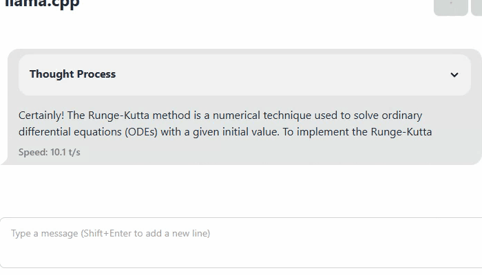

У меня под рукой только DeepSeek-R1-Distill-Qwen-7B-Q4_K_M.gguf, которую я в LM Studio скачал.

Эта модель на данном компе стабильно выдаёт десять токенов в секунду.

Вживую это вот так выглядит, с этим уже можно жить:

Но если я спрошу что-то специфическое, ну вот, к примеру, смотрел намедни Гремми и удивился наряду одной дивы:

У меня нет под рукой других, кроме разве что DeepSeek-R1-Distill-Qwen-7B-Q4_K_M.gguf, что я в LM Studio скачал. Её размер 4.5 ГБ. Вот я прямо сейчас проверил — она стабильно выдаёт 10 токенов в секунду, с этим уже можно жить, да. Но она совершенно не в курсе специфических вещей, вот к примеру:

