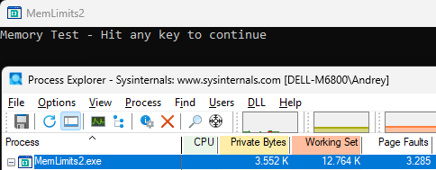
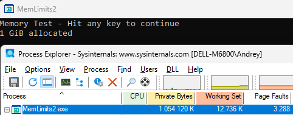
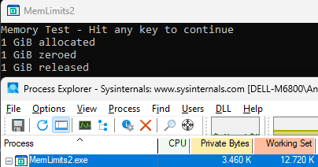

# **(Almost) Everything (Almost) Every LabVIEW Developer Should Know About Memory**

LabVIEW is pretty «High-Level» programming language. Memory allocations and deallocations are done in the background and «hidden» from developer — you don’t need to care what happened with arrays in SubVIs, etc. And in most cases it works quite well. However, in case of troubles you need deeper understanding, and this article about this.

## Windows

At the beginning, let move LabVIEW from the desk and dive into OS. Typical question I asking almost every developers «How much memory can be allocated by 32-bit application on Windows?». Almost any tell me «4GB», but the right answer «it depends».

So, if you have 32-bit application running under 32-bit OS, then the only 2GB memory is available for you by default. If your executable have **IMAGE_FILE_LARGE_ADDRESS_AWARE** flag set and 32-bit Windows running with /3GB switch, then 3 GB. If this application running under 64-bit OS, then 4GB will be available, but again, only if LARGE_ADDRESS_AWARE flag is set, otherwise 2GB only. And 64-bit under 64-bit OS will also get 2GB without this flag (which is set by default for 64-bit apps).

Summary table:

|                                                              | 32-bit OS    | 64-bit OS         |
| ------------------------------------------------------------ | ------------ | ----------------- |
| 32-bit App without LARGE_ADDRESS_AWARE (default, LabVIEW 32-bit up to 7.1) | 2 GB         | 2 GB              |
| 32-bit App with LARGE_ADDRESS_AWARE (LabVIEW 32-bit since 8.0) | 2 GB — 3 GB* | 4 GB              |
| 64-bit App without LARGE_ADDRESS_AWARE                       | N/A          | 2 GB              |
| 64-bit App with LARGE_ADDRESS_AWARE (default)                | N/A          | 8192 GB — 128 TB* |

By default, the virtual size of a process on 32-bit Windows is 2 GB. If the image is marked specifically as large address space–aware, and the system is booted with a special option (described in the section “x86 address space layouts” later in this chapter), a 32-bit process can grow to be up to 3 GB on 32-bit Windows and to 4 GB on 64-bit Windows. The process virtual address space size on 64-bit Windows 8 and Server 2012 is 8192 GB (8 TB) and on 64 bit Windows 8.1 (and later) and Server 2012 R2 (and later), it is 128 TB. Take a note, that different editions of Windows supporting different amount of physical RAM:

|                                 | Number of sockets (32-bit) | Physical Memory supported (32-bit) | Number of sockets /logical CPUs (64-bit) | Physical Memory supported (32-bit) |
| ------------------------------- | -------------------------- | ---------------------------------- | ---------------------------------------- | ---------------------------------- |
| Win 10 Home                     | 1                          | 4 GB                               | 1 socket                                 | 128 GB                             |
| Win 10 Pro/Enterprise           | 2                          | 4 GB                               | 2 sockets                                | 2048 GB                            |
| Win 11 Home                     | N/A                        | N/A                                | 1 socket                                 | 128 GB                             |
| Win 11 Pro/Enterprise           | N/A                        | N/A                                | 2 sockets                                | 2TB (2048 GB)                      |
| Windows 11 Pro for Workstations | N/A                        | N/A                                | 4 sockets / 256 logical CPUs             | 6 TB                               |
| Windows Server 2019             | N/A                        | N/A                                | 64 sockets/unlimited cores               | 24 TB                              |
| Windows Server 2022             | N/A                        | N/A                                | 64 sockets/unlimited cores               | 4 PB                               |
|                                 |                            |                                    |                                          |                                    |

From that point I will use Windows 11 Pro LTSC. The very first experiment which almost every developer should do is just «check limits», where memory allocated again and again in the cycle:

```c
#include <windows.h>
#include <ansi_c.h>

int main (int argc, char *argv[])
{
    int count = 0;
#ifdef _WIN64
	while (malloc(1024*1024*1024)) printf("%d GiB allocated\n", ++count);
#else
	while (malloc(1024*1024)) printf("%d MiB allocated\n", ++count);
#endif	
	printf("No more allocations possible\n");
	return 0;
}
```

You can use almost any C compiler (MSVC, gcc, CVI, etc), I’ll use NI CVI. Here you can compile this small console app as 32 bit as well as 64 bit and run it. In 64-bit App we have much more available memory (up to 128 TB in theory), therefore I will allocate in 1 MiB steps for 32-bit and in 1 GiB for 64 bit.

32-bit:

```
1 MiB allocated
2 MiB allocated
...
3748 MiB allocated
3749 MiB allocated
No more allocations possible
```

64-bit is quite different:

```
1 GiB allocated
2 GiB allocated
...
116 GiB allocated
117 GiB allocated
No more allocations possible
```

As you can see, in 64-bit App I can allocate up to 117 GiB memory (you will get different values here), much more than physical RAM, which I have 32 MB only:


And how is this possible? It is because we not allocating physical RAM, but Virtual Memory instead. Every application will get «linear» virtual address space, so, if you start two same apps simultaneously, then you will get same addresses, but they mapped on different physical addresses.

Both applications was built with large address aware flag, it is quite simple to check:

```
dumpbin.exe /Headers MemLimits32.exe >headers32.txt
```

And then for 32-bit

```
Microsoft (R) COFF/PE Dumper Version 14.43.34810.0
Copyright (C) Microsoft Corporation.  All rights reserved.

Dump of file MemLimits32.exe

PE signature found

File Type: EXECUTABLE IMAGE

FILE HEADER VALUES
             14C machine (x86)
               9 number of sections
        68048068 time date stamp Sun Apr 20 07:04:40 2025
               0 file pointer to symbol table
               0 number of symbols
              E0 size of optional header
             123 characteristics
                   Relocations stripped
                   Executable
                   Application can handle large (>2GB) addresses
                   32 bit word machine
```

and 64-bit:

```
FILE HEADER VALUES
            8664 machine (x64)
...
                   Application can handle large (>2GB) addresses
```

You can change this flag by using editbin:

```
To add – > editbin /LARGEADDRESSAWARE [application]
To remove it-> editbin /LARGEADDRESSAWARE:no [application]
```

And if you will remove this flag, then both app will get 2 GB only.

There are many entries in the PE header, but for a basic understanding, it is sufficient to know that Windows uses a virtual memory model. Each application is given its own linear (virtual) address space, and the addresses used by the application are not physical RAM addresses—they are virtual addresses managed by the operating system. 

But how relationship works between virtual and physical RAM?

### Experiment  2: Pages

Now add access to the each byte of allocated memory. For example, ZeroMemory. In additional, execution suspendend after each step, the code:

```c
#include <windows.h>
#include <ansi_c.h>
#include <utility.h>

#define MB 1024*1024
int main (int argc, char *argv[])
{
	printf("Memory Test - Hit any key to continue\n"); GetKey ();
	uint8_t* ptr = (uint8_t*)malloc(1024 * MB);
	printf("1 GiB allocated\n"); GetKey ();
	ZeroMemory(ptr, 1024 * MB);
	printf("1 GiB zeroed\n"); GetKey ();
	free(ptr);
	printf("1 GiB released\n"); GetKey ();
	return 0;
}
```

Now run the code and check amount of memory and Page Faults. Better to use Process Explorer:



Now allocate one Gibibyte memory:



Now write to Zeros:


and release:



Another useful tool to see internal Memory layout is VMMap. This is what you will see when this app is started (take a note about huge Free area):


This is what you will see after malloc() call - 1 GiB in Private Data, but not in Working Set:


and this is what you will see after Zeromemory() call, now Memory committed, and Working Set is occupied:


If you would like to play with «very minimal» application, then you can use any available Macro Assembler, for example:

```assembly
EUROASM AutoSegment=Yes, CPU=X64, SIMD=SSE2
memtest PROGRAM Format=PE, Width=64, Model=Flat, Subsystem=CON, ListMap=Yes, IconFile=, \
		Entry=Start:

INCLUDE wins.htm, winscon.htm, winabi.htm

Msg1 D "Welcome and hit Enter to continue",0
Msg2 D "1GB allocated, hit Enter to continue",0
Msg3 D "1GB written, hit Enter to continue",0
Buffer DB 80 * B
GB_size EQU 1024*1024*1024  ; 1 GiB
    
Start: nop
	StdOutput Msg1
	StdInput Buffer ; Wait for Enter, then allocate 1GiB Memory
	MemAlloc GB_size ; RAX is pointer to the first byte of the allocated memory.
	StdOutput Msg2
	StdInput Buffer
	mov rdi, rax        ; Copy pointer to destination register
	xor rax, rax        ; Zero entire RAX (0x00000000)
	mov rcx, 0x8000000  ; Set counter to 1 GiB / 8 (134,217,728 iterations)
	cld                 ; Clear direction flag (forward movement)
	rep stosq     
	StdOutput Msg3
	StdInput Buffer
	; MemFree 
	TerminateProgram

ENDPROGRAM memtest
```

Technically behind malloc is [VirtualAlloc](https://learn.microsoft.com/en-us/windows/win32/api/memoryapi/nf-memoryapi-virtualalloc) function.

### Experiment  3: Pages Faults

Page Faults are «not for free». Let measure how long will take Memory Initialization. I will measure execution time for two ZeroMem calls:

```c
#include <windows.h>
#include <ansi_c.h>

#define MB 1024*1024
int main (int argc, char *argv[])
{
	LARGE_INTEGER Start, End, Freq;
	QueryPerformanceFrequency (&Freq);
 	double freq_ms = (double)Freq.QuadPart / 1000.0;

	uint8_t* ptr = (uint8_t*)malloc(1024 * MB); // 1GiB

	QueryPerformanceCounter(&Start); // Activity to be timed
	ZeroMemory(ptr, 1024 * MB); // Here we have Page Faults
	QueryPerformanceCounter(&End);
	printf("First ZeroMemory %f ms\n", (End.QuadPart - Start.QuadPart) / freq_ms);
	
	QueryPerformanceCounter(&Start);
	ZeroMemory(ptr, 1024 * MB); // Here all pages already mapped
	QueryPerformanceCounter(&End);
	printf("Second ZeroMemory %f ms\n", (End.QuadPart - Start.QuadPart) / freq_ms);
	
	free(ptr);
	return 0;
}
```

And this is what I have for the code above:

```
>MemPageBench2.exe
First ZeroMemory 175.402100 ms
Second ZeroMemory 63.327600 ms
```

On the first ZeroMemory we have massive PageFaults, and the second - not, therefore first call take around 3 times longer than second one.

Lesson learned —- check Page Faults in your application, in ideal case this value should stay stable after start and grow. Continuously growing Page Faults indicating about deallocations/reallocations and according penalties. 
