# **(Almost) Everything (almost) Every LabVIEW Developer Should Know About Memory**

LabVIEW is pretty «High-Level» programming language. Memory allocations and deallocations are done in the background and «hidden» from developer — you don’t need to care what happened with arrays in SubVIs, etc. And in most cases it works quite well. However, in case of troubles you need deeper understanding, and this article about this. Therefore «Almost» added twice to the Title - how deep knowledge is required is very depends from the application. In some simple trivial cases you should not worry much about memory, but when you have a «bottleneck», then deeper knowledge is required. Below its assumed that you are familiar with C and WinAPI a little bit. We all was not born with this knowledge, of course, these notes are just result of «learning by doing», which I performing every day and I just would like to share with you, may be this will be useful.

## Windows

At the beginning, let move LabVIEW ot from the desk and dive into OS. Typical question I asking almost every junior developer «How much memory can be allocated by 32-bit application on Windows? And by 64-bit?». Almost any tell me «4GB» for 32-bit and as much as RAM available for 64-bit, but the right answer «it depends».

So, if you have 32-bit application running under 32-bit OS, then the only 2GB memory is available for you by default. If your executable have **IMAGE_FILE_LARGE_ADDRESS_AWARE** flag set and 32-bit Windows running with /3GB switch, then 3 GB. If this application running under 64-bit OS, then 4GB will be available, but again, only if LARGE_ADDRESS_AWARE flag is set, otherwise 2GB only. And 64-bit under 64-bit OS will also get 2GB without this flag (which is set by default for 64-bit apps).

Summary table:

| Application Type | LARGE_ADDRESS_AWARE                     | 32-bit OS    | 64-bit OS         |
| ---------------- | --------------------------------------- | ------------ | ----------------- |
| 32-bit App       | OFF (default, LabVIEW 32-bit up to 7.1) | 2 GB         | 2 GB              |
| 32-bit App       | ON  (LabVIEW 32-bit since 8.0)          | 2 GB — 3 GB* | 4 GB              |
| 64-bit App       | OFF                                     | N/A          | 2 GB              |
| 64-bit App       | ON (Default for 64-bit Apps)            | N/A          | 8192 GB — 128 TB* |

By default, the virtual size of a process on 32-bit Windows is 2 GB. If the image is marked specifically as large address space–aware, and the system is booted with a special /3GB option (can be set with «bcdedit /set IncreaseUserVa 3072» command), a 32-bit process can grow to be up to 3 GB on 32-bit Windows. And large address space–aware enabled application can utilize up to 4 GB on 64-bit Windows. Important to remember that you working  in Virtual Address space and the process virtual address space size on 64-bit Windows 8 and Server 2012 is 8192 GB (8 TB) and on 64 bit Windows 8.1 (and later) and Server 2012 R2 (and later), it is 128 TB. Take a note, that different editions of Windows supporting different amount of physical RAM:

|                                 | Number of sockets (32-bit) | Physical Memory supported (32-bit) | Number of sockets /logical CPUs (64-bit) | Physical Memory supported (64-bit) |
| ------------------------------- | -------------------------- | ---------------------------------- | ---------------------------------------- | ---------------------------------- |
| Win 10 Home                     | 1                          | 4 GB                               | 1 socket                                 | 128 GB                             |
| Win 10 Pro/Enterprise           | 2                          | 4 GB                               | 2 sockets                                | 2048 GB                            |
| Win 11 Home                     | N/A                        | N/A                                | 1 socket                                 | 128 GB                             |
| Win 11 Pro/Enterprise           | N/A                        | N/A                                | 2 sockets                                | 2TB (2048 GB)                      |
| Windows 11 Pro for Workstations | N/A                        | N/A                                | 4 sockets / 256 logical CPUs             | 6 TB                               |
| Windows Server 2019             | N/A                        | N/A                                | 64 sockets/unlimited cores               | 24 TB                              |
| Windows Server 2022             | N/A                        | N/A                                | 64 sockets/unlimited cores               | 4 PB                               |
|                                 |                            |                                    |                                          |                                    |

From that point I will use Windows 11 Pro LTSC, which is 64-bit OS The very first experiment which almost every developer should do is just «check limits», where memory allocated again and again in the cycle:

```c
#include <windows.h>
#include <ansi_c.h>

int main (int argc, char *argv[])
{
    int count = 0;
#ifdef _WIN64
	while (malloc(1024*1024*1024)) printf("%d GiB allocated\n", ++count);
#else
	while (malloc(1024*1024)) printf("%d MiB allocated\n", ++count);
#endif	
	printf("No more allocations possible\n");
	return 0;
}
```

You can use almost any C compiler (MSVC, gcc, CVI, etc), I’ll use NI CVI. Here you can compile this small console app as 32 bit as well as 64 bit and run it. In 64-bit App we have much more available memory (up to 128 TB in theory), therefore I will allocate in 1 MiB steps for 32-bit and in 1 GiB for 64 bit.

32-bit:

```
1 MiB allocated
2 MiB allocated
...
3748 MiB allocated
3749 MiB allocated
No more allocations possible
```

64-bit is quite different:

```
1 GiB allocated
2 GiB allocated
...
116 GiB allocated
117 GiB allocated
No more allocations possible
```

As you can see, in 64-bit App I can allocate up to 117 GiB memory (you will get different values here), much more than physical RAM, which I have 32 MB only:

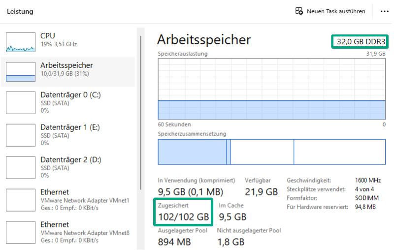

And how is this possible? It is because we not allocating physical RAM, but Virtual Memory instead. Every application will get «linear» virtual address space, so, if you start two same apps simultaneously, then you will get same addresses, but they mapped on different physical addresses.

Both applications was built with large address aware flag, it is quite simple to check:

```
dumpbin.exe /Headers MemLimits32.exe >headers32.txt
```

And then for 32-bit

```
Microsoft (R) COFF/PE Dumper Version 14.43.34810.0
Copyright (C) Microsoft Corporation.  All rights reserved.

Dump of file MemLimits32.exe

PE signature found

File Type: EXECUTABLE IMAGE

FILE HEADER VALUES
             14C machine (x86)
               9 number of sections
        68048068 time date stamp Sun Apr 20 07:04:40 2025
               0 file pointer to symbol table
               0 number of symbols
              E0 size of optional header
             123 characteristics
                   Relocations stripped
                   Executable
                   Application can handle large (>2GB) addresses
                   32 bit word machine
```

and 64-bit:

```
FILE HEADER VALUES
            8664 machine (x64)
...
                   Application can handle large (>2GB) addresses
```

You can change this flag by using editbin:

```
To add – > editbin /LARGEADDRESSAWARE [application]
To remove it -> editbin /LARGEADDRESSAWARE:no [application]
```

And if you will remove this flag, then both app will get 2 GB only.

There are many interesting entries in the PE header, but for a basic understanding, it is sufficient to know that Windows uses a virtual memory model. Each application is given its own linear (virtual) address space, and the addresses used by the application are not physical RAM addresses—they are virtual addresses managed by the operating system. And your 64-bit LabVIEW application will get address space up to 128 TB (yes, 128 Terabytes, I’ll show below), but of course you can’t allocate whole 128 TB, the limit depends on RAM and paging file.

But how relationship works between virtual and physical RAM?

### Experiment  2: Pages

Now add access to the each byte of allocated memory. For example, ZeroMemory. In additional, execution suspendend after each step with GetKey(), the code:

```c
#include <windows.h>
#include <ansi_c.h>
#include <utility.h>

#define MB 1024*1024
int main (int argc, char *argv[])
{
	printf("Memory Test - Hit any key to continue\n"); GetKey ();
	uint8_t* ptr = (uint8_t*)malloc(1024 * MB);
	printf("1 GiB allocated\n"); GetKey ();
	ZeroMemory(ptr, 1024 * MB);
	printf("1 GiB zeroed\n"); GetKey ();
	free(ptr);
	printf("1 GiB released\n"); GetKey ();
	return 0;
}
```

Now run the code and check amount of memory and Page Faults. Better to use Process Explorer from SysInternals:

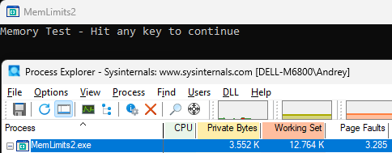

Now allocate one Gibibyte memory:

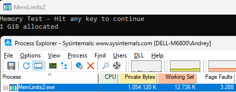

Now write to Zeros:

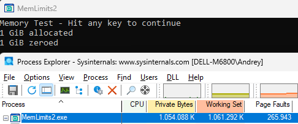

and release:

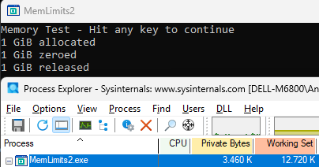

Another useful tool to see internal Memory layout is VMMap. This is what you will see when this app is started (take a note about huge Free area):

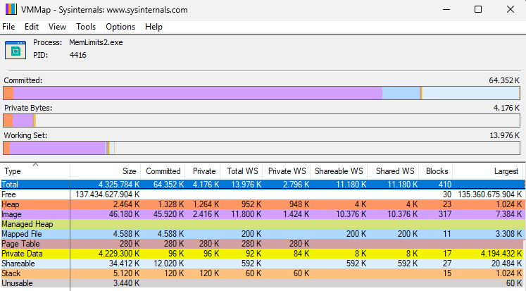

This is what you will see after malloc() call - 1 GiB in Private Data, but not in Working Set:

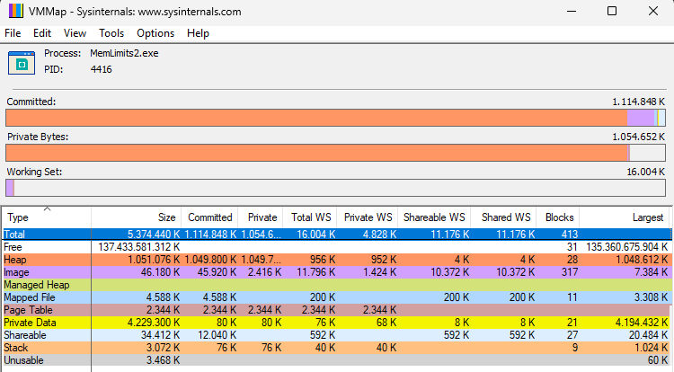

and this is what you will see after Zeromemory() call, now Memory committed, and Working Set is occupied:

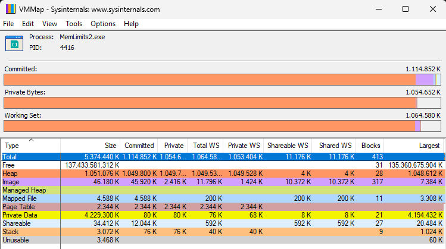

Whole paging mechanism looks like this:

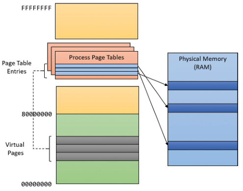

If you would like to play with «very minimal» application, then you can use any available Macro Assembler, for example:

```assembly
EUROASM AutoSegment=Yes, CPU=X64, SIMD=SSE2
memtest PROGRAM Format=PE, Width=64, Model=Flat, Subsystem=CON, ListMap=Yes, IconFile=, \
		Entry=Start:

INCLUDE wins.htm, winscon.htm, winabi.htm

Msg1 D "Welcome and hit Enter to continue",0
Msg2 D "1GB allocated, hit Enter to continue",0
Msg3 D "1GB written, hit Enter to continue",0
Buffer DB 80 * B
GB_size EQU 1024*1024*1024  ; 1 GiB
    
Start: nop
	StdOutput Msg1
	StdInput Buffer ; Wait for Enter, then allocate 1GiB Memory
	MemAlloc GB_size ; RAX is pointer to the first byte of the allocated memory.
	StdOutput Msg2
	StdInput Buffer
	mov rdi, rax        ; Copy pointer to destination register
	xor rax, rax        ; Zero entire RAX (0x00000000)
	mov rcx, 0x8000000  ; Set counter to 1 GiB / 8 (134,217,728 iterations)
	cld                 ; Clear direction flag (forward movement)
	rep stosq     		; write 0 into 1 GiB memory
	StdOutput Msg3
	StdInput Buffer
	; MemFree 
	TerminateProgram

ENDPROGRAM memtest
```

Technically behind malloc is [VirtualAlloc](https://learn.microsoft.com/en-us/windows/win32/api/memoryapi/nf-memoryapi-virtualalloc) function.

### Experiment  3: Pages Faults

Page Faults are «not for free». Let measure how long will take Memory Initialization. I will measure execution time for two ZeroMem calls:

```c
#include <windows.h>
#include <ansi_c.h>

#define MB 1024*1024
int main (int argc, char *argv[])
{
	LARGE_INTEGER Start, End, Freq;
	QueryPerformanceFrequency (&Freq);
 	double freq_ms = (double)Freq.QuadPart / 1000.0;

	uint8_t* ptr = (uint8_t*)malloc(1024 * MB); // 1GiB

	QueryPerformanceCounter(&Start); // Activity to be timed
	ZeroMemory(ptr, 1024 * MB); // Here we have Page Faults
	QueryPerformanceCounter(&End);
	printf("First ZeroMemory %f ms\n", (End.QuadPart - Start.QuadPart) / freq_ms);
	
	QueryPerformanceCounter(&Start);
	ZeroMemory(ptr, 1024 * MB); // Here all pages already mapped
	QueryPerformanceCounter(&End);
	printf("Second ZeroMemory %f ms\n", (End.QuadPart - Start.QuadPart) / freq_ms);
	
	free(ptr);
	return 0;
}
```

And this is what I have for the code above:

```
>MemPageBench2.exe
First ZeroMemory 175.402100 ms
Second ZeroMemory 63.327600 ms
```

On the first ZeroMemory we have massive PageFaults, and the second — not, therefore first call take around 3 times longer than second one.

On my PC I can fill 1GiB within 50-60 ms, because memory throughput is around 20 GB/sec:

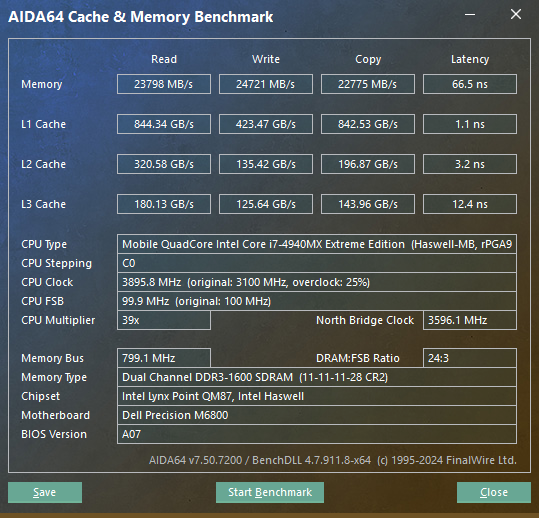

Lesson learned —- check Page Faults in your application, in ideal case this value should stay stable after start and grow. Continuously growing Page Faults indicating about deallocations/reallocations and according penalties. 

It is hard to demonstrate this in LabVIEW (without direct usage of memory manager functions), but can be shown using IMAQ Vision. For example, if I will allocate 1GiB image, then fill it twice, then you will see that the memory is not increased after setting the size (but the memory is allocated already), and memory gets occupied only after IMAQ Fill, with according page faults, and the time of the first and second fill different and matched timing from the example above 

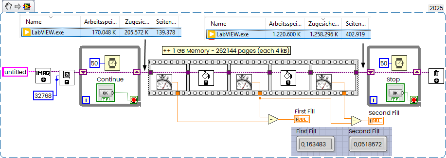

Okay, we have Virtual Memory, spitted into 4kB pages and mapped to Physical.

By the way, you can see this mapping in the RAMMap software:

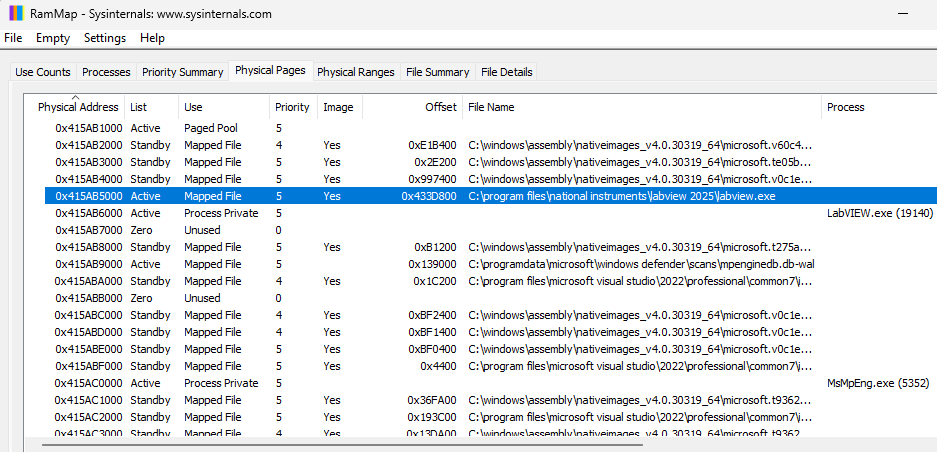

This article is also not so bad, really: https://connormcgarr.github.io/paging/

## Caches

Together with slow RAM you have also three Cache memory Levels. You can see this Taks Manager, but to get more detailed information you can use CPUz Software:

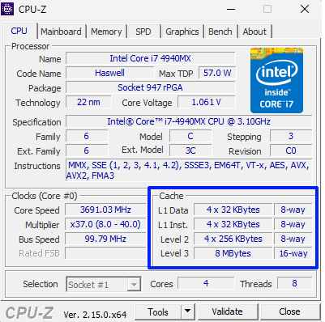

Level 1 and Level 2 are assigned to each core, and Level 3 is shared between cores. Important to understand that the caches are much faster than RAM (sse AIDA Screenshot above). They also known as First Level cache, Mid-Level cace and Last Level cache. First Level cache separated for Data and instuctions.

Here important to know that the Cache Line is 64 bytes. A cache line is the fundamental unit of data transfer between main memory and CPU cache. 64 bytes is standard in modern CPUs. It means, every time when you access single byte in RAM, the whole line loaded into cache. When accessing a memory address, the entire 64-byte block (aligned to 64-byte boundaries) containing that address is loaded into the cache6[8](https://stackoverflow.com/questions/5007377/understanding-cpu-cache-and-cache-line). For example, accessing address `0x1234` would load the range `0x1200-0x123F` (assuming 64-byte lines)

The size of the L1 cache totals 32 KBytes per CPU which are accessed 64 bytes (the size of the “cache line” in that system) at a time and grouped into a set of eight “ways”. So each “way” totals 4096 bytes or 64 cache lines.

A “way” is by itself a partially associative cache meaning that the lower six address bits of the data we are searching for and are used to read out one specific cache line (and its “tag”) from the 64 cache lines (that is the lower six bits are used as an index or address into the data stored in the “way”). The tag represents the upper address bits associated with the stored data and is then compared with the corresponding bits of the data of interest. If a match is detected, then the data that was read is returned to the requesting agent (CPU or IO).

This same operation is performed simultaneously in all eight “ways”. Having additional “ways” improves the chance that the requested cache line resides somewhere in that cache structure. There can be any number of ways in a cache - it does not have to be restricted to some power of two (1, 2, 4, 8, 16,…).

https://www.quora.com/What-does-L1-cache-32-KB-64-B-line-8-way-mean

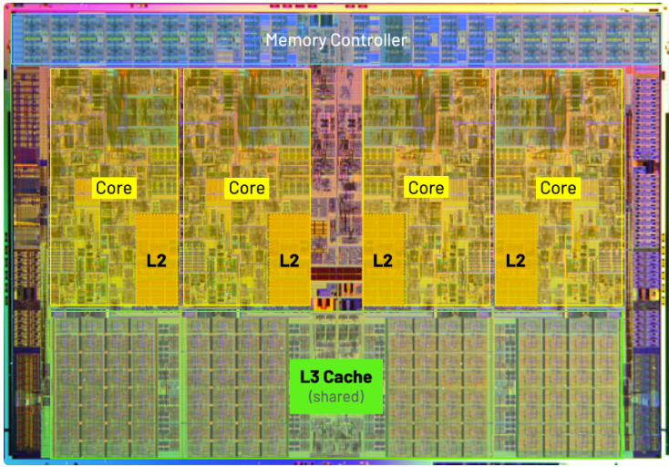


It is quite simple to esimate cache latency with simple C code

```c
#include <windows.h>
#include <ansi_c.h>

#define MIN_SIZE (1 << 10)  // 1 KB
#define MAX_SIZE (1 << 27)  // 128 MB
#define STRIDE 64
#define ITERATIONS 100000000

void measure_latency(size_t size) {
	
	LARGE_INTEGER Start, End;
	
    // Allocate and initialize memory
    char *mem = malloc(size);
    for (size_t i = 0; i < size; i += 64) mem[i] = (char)i;
    
    // Pointer chasing to create stride accesses
    volatile char **ptr = (volatile char **)mem;
    for (size_t i = 0; i < size / sizeof(char *); i += STRIDE / sizeof(char *)) {
        ptr[i] = (char *)&ptr[(i + STRIDE) % (size / sizeof(char *))];
    } //The pointer chasing pattern prevents hardware prefetcher optimizations, 
	// giving more accurate latency measurements.

    // Warm-up and timing measurement
    volatile char **p = ptr;
	volatile char sum = 0;
	QueryPerformanceCounter(&Start);
    for (int i = 0; i < ITERATIONS; i++) {
		sum += **p;
		p = (volatile char **)*p;
    }  
    // Calculate latency per access (ns)
	QueryPerformanceCounter(&End);
    double latency = (End.QuadPart - Start.QuadPart) * 100.0 / ITERATIONS / 2.0; //100 th nanoseconds R/W
    printf("Buffer size: %zu KiB, Latency: %.2f ns %d\n", size/1024, latency, sum);
    
    free(mem);
}

int main() {
	LARGE_INTEGER Freq;
	QueryPerformanceFrequency (&Freq);
 	double freq = (double)Freq.QuadPart;
	printf("freq %.2f\n",freq);
	
    for (size_t size = MIN_SIZE; size <= MAX_SIZE; size *= 2) measure_latency(size);
 
    return 0;
```


---

https://people.freebsd.org/~lstewart/articles/cpumemory.pdf

https://www.researchgate.net/publication/366111607_Partition-based_SIMD_Processing_and_its_Application_to_Columnar_Database_Systems

https://paul.bone.id.au/blog/2019/05/01/cpu-cache/

https://mecha-mind.medium.com/demystifying-cpu-caches-with-examples-810534628d71

