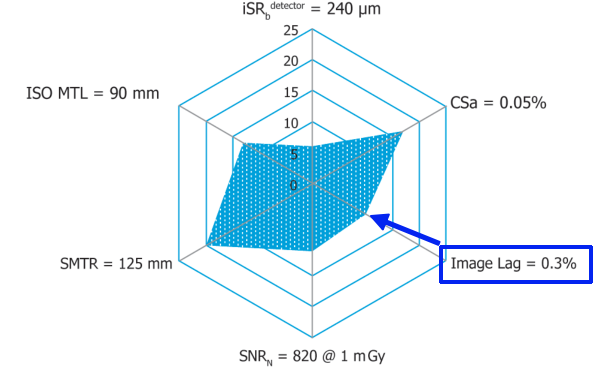
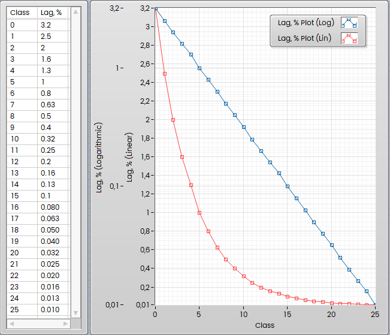

## Some Notes about LAG Measurement

In this article I would like to explain some details about X-Ray Detector Lag measurement according ASTM standards and how to perform it. This pure technical article could be interesting for NDT specialists.

What is the Lag? It is pretty simple thing. If you will exposure the detector for some time, then cut off x-ray (or change object position quickly), then you will observe some artefacts from pervious images in the dark areas.

Why Detector’s Lag is important? In 2D applications, especially on automated machines with ADR where the part changed from position to position is very quickly, large Lag could leave some artefacts, which can be interpreted as false detections. In CT applications Lag could affect image quality, especially in Fast CT, where the part rotated quickly continuously or with short steps with small amount of averaged images. So, it is important to have small and short Lag to get crisp and clear images.

Do not confuse between Lag and Burn-In. The Burn-In is long term effect, caused by burned scintillator (physic of this process is out of the scope for this article). If you exposure high-contrast static object for long time with high dose, then remove it from the beam, then you will see «ghost» image few minutes after exposure (sometimes hours or days). But you need x-ray to see this burned image. In opposite to Burn-In the Lag is «short term» effect, just few frames only, caused by «after glowing» of the scintillator plus some «electronic inertia» of the photodiodes and visible short time after exposure in absence of the x-ray, that the difference.

If you purchasing or choosing the x-ray detector, then often can see «Spider Chart Diagram» provided by supplier. According to the latest ASTM 2597 standard the Spider Chart Diagram should have 6 parameters, and the Lag is one of them:

How to read this properly? The Values of the Lag (as percentage) translated to the Classes. The ASTM Standard defines 26 classes numbered from 0 to 25, which cover the Lag Range  from 3,2% to 0.010% in logarithmical scale, it looks like this:

From the example above you see- the Lag 0,3% is Class 10. So, you can compare detectors, higher class means lower Lag and better Detector. But what means «0,3 %»? Let me explain.

### Lag Measurement Procedure

Technically the Lag Measurement procedure is pretty simple thing. You have to exposure detector at constant dose for some time, then cut off the X-Ray, then measuring average intensity of the each frame, and you will see obviously intencity drop, and the Lag inn general is percentage of the image where the x-ray is completely off and the previous frame:

:todo:

But the Devil in the details, as usually, and these details I would like to explain below.

#### X-Ray OFF

Obviously, to measure the Lag you have to switch off x-ray to measure «rest» intensity in the «dark» image in absense of x-ray. But it means that you should turn off x-ray as quick as possible. This action is not good for most of the tubes, and typically you have kV ramps (Ramp-Up and Rump-Down) which typically hundreds of milliseconds. It means that the generator should drop high voltage to zero within given and defined by supplier time, otherwise your x-ray tube out of warranty when damaged. This called kV Ramp. Usually adjustable in generator and often increased to prolongate lifetime of the tubes. But if you have such ramp, which is longer than frame time of the detector, then you will measure that Ramp instead of pure Lag. If you have no possibilities to adjust or turn off the ramp, then as trick you can use Emergency Stop button to turn off x-ray and this action will not damage your tube, but this is stress situation. Better solution is to use fast Shutter.

