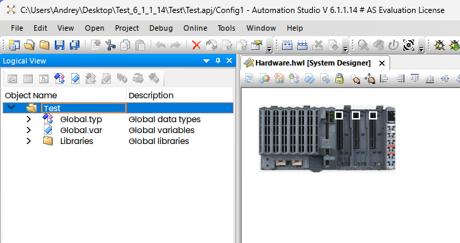

Компания B&R была основана в 1971 году, штаб квартира и основное производство с учебными центрами располагаются в австрийском Эггельсберге:

Это чуть больше сотни километров от Мюнхена на восток, где-то полтора часа езды.

Кстати, именно там и находится то знаменитое село:

Говорят, его название сменили на Fugging, но я проезжал там несколько раз, когда ездил на обучение и застал именно ту вывеску. Вот за тем лесом, километров десять и будет Эггельсберг.

Сегодня у меня на рабочем столе, а значит в обзоре, типичный представитель мира ПЛК - [X20CP1586](https://www.br-automation.com/en/products/plc-systems/x20-system/x20-plc/x20cp1586/):

Это ПЛК на процессоре Intel Atom. Конкретно в этой модели установлен [Atom E680T](https://www.intel.com/content/www/us/en/products/sku/52498/intel-atom-processor-e680t-512k-cache-1-60-ghz/specifications.html), с частотой 1.6 ГГц. Процессор довольно слабенький, 24 кБ кэш данных, 32 кБ кэш команд, 512 кБ кэша второго уровня, третьего и нет вовсе. Выполнен по технологии 45 нм на архитектуре Tunnel Creek. Выпущен аж в 2010 году, был предназначен как раз для использования в ПЛК и всяком эмбеддинге. На борту у конкретно этого ПЛК 512 МБ памяти DDR2 800 SDRAM. Максимально процессор может адресовать 2 ГБ. Память распаяна. Охлаждение пассивное, TDP там всего 4.5 ватта, но диапазон рабочих температур довольно широкий: от -25°C до 60°C. Крышку я, с вашего позволения, снимать не буду, там довольно хлипкие "одноразовые" защёлки, радиатор охлаждения хорошо виден через решётку корпуса:

<ФОТО>

По сути это обычный одноплатный компьютер с парой специальных фишек. Давайте посмотрим на его интерфейсы поближе, снизу видно два обычных RJ45 коннектора. Слева IF2 - это гигабитный Ethernet. Правее - это [POWERLINK](https://ru.wikipedia.org/wiki/Ethernet_powerlink), это в общем тот же Ethernet, но "реального времени" расширенный для высокоточной синхронизации узлов сети (мы говорим о временах порядка нескольких микросекунд). Затем у нас есть пара USB (оба 1.1/2.0), над ними разъём CF карты — это суть накопитель, на котором операционная система и управляющая программа. Справа X2X Link. Это проприетарная полевая шина для бэкплейна, на которую "нанизываются" модули расширения. Вы можете спросить, где же IF1, а он тут есть — это RS232 выведенный на тот же коннектор (строго говоря это [X20TB12](https://www.br-automation.com/en/products/io-systems/x20-system/terminal-blocks/x20tb12/) терминал блок), на который подаётся питание. Батарейка CMOS (3 V / 950 mAh) прячется под крышкой: 

<ФОТО>

Пустой слот посередине между терминальным блоком и процессором предназначен для модулей расширения [других шин](https://www.br-automation.com/en-us/products/networks-and-fieldbus-modules/) типа EtherCAT, ModbusTCP, DeviceNet и т.д., например если вам нужно общаться с конвейером, которым управляет ПЛК с шиной Profibus, то туда будет вставлен вот такой модуль:

Справа "нанизываются" модули расширения. Их огромное количество, я в учебных целях возьму пару самых "ходовых", это один модуль входов и один выходов.

Питается эта игрушка от 24 вольт (что в общем стандарт в промышленности), потребляет где-то пол-ампера.

### Программирование ПЛК

Давайте теперь посмотрим, как этот "Лего" конструктор программируется. 

Для этого предназначена IDE, которая называется Automation Studio. Актуальная на момент обзора версия 6.1.1.14, выпущенная в середине декабря, но этот старенький ПЛК в ней не поддерживается, так что я буду пользоваться четвёртой версией (визуально шестая от четвёртой мало чем отличается). Все скриншоты будут на английском, русского сюда не завезли, тут уж извините. Впрочем других языков кроме немецкого там тоже нет. Скачать можно бесплатно [вот отсюда](https://www.br-automation.com/de/downloads/#categories=Software-1344987434933/Automation+Studio-1344987435049/Automation+Studio+6-1713276081004). Вначале надо ставить 6.0.2.177, затем накатить обновление до 6.1.1.14. Триальную лицензию на 90 дней робот раздаёт бесплатно [вот здесь](https://www.br-automation.com/en/service/software-registration/automation-studio-licensing/). Там ограничено время работы двумя часами и выпилены онлайн обновления, в остальном "на попробовать" — самое то. По истечении 90 дней можно без проблем просить снова и снова. Единственно — я честно не уверен, что всё это доступно из России, но ВэПээНы пока вроде работают. Там в комплект входит очень неплохой симулятор, то есть можно сконфигурировать реальное железо, и запускать код даже при его отсутствии.

Изначально ПЛК "мёртв", ему нужно залить на флешку образ, который сначала нужно изготовить, для этого "с нуля" создаётся проект и конфигурируется в точном соответствии с железом, которым вы располагаете:

Я не буду превращать пост в простыню скриншотов (у меня в общем не стоит задачи заменить инструкцию), просто обозначу ключевые места, чтобы у вас сложилась "общая картина". У меня, кстати, остались кой какие учебные материалы, в том числе на русском, если кому надо — стукнитесь в личку.

ToDo - stup latest B&R

