Это будет "лонгрид", но разбивать его на несколько постов я не буду, чтобы не забивать ленту почём зря, поскольку материал довольно быстро уйдёт с главной в (не побоюсь этого слова) анналы хабра, и кто-нибудь будет время от времени находить его в поиске и таки найдёт для себя что-то полезное.

Прежде чем продолжить — небольшой дисклеймер — я не имею прямого отношение ни к одной упоминающейся ниже компании, рекламной нагрузки пост не несёт.

Речь пойдет про ПЛК (Программируемый Логический Контроллер), изготовленным компанией B&R B&R Industrial Automation GmbH.

Компания B&R была основана в 1979 году Эрвином Бернекером и Джозефом Райнером, откуда и название которое иногда пишут как B+R. Довольно молодая в сравнении с"монстрами" типа Сименс и иже с ними. Штаб квартира и основное производство с учебными центрами располагаются в австрийском Эггельсберге:

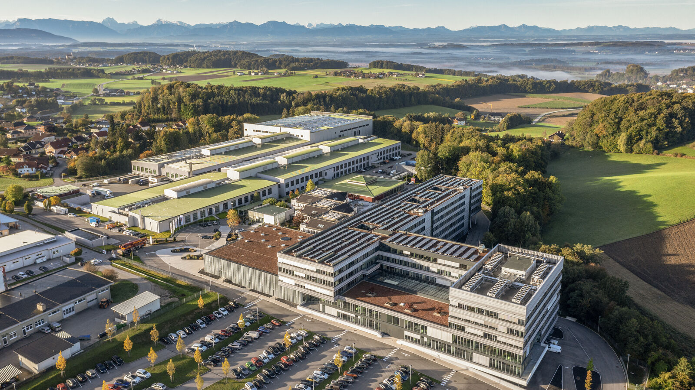

Это чуть больше сотни километров от Мюнхена на восток, где-то полтора часа езды. Милое местечко.

Кстати, именно там и находится то знаменитое село:


Говорят, его название сменили на Fugging, но я проезжал там несколько раз пять лет назад, когда ездил на обучение и застал именно ту вывеску. Вот за тем лесом, километров десять и будет Эггельсберг. В настоящее время компания принадлежит концерну АВВ, который хорошо известен своими роботами да электрикой.


Сегодня у меня на рабочем столе, а значит в обзоре, типичный представитель мира ПЛК от B&R — [X20CP1586](https://www.br-automation.com/en/products/plc-systems/x20-system/x20-plc/x20cp1586/):

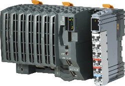

Это ПЛК на процессоре Intel Atom. Конкретно в этой модели установлен [Atom E680T](https://www.intel.com/content/www/us/en/products/sku/52498/intel-atom-processor-e680t-512k-cache-1-60-ghz/specifications.html), с частотой 1.6 ГГц. Процессор довольно слабенький, 24 кБ кэш данных, 32 кБ кэш команд, 512 кБ кэша второго уровня, третьего и нет вовсе. Выполнен по технологии 45 нм на архитектуре Tunnel Creek. Выпущен аж в 2010 году, процессор этот был предназначен как раз для использования в ПЛК и всяком эмбеддинге. На борту у конкретно этого ПЛК 512 МБ памяти DDR2 800 SDRAM. Максимально процессор может адресовать 2 ГБ. Память распаяна. Охлаждение пассивное, TDP там всего 4.5 ватта, но диапазон рабочих температур довольно широкий: от -25°C до 60°C. Кстати, современные ПЛК недалеко ушли от этого, в топовых на данный момент [X20CP3686X](https://www.br-automation.com/en/products/plc-systems/x20-system/x20-plc/x20cp3686x/) да [X20CP3687X](https://www.br-automation.com/en/products/plc-systems/x20-system/x20-plc/x20cp3687x/) установлены Атомы E3930 и E3940, а память добили до одного и двух гигов, но уже DDR4, спасибо и на этом. Крышку я, с вашего позволения, снимать не буду, там довольно хлипкие "одноразовые" защёлки, радиатор охлаждения процессора хорошо виден через решётку корпуса:

<ФОТО>

По сути это обычный одноплатный компьютер с парой специальных фишек. Давайте посмотрим на его интерфейсы поближе, снизу видно два обычных RJ45 коннектора. Слева IF2 - это гигабитный Ethernet. Правее - это [POWERLINK](https://ru.wikipedia.org/wiki/Ethernet_powerlink), это в общем тот же Ethernet, но "реального времени" расширенный для высокоточной синхронизации узлов сети (мы говорим о временах порядка нескольких микросекунд). Затем у нас есть пара USB (оба 1.1/2.0, в один из них обычно втыкается донгл с лицензией), над ними разъём CF карты — это суть накопитель, на котором операционная система и управляющая программа. Справа X2X Link. Это проприетарная полевая шина для бэкплейна, на которую "нанизываются" модули расширения. Вы можете спросить, где же IF1, а он тут есть — это RS232 выведенный на тот же коннектор (строго говоря это [X20TB12](https://www.br-automation.com/en/products/io-systems/x20-system/terminal-blocks/x20tb12/) терминал блок), на который подаётся питание. Батарейка CMOS (3 V / 950 mAh) прячется под крышкой: 

<ФОТО>

Пустой слот посередине между терминальным блоком и процессором предназначен для модулей расширения [других шин](https://www.br-automation.com/en-us/products/networks-and-fieldbus-modules/) типа EtherCAT, ModbusTCP, DeviceNet и т.д., например если вам нужно общаться с конвейером, которым управляет ПЛК с шиной Profibus, то туда будет вставлен вот такой модуль:

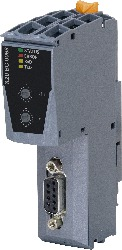

Справа "нанизываются" модули расширения. Их огромное количество, я в учебных целях возьму пару самых "ходовых", это один модуль входов и один выходов, каждый на 12 сигналов.

Модуль, кстати, выполнен довольно разумно - у него передняя часть отщёлкивается, так что при замене модуля вам не нужно выдёргивать из него лапшу проводов, а просто отщёлкнуть коннектор вместе с подсоединёнными проводами. это исключает ошибки "воткнул провод не туда".

Питается эта игрушка от 24 вольт (что в общем стандарт в промышленности), потребляет где-то пол-ампера, в максимуме полтора.

### Программирование ПЛК

Давайте теперь посмотрим, как этот "Лего" конструктор программируется. 

Для этого предназначена IDE, которая называется Automation Studio. Актуальная на момент обзора версия 6.1.1.14, выпущенная в середине декабря, но конкретно этот старенький ПЛК в ней не поддерживается, так что местами я буду пользоваться четвёртой версией (визуально шестая от четвёртой мало чем отличается). Все скриншоты будут на английском, русского сюда не завезли, тут уж извините. Впрочем других языков кроме немецкого да английского там тоже нет. Скачать можно бесплатно [вот отсюда](https://www.br-automation.com/de/downloads/#categories=Software-1344987434933/Automation+Studio-1344987435049/Automation+Studio+6-1713276081004). Вначале надо ставить 6.0.2.177, затем накатить обновление до 6.1.1.14. Триальную лицензию на 90 дней робот раздаёт бесплатно [вот здесь](https://www.br-automation.com/en/service/software-registration/automation-studio-licensing/). Там ограничено время работы двумя часами и выпилены онлайн обновления, в остальном "на попробовать" — самое то. По истечении 90 дней можно без проблем просить снова и снова на тот же email. Единственно — я честно не уверен, что на данный момент всё это доступно из России, но ВэПээНы пока вроде работают. Там в комплект входит очень неплохой симулятор, то есть можно сконфигурировать реальное железо, и запускать код даже при его отсутствии. Ниже по тексту для краткости я буду называть Automation Studio 6 просто "AS6", а Automation Studio 4 — "AS4"; если речь будет идти об обеих версиях, то просто "AS".

Изначально ПЛК "мёртв", ему нужно залить на флешку образ, который сначала нужно изготовить, для этого "с нуля" создаётся проект и конфигурируется в точном соответствии с железом, которым вы располагаете:

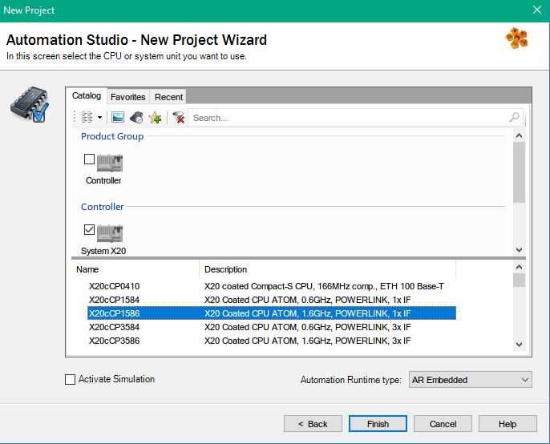

Я не буду превращать пост в простыню скриншотов, коих и так будет много (у меня в общем не стоит задачи заменить инструкцию), просто обозначу ключевые места, чтобы у вас сложилась "общая картина". У меня, кстати, остались кой какие учебные материалы, в том числе на русском, если кому надо — стукнитесь в личку. Добрый китайский товарищ выложил часть на [Гитхаб-brtraining](https://github.com/brtraining/brtraining.github.io/tree/master/TM42ENG), там правда какая-то часть на китайском, если кому надо.

Среда разработки выглядит вот таким образом — слева окошко с тремя вкладками - логическое представление, там как раз находятся ваши программы. что крутятся в ПЛК и переменные, затем конфигурационная вкладка, где конфигурируется вся программная часть, и физическое представление, где конфигурируется железо, в центре идёт основная работа, а справа - библиотеки модулей, как физических, так и программных. Нам надо собрать конфигурацию с двумя модулями - входы 9371 и выходы 9322. Они просто перетягивются мышкой из библиотеки, список доступных модулей там очень большой, так что проще воспользоваться поиском, вот так:

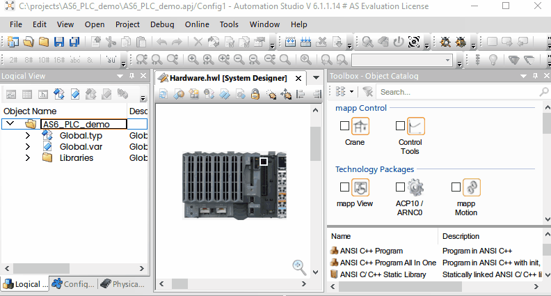

Теперь нам надо как-то "достучаться" до выходов и получить значения входов, делается это очень простым способом, давайте поморгаем светодиодиками.

В лучших традициях некошерного программирования я заведу несколько глобальных переменных:

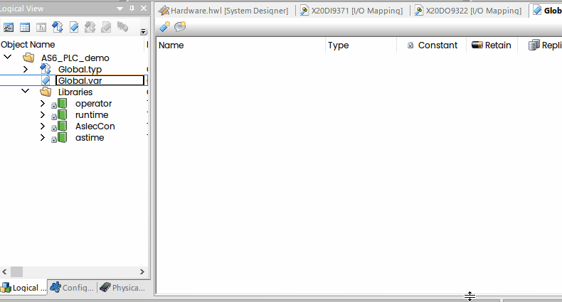

(с областями видимости тут всё нормально — глобальные переменные видны всем программам, но можно заводить и локальные, доступные лишь той программе, где они созданы).

К базовым типам надо привыкнуть, скажем USINT - это uint8_t, а не uint32_t, как вы могли бы подумать, но к счастью есть описание:

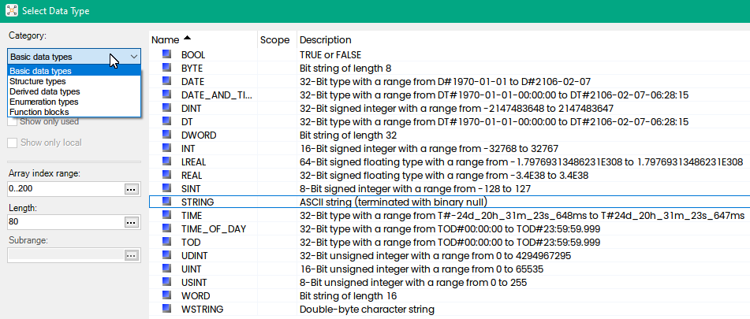

А теперь я просто сделаю маппинг (отображение) этих булевых переменных на физические выходы:

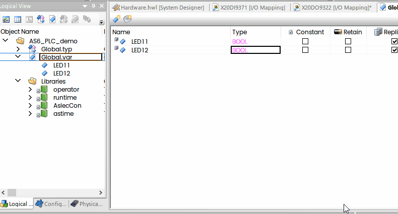

И так далее. Для входов всё происходит ровно также — читаете переменную, там будет значение на входе. Осталось написать программу, которая будет периодически перебрасывать эти переменные из true в false и обратно.

Вообще говоря среда разработки предоставляет возможности написания программ на десяти языках, пять из которых определены стандартом IEC 61131-3 (европейский EN 61131 или МЭК 61131-3), но для начала давайте воспользуемся классическим Си и вам сразу стает понятен принцип программирования этого контроллера.

### Программируем ПЛК на Си

Для того, чтобы добавить Си-программу, надо просто перейти на вкладку логического представления, найти в списке справа "ANSI C Program All in One" да щёлкнуть два раза (или просто перетащить мышкой на проект): 

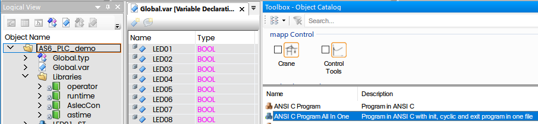

"All in One" - означает "всё в одном", иначе вам будет создано три (один файл - одна функция). Для вас же будет создан файл main.c с тремя функциями, куда нужно будет добавить в нашем случае одну-единственную строчку инвертирования переменной:

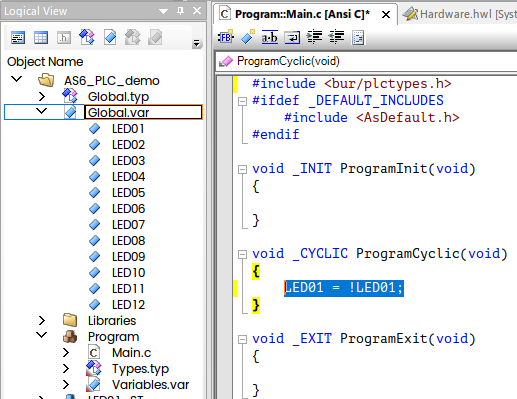

В принципе если вы загрузите эту программу в ПЛК, то светодиод сразу начнёт мигать, но тут надо сделать небольшое пояснение. Функции ProgramInit() и ProgramExit() вызываются одноразово при старте ПЛК и останове, а вот ProgramCyclic() вызывается циклически (её имя как бы намекает). Фактически там крутится бесконечный цикл, но он спрятан в недрах ПЛК, вам не нужно о нём заботиться. В этом цикле читаются все входы и переменные, затем выполняется ProgramCyclic(), после чего все выходы устанавливаются в соответствующие значения сообразно логике программы. Как часто вызывается ProgramCyclic()? Это определяется вот здесь в конфигурации:

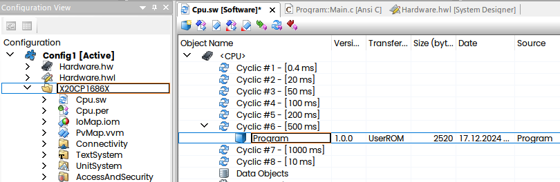

Вам доступно восемь "Cyclic" слотов с разным временем цикла. Программы можно добавлять сюда и перетаскивать их мышкой. В один слот можно поместить любое количество программ (предел мне неизвестен). Предопределённое время каждого слота можно изменить вот здесь:

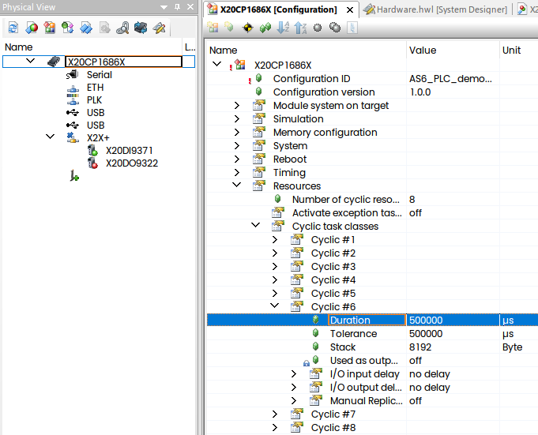

Минимально возможное время зависит от конкретного ПЛК, обычно 100-400 µs. Duration — это и есть время цикла, о Tolerance мы поговорим чуть ниже. В общем случае своим кодом вы должны уложиться во время Duration+Tolerance, иначе ПЛК свалится в ошибку (он ведь суть контроллер реального времени).

Вот собственно и всё, теперь программу можно загрузить в контроллер

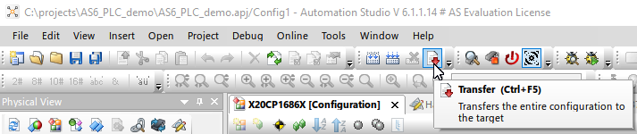

Если у вас нет физического контроллера, то можно активировать симуляцию:

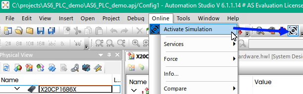

IP адрес контроллера, к которому коннектимся, задаётся в Online->Settings:

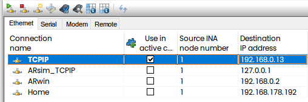

Процесс загрузки выглядит вот так:

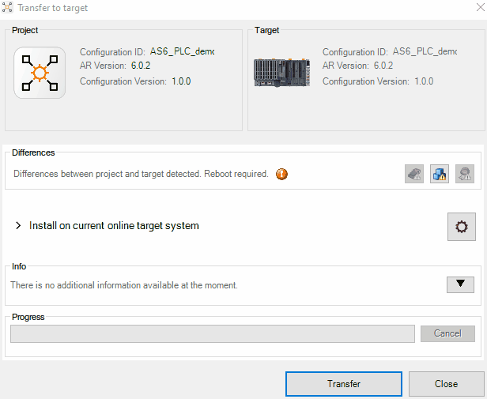

Как вы могли заметить, ПЛК перезагрузился. Он делает это не всегда, при небольших изменениях программа подменяется "на лету" без останова. На самом деле перезагрузка добавляет определённую головную боль, например, у вас ПЛК может управлять конвейером и для холодного рестарта вам может потребоваться снять все детали. Сименсовский ПЛК значительно более "устойчив", там вы меняете программу, и он как-то умудряется разруливать свои внутренние противоречия, а этот перегружается по каждому чиху, но к этому в общем можно привыкнуть.

А, нам же ещё хочется видеть изменение переменных в реальном времени, для этого есть Монитор, гуда можно перетаскивать переменные, ну и просто наведя мышкой на код можно видеть что там происходит:

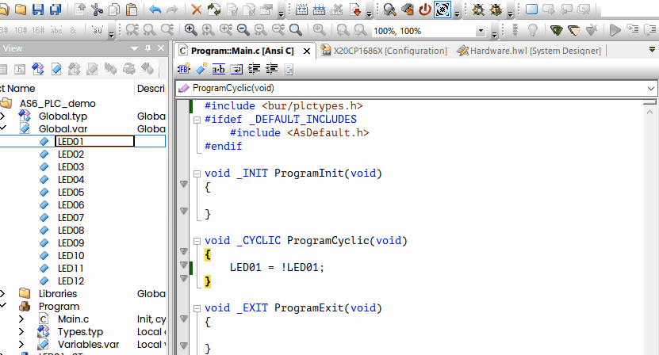

Прежде чем продолжать, давайте очень быстро и поверхностно пробежимся по остальным восьми языкам, начиная с тех пяти, что определены в МЭК 61131-3. Устройство у всех программ одинаково — есть Cyclic программа, куда и вписывается (или врисовывается) код.

### Другие языки - огласите весь список, пожалуйста

**ST - Structured Text.** Это текстовый язык и (так уж исторически сложилось) один из основных, на котором происходит разработка программ на B&R ПЛК. Это такой "паскалеподобный" язык.

Мигание светодиодом на нём будет выглядеть просто вот так:

```structured text
PROGRAM _CYCLIC
	LED11 := NOT LED11;	 
END_PROGRAM
```

В остальном язык как язык, если вы писали на Паскале или на Дельфи, вам понравится.

**IL — Instruction List.** Это тоже текстовый язык, весьма низкоуровневый, его ещё иногда называют "ассемблером для ПЛК". Я сто лет на нём ничего не писал, самый простой способ инвертировать выход выглядит вероятно как-то вот так:

```
PROGRAM _CYCLIC
	LDN LED12
	ST LED12
END_PROGRAM
```

Тут мы грузим инвертированный сигнал (LoaDNegative) в аккумулятор и пишем обратно (STore). Там есть и условия и переходы.

**LD - Ladder Diagram.** Это графический язык, который называют языком релейно-контактной логики. Если вы в прошлой жизни были электриком, то вам сюда.

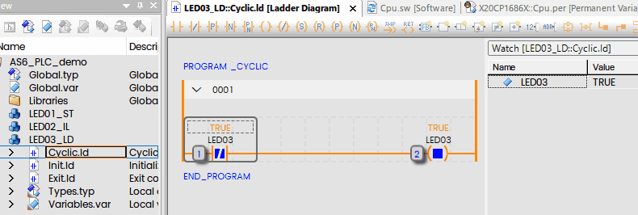

В последней версии визуально выглядит посимпатичнее чем раньше (а так вообще вся эта среда разработки "привет из девяностых").

**FBD — Function Block Diagram**. Это также графический язык. Выглядит как-то так:

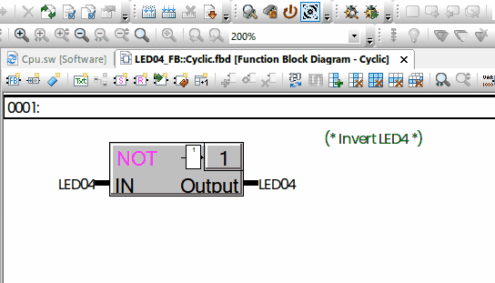

Вся программа будет выполняться поблочно и последовательно.

**SFC — Sequential Function Chart**. Тут есть шаги-экшены и переходы между ними.

На самом деле язык действительно не очень простой (в смысле интуитивности), за деталями могу предложить сходить в пост "[Светофор на ПЛК – все языки МЭК 61131-3](https://habr.com/ru/articles/209290/)", там всё то же, что и выше, только подробнее. 

**CFC —  Continuous Function Chart.** Этот язык не включён в МЭК 61131-3, но представляет собой, скажем так, расширение FBD, куда привнесена идеология потоков данных.

Я оставлю здесь скриншот из файла помощи, здесь рассматривается порядок выполнения блоков:

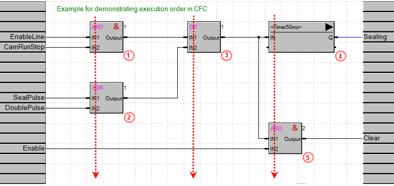

Не будет вызывать отторжения у тех, кто программировал на LabVIEW, а так всё это уже было в STEP 7 да в CODESYS.

**AB — B&R Automation Basic**. Это текстовый язык — специальное "изобретение" B&R.

Бейсик как есть, некромантам понравится.

**С++**. Об этом девятом языке особо говорить не о чем, Си++ он везде плюсплюс, базовый набросок инвертирования выхода от Си отличаться в общем не будет, но ниже будет пример поинтереснее.

**Ассемблер.** Да, этот ПЛК можно программировать и на ассемблере (добавляя написанные на ассемблере функции как *.s файлы, либо при помощи вставок ассемблерного кода прямо в Си или C++ код), ну а нужно ли — это уже другой вопрос. Я ниже покажу пример, ведь ассемблер — это же всегда весело, тут вы с процессором один-на-один.

### Оценка производительности ПЛК.

Ладно, вернёмся от МЭК 61131-3 к нормальному программированию. Мне на досуге стало любопытно, как можно замерить время выполнения участка кода. Это на самом деле довольно важно, мы как-то делали перемещение манипулятора с анализом коллизий (чтобы грубо говоря не въехать в стену), и действительно упёрлись в то, что не укладывались во время цикла, а увеличивать его не хотелось, так как это приводило к большим задержкам (приходилось тормозить сильно не доезжая до точки коллизии). Ну и просто интересно. И хотя в AS  есть инструменты для трассировки и профайлинга, однако мне хотелось "классического" бенчмарка, но оказалось, что функции запроса времени возвращают нули... И тут я вспомнил, что ведь есть ещё rdtsc, ну а интеловский процессор— он и в ПЛК остаётся им.

Вообще для того, чтобы воспользоваться __rdtsc() надо включить заголовочный файл x86intrin.h либо ia32intrin.h, и хотя оба эти файла вроде в наличии, но нет:


Где наша не пропадала, засучим рукава, и для начала просто поупражняемся. Пример использования ассемблера есть даже в файле помощи B&R, он выглядит вот так:

```
.globl asmfun
asmfun:
	push %ebp
	mov %esp, %ebp
	sub $0x18, %esp
	mov 0x8(%ebp), %eax
	mov %ax, 0xfe(%ebp)
	movzwl 0xfe(%ebp), %eax
	inc %eax
	movswl %ax, %edx
	mov %edx, %eax
	lea 0x0(%esi), %esi
	leave 
ret 
```

Тут просто инкремент, я не знаю зачем так сложно. Сложим, к примеру просто два целых числа:

```
.globl add_integers
.type add_integers, @function

add_integers:
    push %ebp
    mov %esp, %ebp
    
    mov 8(%ebp), %eax   # Грузим первый аргумент в eax
    add 12(%ebp), %eax  # Прибавляем второй туда же, в eax
    
    mov %ebp, %esp
    pop %ebp
    ret
```

Этот код надо положить в *.s файл, прибавить до кучи нехитрый заголовочный файл

```
/* Declaration */
int add_integers(int, int);
```

И можно использовать:

```
void _CYCLIC ProgramCyclic(void)
{
	res1 = add_integers(a++, b++);
}
```

И оно работает:

<ГИФКА>

Для тех, кому синтаксис GNU Assembler кажется богомерзким, можно и вот так:

```
.globl add_integers_intel
.type add_integers_intel, @function
.intel_syntax noprefix

add_integers_intel:
    push ebp
    mov ebp, esp
    
    mov eax, [ebp+8]   # Тут справа налево
    add eax, [ebp+12]  # 
    
    mov esp, ebp
    pop ebp
    ret
```

Ну а если лень класть код в *.s файл, то можно заинлайнить прямо в Си код:

Хоть так:

```c
int add_integers_inline(int a, int b) {
	int result;
	__asm__ (
		"movl %1, %%eax\n\t"
		"addl %2, %%eax"
		: "=a" (result)
		: "r" (a), "r" (b)
	);
	return result;
}

void _CYCLIC ProgramCyclic(void)
{
	//...
	result = add_integers_inline(a++, b++);
}
```

Либо вообще так:

```c
void _CYCLIC ProgramCyclic(void)
{
	//...
	
	__asm__ (
		"movl %1, %%eax\n\t"
		"addl %2, %%eax"
		: "=a" (result)
		: "r" (a), "r" (b)
	);
}
```

Кстати, на использование регистров rax и прочих 64-битных компилятор ругается:

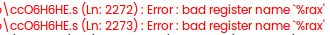

что вероятно намекает нам на то, что мы находимся в 32-битном окружении. 

Ну вот, теперь. после несложных упражнений можно перейти к делу.

Нам потребуется вот такая нехитрая функция, тут одна команда всего:

```assembly
uint64_t rdtsc() {
	uint32_t low, high;
	__asm__ __volatile__ (
		"rdtsc" 
		: "=a" (low), "=d" (high)
	);
	return ((uint64_t)high << 32) | low;
}
```

Заметьте, что тут добавлено __volatile__, это нужно так как формально компилятор имеет право переставлять инструкции, не влияя на результат, а нам как раз важно чтобы rdtsc была вызвана именно там, где мы просим. 

Делаем несложную программку CycleTime:

```c
#include <bur/plctypes.h>
#include <inttypes.h>

#ifdef _DEFAULT_INCLUDES
	#include <AsDefault.h>
#endif

static uint64_t cycles, cycles_saved;

void _INIT ProgramInit(void)
{
	cycles_saved = rdtsc();

}

void _CYCLIC ProgramCyclic(void)
{
	cycles = rdtsc();
	CycleTimeTicks = (UDINT)(cycles - cycles_saved);
	cycles_saved = cycles;
}

void _EXIT ProgramExit(void) { }
```

 и кладём её в цикл в одну секунду

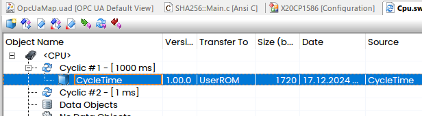

Теперь надо как-то вытащить данные наружу (мне хочется иметь график). В принципе в Automation Studio есть встроенный профилировщик, но он выносит мне мозг, я хочу просто получить значения переменной.

Самый простой способ — просто поднять OPC UA сервер и забрать данные подходящим клиентом, он в AS4 вот тут включается:

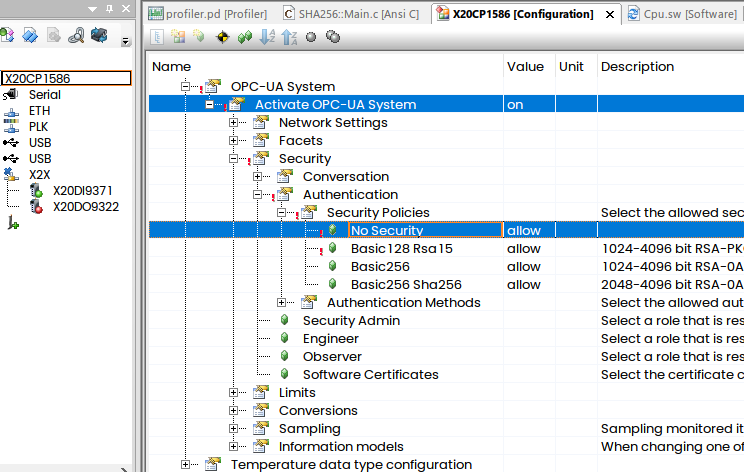

Вообще класть все настройки в одно здоровенное дерево, чтоб потом лазить туда-сюда - это болезнь всех сред разработки для ПЛК, у Сименса тоже примерно также. 

Теперь подключаем нашу переменную в OpcUaMap файле:

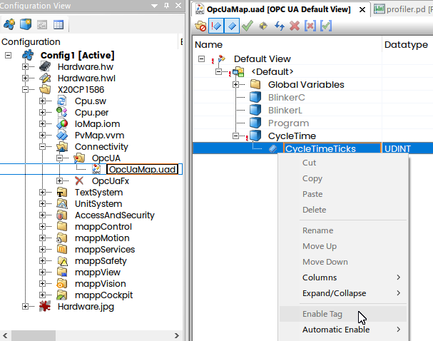

Это всё. У любого АСУ ТП инженера в ящике с инструментарием валяется OPC UA клиент, обычно пользуются UA Expert:

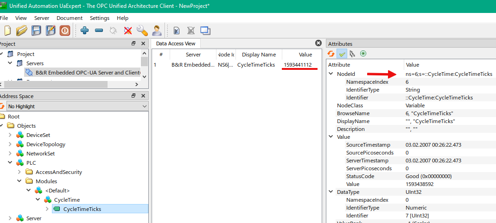

Теперь мне проще всего взять LabVIEW с OPC UA тулкитом и набросать вот такую оснастку:

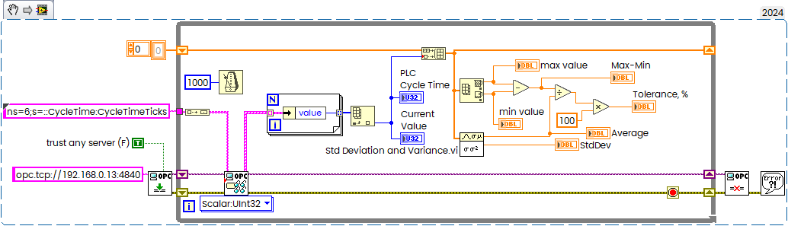

И вот мой график количества циклов:

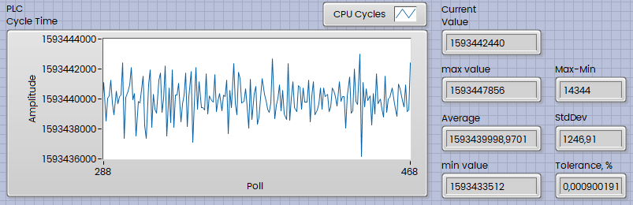

Среднее значение количества тактов при 1 секундом цикле в 1593440000 намекает мне, что частота шины там 99.59 МГц (), так как 16 * 99590000 даст мне ровно то самое значение. Время цикла слегка потрясывет на плюс минус десяток тысяч тактов, но эта тысячная доля процента вообще ни о чём, вы никогда в жизни не получите такого устойчивого значения под Виндовс. Реалтайм есть реалтайм. В принципе эта тенденция будет сохраняться и при уменьшении времени цикла. На минимальном времени в сто микросекунд у нас будет 160000 тактов на цикл, но я не буду утомлять читателя ненужными цифрами.

Давайте прикинем производительность камушка. В качестве референсного кода я возьму [вот эту реализацию SHA256 на чистом Си](https://github.com/B-Con/crypto-algorithms/blob/master/sha256.c) и просто скопирую файл и заголовок в проект как есть (чуть поправив типы данных, чтобы не было предупреждений), собственно и всё. Вы, кстати, пробовали вычислить SHA256 на сименсовском ПЛК? Нет ничего невозможного, но таки придётся повозиться.

Собственно вычисление производится в три строчки, которые я обложу контролем времени:

```с
#include "sha256.h"
static long long begin, begin_saved, end;

void _INIT ProgramInit(void)
{
	int i; //C99
	for(i = 0; i< sizeof(buffer); i++) buffer[i] = 'a';
}

void _CYCLIC ProgramCyclic(void)
{
	SHA256_CTX ctx;

	begin = rdtsc();
	cycle_time = (LREAL)(begin - begin_saved);
	begin_saved = begin;
	
	sha256_init(&ctx);
	sha256_update(&ctx, buffer, sizeof(buffer));
	sha256_final(&ctx, digest);

	end = rdtsc();
	cpu_time_used = ((LREAL)(end - begin));

	MBperSec = cycle_time / cpu_time_used;
}
```

Буфер я заведу размером в мегабайт (точнее в мебибайт, если уж быть дотошным) и заполню его буквами "а", чтобы быть уверенным, что дайджест вычисляется верно. На моём десктопе этот код, будучи скомпилированным самым свежим gcc выдаёт на гора около двухсот мегабайт в секунду. Посмотрим, что будет на атомном ПЛК.

<РЕЗУЛьТАТ>

Ну, как я это называю, камушек с TDP в четыре с половиной ватта и работатет на те самые четыре с половиной ватта. Чудес не бывает, реалтайм это не про скорость, это про детерминированность.

### Стреляем себе в ноги

Тут мой коллега, заметив все эти эксперименты, заявил, что мол как-же так, ведь ПЛК — это типа эталон надёжности, а ты его на Си..., можно ж "выстрелить себе в ногу" как это нынче модно говорить. Понятное дело, что ассемблерными вставками я могу отстрелить себе вообще всё что угодно, но давайте попробуем, нет проблем:

```c
void _CYCLIC ProgramCyclic(void)
{
	int *p = 0;
	*p = 0;
}
```

этих двух операторов достаточно, чтобы положить ПЛК "на лопатки". При исполнении этого кода он мгновенно перезагрузится, и перейдёт в сервисный режим. Совсем он не умрёт, встроенный веб сервер диагностики выживет, и там можно увидеть статус, он доступен вот здесь:

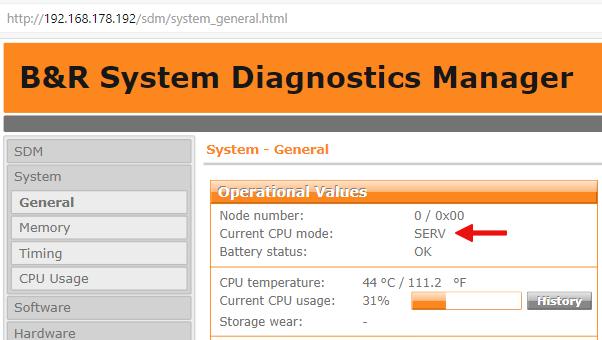

А в логгере причину останова:

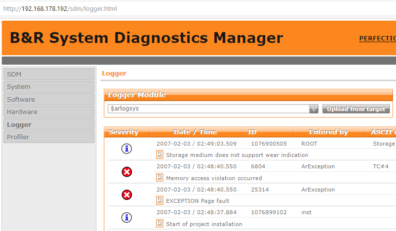

Выброшено исключение, так как мы из программы в TC#4 ткнулись куда не следует, всё честно.

Вернуть всё обратно несложно, надо убрать причину неполадки и загрузить новую программу (флешку в кардридер переставлять не надо, ПЛК в таком режиме вполне вменяем). Важно понимать, что на выходах останутся старые значения и все железки, подключённые к ПЛК, могут перейти в "неопределённое состояние".

Другой пример, я положу программу для вычисления SHA256 в цикл 10 мс. Поскольку для вычисления нужно раз этак в десять больше времени, то мы гарантированно спровоцируем таймаут.

Результат, как говорится "те же, там же" - мы снова встали в сервис, вот только причина другая:

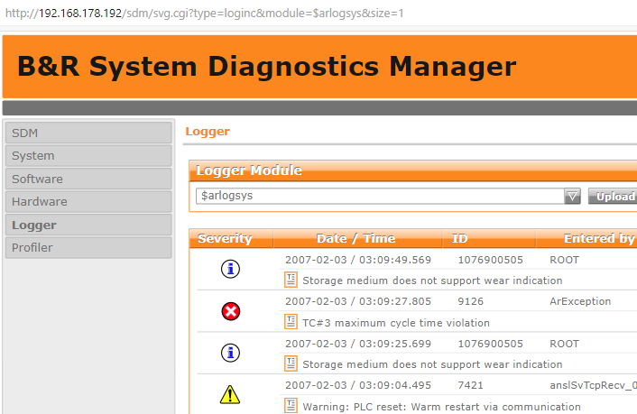

Максимальное время в TC#3 превышено. Вот что происходит, если мы не укладываемся кодом в отведённый лимит.

И так далее. В принципе "окирпичить" этот ПЛК непросто, так как даже если программа окажется настолько кривой, что всё встанет вообще "колом" (мне удавалось и такое), то всегда можно просто вытащить флешку, закинуть на неё "живую" программу, прошить в кардридере и ПЛК будет как новенький, снова в строю.

### Безопасность

Некоторые читатели могут воскликнуть "ну то есть, если всё пошло вразнос, я пытаюсь всё остановить, а ничего не выходит, потому что ПЛК встал, словив исключение — так же нельзя". На самом деле система всегда проектируется с таким расчётом, что ПЛК в любой момент может уйти в отказ. И даже не в смысле программной части — там ведь обычный Атом, память, флешка, куча электроники, отказоустойчивость которой далеко не бесконечна. Но не всё так плохо. Если вы внимательно смотрели на фотку тестового стенда, то видели, что там на рейке висели также и нарядные жёлто-красные модули. Это "безопасные" модули (Safety). Никто и никогда не заводит кнопку экстренного останова на обычный ПЛК, их соединяют либо с релейной автоматикой, либо заводят на вот такие специальные модули. Кнопка экстренного останова есть и на нашем тестовом стенде, и если заглянуть на обратную сторону, то вы увидите, что там не два, а четыре провода, внутри там две пары нормально замкнутых контактов и безопасный ПЛК постоянно их опрашивает, сам этот ПЛК тоже сдублированный, да и модули ввода/вывода — тоже. Кроме того, оранжевый PowerLink заведён и на моторы, которые подключены к безопасному контроллеру, так что если оператор жамкнет по экстренному останову, то моторы немедленно (безо всяких "мягких тормозных рамп") встанут, даже если основной ПЛК к тому времени будет чуть более чем мёртв.

Конечно, хотелось бы иметь и Раст на борту, но вообще говоря не бывает абсолютно безопасных языков программирования, всё чаще встречаются просто кривые руки.

### Идём в Плюсплюсы

Компиляция Си и С++ программ осуществляется при помощи тулчейна gcc. Предыдущие версии Automation Studio включали в себя древнейшие версии компиляторов начала века, там просто не поддерживались современные стандарты С++. Мы даже обращались в поддержку, и вот оно, свершилось — в AS6 завезли gcc v.11.3, о чём гордо отчитались в окошке "о программе":

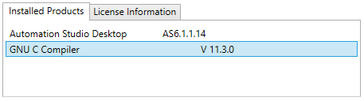

Мир заиграл новыми красками.

Я это к чему. Один из основных паттернов проектирования в АСУ ТП — это конечный автомат. Если бы я проводил собеседование, то непременно спросил бы новичка, у которого ещё свежи теоретические знания основ теории автоматов, чем отличаются автоматы Мили и Мура, начинающего миддла вероятно попросил бы нарисовать и обсудить RS триггер, а самым продвинутым предложил бы изобразить конечный автомат, перемножающий два двоичных числа. Инженер АСУ ТП может быть не в курсе про синглтоны, но вот конечные автоматы знать обязан.

Если вы программируете на ST, то скорее всего вас ждёт развесистый switch, каждый кейс которого — суть состояние. В несложный автоматах это норм, но при усложнении логики будут проблемы.

Наш ведущий инженер сделал универсальную библиотечку для конечных автоматов используя ООП, но во время проектирования он испытывал сильные моральные страдания, будучи вынужден пользоваться устаревшим инструментарием (пытаться подменять тулчейн смысла нет, там gcc допиленный B&R). Выкладывать код с работы я по понятным причинам не имею права (да и с выпуском AS6 он перешёл в состояние "легаси"), но на С++ существуют готовые открытые реализации конечных автоматов разной степени удобства и элегантности. Я взял одно из них — [High-Performance Hierarchical Finite State Machine](https://github.com/andrew-gresyk/HFSM2), авторства Andrew Gresyk (я не знаю, как правильно пишется фамилия Андрея по-русски). Эта реализация довольно удобная и свежая, в одном заголовочном файле, и полностью совместима с последней версией AS (что удивительно, там в [machine.hpp](https://github.com/andrew-gresyk/HFSM2/blob/master/include/hfsm2/machine.hpp) больше семнадцати тысяч строк, но нет, ни одной ошибки или даже предупреждения не вывалилось), кроме того снабжена готовым [примером светофора](https://github.com/andrew-gresyk/HFSM2/blob/master/examples/basic_traffic_light/main.cpp), который мы просто перетащим в ПЛК.

Вот смотрите, как там устроен оригинальный пример на самом высоком уровне:

```cpp
int main() {
	// shared data storage instance
	Context context;

	FSM::Instance machine{context};

	while (machine.isActive<Off>() == false)
		machine.update();

	return 0;
}
```

Он просто идеально ложится на идеологию ПЛК, цикл while - это как раз наша Cyclic программа, которую крутит сам ПЛК, так что выкидываем while, выносим контекст за скобки и вот весь наш код в main.cpp:

```cpp
#include "machine.hpp"

// shared data storage instance
Context context;
FSM::Instance machine{context};

void _CYCLIC ProgramCyclic(void)
{
	machine.update();
}
```

Каждый такт циклической программы наш ПЛК будет проворачивать автомат, а тот будет прыгать из одного состояния в другое. Всё.

Состояния я вынесу в отдельный файл, там вначале идёт их список:

```cpp
#include "machine.hpp"

// data shared between FSM states and outside code
struct Context {
	unsigned cycleCount = 0;
	unsigned countGreenBlinking = 0;
	unsigned countGreen = 0;
	unsigned countYellow = 0;
	unsigned countRed = 0;
};

// convenience typedef
using M = hfsm2::MachineT<hfsm2::Config::ContextT<Context>>;

// macro magic invoked to simplify FSM structure declaration
#define S(s) struct s

// State machine structure
using FSM = M::PeerRoot<
	// sub-machine ..
	M::Composite<S(On),
	// .. with 5 sub-states
	S(Red),
	S(YellowDownwards),
	S(YellowUpwards),
	S(GreenBlinking),
	S(Green)
	>,
				S(Off)
			>;
#undef S

//------------------------------------------------------------------------------

static_assert(FSM::regionId<On>()			  ==  1, "");

static_assert(FSM::stateId<On>()			  ==  1, "");
static_assert(FSM::stateId<Red>()			  ==  2, "");
static_assert(FSM::stateId<YellowDownwards>() ==  3, "");
static_assert(FSM::stateId<YellowUpwards>()	  ==  4, "");
static_assert(FSM::stateId<GreenBlinking>()	  ==  5, "");
static_assert(FSM::stateId<Green>()			  ==  6, "");
static_assert(FSM::stateId<Off>()			  ==  7, "");
```

А самое "мясо" выглядит вот так, к примеру, мы находимся в состоянии "мигающий зелёный" и по истечении заданного времени мигания переходим в состояние "жёлтый вверх", это когда он загорается без красного:

```
struct GreenBlinking
	: FSM::State
{
	void enter(Control& control) {
		TraceMessage("Green Blinking");
		CountDownGreenON = true;
		control.context().countGreenBlinking = 0;
	}

	void update(FullControl& control) {
		LightGreen = !LightGreen; // Blinking
		if ((control.context().countGreenBlinking++ > DurationGreenBlinking) && !LightGreen) {
			control.changeTo<YellowUpwards>();
		}
		CountDown--;
	}
};
```

Мигание зелёного ничем не отличается от мигания светодиодиком, LightGreen заведена прямо на выход ПЛК. Количество "обвязки" минимально и такое решение можно легко масштабировать.

В жёлтом состоянии мы выключим зелёный, зажжём жёлтый и потом перейдём в состояние красного:

```c++
struct YellowUpwards
	: FSM::State
{
	void enter(Control& control) {
		TraceMessage("Yellow ^");
		LightGreen = false;
		LightYellow = true;
		CountDownGreenON = false;
		control.context().countYellow = 0;
	}

	void update(FullControl& control) {
		if (control.context().countYellow++ > DurationYellow) {
			control.changeTo<Red>();
		}
	}
};
```

Очень удобно то, что в каждом состоянии есть функция enter(), которая выполняется однократно при входе в это состояние, затем циклически выполняется update() на каждый вызов machine.update(), которую там выше крутит ПЛК.

Трассировка состояний в оригинальном примере шла прямо в консоль std::cout:

```
struct Green
	: FSM::State
{
	void enter(Control&) {
		std::cout << "      Green" << std::endl;
	}
	void update(FullControl& control) {
		control.changeTo<YellowUpwards>();
	}
};
```

Но у нас нет консоли (а жаль), и хотя есть лог, но я добавлю самодельный велосипед:

```
void ClearTraceLog()
{
	for (int i=0; i<MAX_LOG_ENTRIES; i++) strcpy(TraceMessages[i], "");
}

void TraceMessage(const char* Message)
{
	for (int i=0; i<MAX_LOG_ENTRIES; i++){
		strcpy(TraceMessages[i], TraceMessages[i+1]);
	}
	strcpy(TraceMessages[MAX_LOG_ENTRIES], Message);
}
```

И теперь я вижу, как автомат переходит из одного состояния в другое, заодно и то, что он показывает:

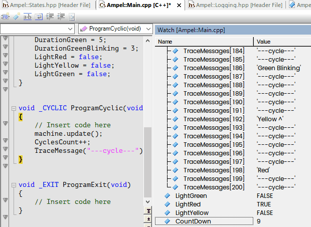

Я с воодушевлением продемонстрировал этот проект моему коллеге, дядьке за шестьдесят, начинавшему ещё со STEP 5 (я в общем тоже немолод, мы за четверть века запустили с ним несметное число систем, выпив вместе вёдра пива на пусконаладках), предложил ему на досуге выучить C++ и делать теперь только так и вот он как-то странно на меня посмотрел, нехорошо так посмотрел, не по-доброму... Ну да ладно.

### OPC UA в AS6

Тут возникает вопрос — как отобразить на экране всё, что происходит в ПЛК. Понятно, что можно пробросить наружу все необходимые сигналы в OPC UA, и с этого момента можно использовать любой доступный инструментарий, поддерживающий эту технологию, хоть С#, хоть Питон, хоть LabVIEW (что и было выше продемонстрировано).

Единственный момент — в AS6 настройки OPC UA сервера переехали в другое место, вот сюда:


Всё в лучших традициях — в Виндовс настройки тоже гоняют туда-сюда.

Тут также кое-что обновили в смысле списка алгоритмов шифрования, кроме того почему-то в анонимном режиме подключение стало невозможно, теперь просто обязательно создание минимум одного пользователя с соответствующим уровнем доступа:


В остальном всё также, переменные маппятся на узлы OPC UA, и вот наша нехитрая программка на LabVIEW


бодро мигает светофором из ПЛК:


### Визуализация (SCADA) в mappVIEW

Но на борту у этого ПЛК есть и встроенное решение, которое называется mappVIEW (точнее их два — VC4 и mappVIEW, но VC4 — это отчаянное легаси, там по сути поднимается VNC сервер и вы можете заходить в ПЛК любым VNC клиентом, это всё равно что сравнивать WinForms и WPF).

Суть в том, что в логическом представлении вы строите страницы, так как хотите показать их юзеру, просто интерактивно перетаскивая контролы и индикаторы на панели (можно создавать визуализации под разные разрешения, скажем если вы хотите показать что-либо на планшете или смартофоне), а затем биндите их к переменным.

В живой разработке это выглядит как-то вот так:

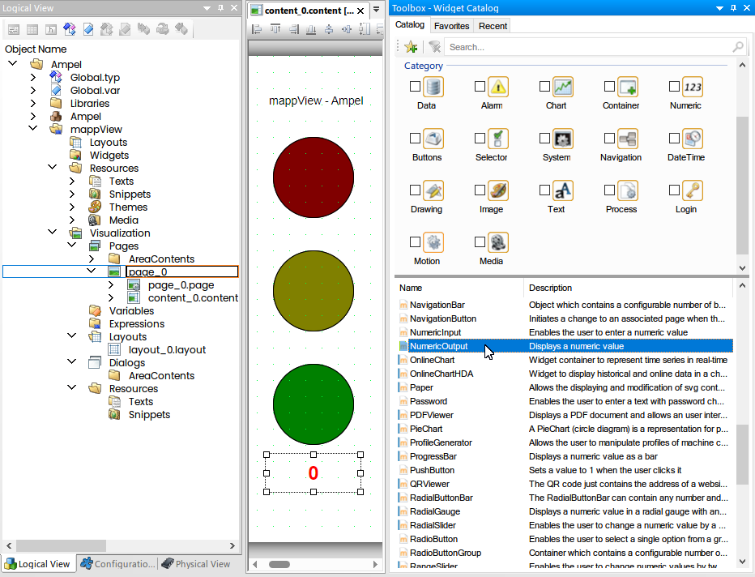

Там много чего можно сделать, например бросить на панель видеоплеер и развлекать оператора видосиками:

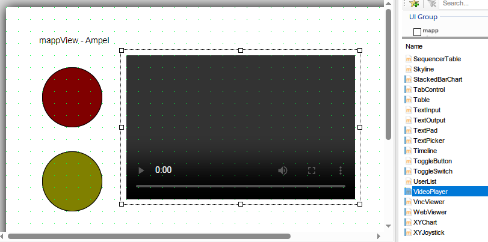

Тут же я, не мудрствуя лукаво, просто набросал цветных кружочков да численный индикатор, и буду дёргать свойства видимости. Вся разметка хранится в XML файле, что хорошо с точки зрения контроля версий.

Ну а связи (Bindings) прописаны в конфигурационной вкладке, там тоже XML:

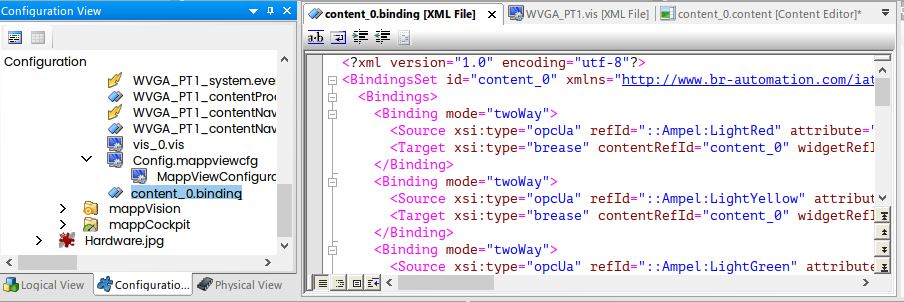

По сути тут работает MVVM, всё достаточно разумно. Если вы работали с WPF или Авалонией, то вам всё будет весьма близко и знакомо.

После загрузки этого проекта в ПЛК (или в симулятор) он поднимет вам веб-сервер на 81-м порту (это настраивается само собой) и вот:

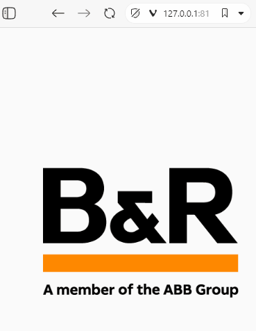

Технически там адский коктейль из JS, CSS и HTML5. Кстати, самый "беспроблемный" браузер — это как ни странно Vivaldi, в Файрфоксе и Хроме вёрстка бывало слегка "уезжала", кроме того Vivaldi несложно установить в Stand Alone, у меня всегда открыто два окна, и если открыть веб сервер диагностики, то сервер mappView в той же сессии открыть не получится, там куки отчаянно дерутся друг с другом.

В случае, если в системе установлен монитор B&R, то оно работает ровно также, только монитор включён в проект, но по сути в мониторе встроен одноплатник на линуксе с веб-браузером (к нему можно и клавиатуру с мышкой подключить), он коннектится к ПЛК точно также как и обычный клиент и просто показывает веб-страничку (управлять тоже можно, он с тач-скрином).

### IDE

Вообще говоря, Automation Studio — одна из самых ужасных IDE, которую я когда-либо держал в руках. В четвёртой версии там был жутко раздражающий баг, проявляющийся в том, что при определённом стечении обстоятельств и интенсивном использовании препроцессора эта среда могла почикать все отступы, превратив код в сплошную простыню операторов, причём это могло произойти при открытии или сохранении проекта. Это так отрабатывала опция "умного отступа". Баг пофиксили, но осадочек остался, и хотя в шестой версии всё стало лучше, но автоматические отступы время от времени "промахиваются" мимо правильных уровней вложенности. Сравнивать редактор AS с MSVS - это всё равно что сравнивать гусеничный трактор с Теслой.

Во время интенсивной работы над кодом я даже время от времени переходил на VS Code. В принципе Си/С++ в проекте лежат как нормальные файлы, их без разницы где редактировать, хоть в Notepad. Само собой в системе контроля версий всё хорошо, хоть в Git, хоть в TFS, чего не скажешь о графических языках из списка МЭК 61131-3.

Вызывать компилятор, кстати, можно и из командной строки, как-то вот так:

```
<Путь куда установлена AS>\BR.AS.Build.exe" <проект>.apj -all
```

Опции командной строки

```
Usage: BR.AS.Build.exe file... [options]
Options:
-h / -?	Displays this information
-c <config>	Name of the configuration to be built
-t <directory>	Temporary directory
-o <directory>	Output directory
-all	Project rebuild (cleans the binary and parts of the temporary files)
-profile	Display profiling information
-X	Create cross reference only data
-clean	Cleans the Binary and parts of the Temp folder
-clean-temporary	Cleans the Temp folder
-clean-binary	Cleans the Binary folder
-clean-generated	Cleans the Temp\Includes and Temp\Archives\<ConfigName> folder
-clean-diagnosis	Cleans the Diagnosis folder
-cleanAll	Cleans the Temp, Binaries, Diagnosis and the rest of temporary folders
-buildMode "<mode>" Defines the mode of the build ("Build", "BuildAndTransfer", "BuildAndCreateCompactFlash")
-simulation Flag indicating if a simulated configuration should be built
-buildRUCPackage Flag indicating if a RUC Package should be created during build
```

С этим уже можно жить, сделав билд-спецификацию в том же VS Code. Но отладка и настройка — тут само собой — только в Automation Studio.

### Заключение

Вот собственно и всё, что я хотел рассказать. Самое главное, наверное, это то, что современные АСУ ТП — это не только про довольно устаревшие релейные схемы, но и достаточно современные технологии. И да, знание C++ вполне может пригодиться, инженеру АСУ ТП в том числе.

Тема на самом деле очень обширная, к сожалению за кадром осталась отладка — да там, можно ставить точки останова и выполнять программу пошагово, работает через gdb (кто бы сомневался при наличии gcc компилятора), также есть юнит-тестирование, настройка и конфигурация безопасной части (там отдельная IDE — SafeDESIGNER), довольно увлекательно работать с моторами. Возможно даже кого-нибудь этот пост мотивирует начать карьеру АСУ ТП программиста.

Всех с наступающим Рождеством!
