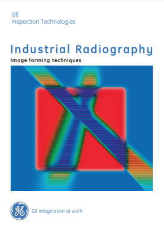
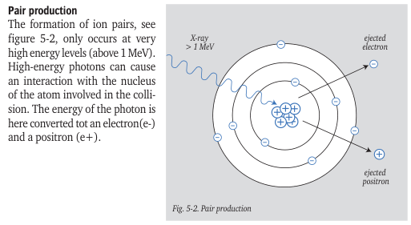
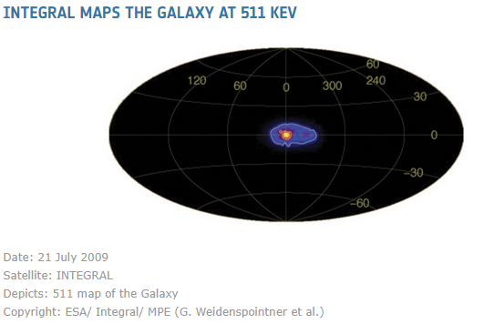

If you have LINAC in your hands, and working with at very high energies like gamma-rays, then probably know that together with Photoelectric and Compton effects you have also well-known Pair production inside of your object under inspection.

Just take a look into "Industrial Radiography — Image Forming Technique" (still available here), I mean this brochure:

then on the page 24 you will see an illustration

Here I would like to add some remarks. First of them — the electron and positron are not "ion pairs". Well, Ion pairs generally consist of a positively and negatively charged ions created through ionization processes. In contrast, pair production creates a particle-antiparticle pair — the electron (which is a negatively charged elementary particle) and the positron which is the electron's antimatter counterpart with a positive charge). While both particles are charged with opposite sign, they are not ions in the traditional sense.

If you will take a look on the picture you might get wrong feeling that the positrons are "ejected" from the nucleus. It is not. There are no positrons inside of nucleus, the nucleus of an atom consists of protons and neutrons, and the protons are indeed positively charged, therefore marked "+" on the Figure above, but protons and positrons are not the same at all.  The term "pair" in pair production refers to the simultaneous creation of two new particles from energy. Pair production does not occur within the nucleus or involve the electrons already present in an atom, the photon interacts with the strong electric field surrounding the nucleus, not the nucleus itself.

And the required minimal photon's energy level (stated "above 1 MeV" on the picture above) must have energy greater than 1.022 MeV, to be exact (you will understand later why).

Most interesting thing is — what happened with positron and electron after that? As you have read in many science fiction books — when antimatter collides with matter, then "boom" happened. And this is exactly what happened here — this process called electron-positron annihilation. And the annihilation results in the creation of two new energetic photons, each with an energy of 511 keV. So, your part act as secondary 511 keV X-Ray Tube.

If you have curious brain, then you will ask yourself — why exactly 511 keV? Is it always 511? Why not 500?

It is simply because of 
$$
E=mc^2
$$
Indeed, mass of the electron (or positron, they have the same mass) is 
$$
9.10938356 \times 10^{-31} \text{ kg}
$$
speed of the light in the vacuum is
$$
2.99792458 \times 10^{8} \text{ m/s}
$$
Now just multiply all together, this will give us Energy in Joules:
$$
E = (9.10938356 \times 10^{-31} \text{ kg}) \times (2.99792458 \times 10^{8} \text{ m/s})^2 = 8.18710565 \times 10^{-14} \text{ J}
$$

Relationship between one Joule and eV is 
$$
6.241509074461 \times 10^{18} \text{ eV/J}
$$
And multiply both together
$$
(8.18710565 \times 10^{-14} \text{ J}) \times (6.24150907 \times 10^{18} \text{ eV/J}) = 5,10998942 \times 10^{5} \text{ eV} \approx 511 \text{ keV}
$$

This is how E=mc^2 working exactly and great  practical proof. Albert Einstein war genius — he wrote this equation in 1905 (just ten years after X-Ray discovery). Unbelievable!

Now you can understand — why do you need at least 1.022 MeV (twice the rest mass of an electron) — it is because two particles produced and then both annihilates, therefore double energy required and the energy must be obviously preserved.

Technically you have only rare incidents of pair production at the minimum photon energy required 1.022 MeV, but it becomes more significant at energies around 10 MeV like our High Energy System, which is 9 MeV max. What happened with rest energy? This is why pair production requires the presence of an atomic nucleus — to conserve momentum. The photon must be near a nucleus in order to satisfy conservation of momentum, as an electron–positron pair produced in free space cannot satisfy conservation of both energy and momentum. Because of this, when pair production occurs, the atomic nucleus receives some [recoil](https://en.wikipedia.org/wiki/Atomic_recoil). But this shake is not large — the protons inside of nucleus much much heavier than electrons or positrons, they are
$$
1.67262193 \times 10^{-27} \text{ kg}
$$
Back to 511 keV — this also called as characteristic annihilation radiation, happened everywhere in our Universe, this 511 keV x-ray line is prominently associated with the annihilation of positrons in the Milky Way, particularly concentrated towards the Galactic center. This emission was first detected in the early 1970s and has been confirmed by numerous observations, including those from the [INTEGRAL satellite](https://sci.esa.int/web/integral/-/45328-integral-maps-the-galaxy-at-511-kev) and other gamma-ray observatories.

And also  511 keV emissions can occur in thunderstorms called as Terrestrial Gamma-Ray Flashes (TGFs). Thunderstorms can produce TGFs, which are intense bursts of gamma rays, including emissions around 511 keV. These flashes occur when electrons are accelerated to nearly the speed of light in the strong electric fields created within storm clouds. When these high-energy electrons collide with air molecules, they can produce gamma rays, including the annihilation radiation from positrons created in the process.

Just one more thing about Einstein Equation:

As you can see, the mass of an electron is very small. However, when multiplied by the square of the speed of light, it produces a significant energy of 511 keV (which could be considered "high" in the context of NDT compared to 450 kV tubes) during the conversion of rest mass to pure energy. This immense energy was practically demonstrated in Japan on August 6, 1945. On that day, approximately 0.7 grams of matter from about 64 kilograms of highly enriched uranium-235 was converted into energy. Just remember, it was less than one gram.
