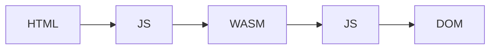

# Как я перенес консольное приложение в Rust + WASM и выложил на GitLab Pages

Мне попало небольшое консольное приложение с предложением посмотреть, как работает.  
Вместо локального запуска я решил сразу сделать веб-версию, которую можно открыть по [ссылке на демо][demo].

Вместо этого предложил автору перенести утилиту в WebAssembly и опубликовать как статическую страницу. Приложение легкое, без системных вызовов, идеально подходит для WASM.

Автор отказался, но идея мне самому очень понравилась. В итоге сделал перенос сам: переписал консольную логику на Rust, собрал в WASM и выложил рабочую демку через GitLab Pages.

![./comix/1.png][img-comix-1]

## Что в итоге получилось

- Репозиторий: [gitlab.com/Evgene-Kopylov/iching_wasm][repo]
- Демо: [i-ching-wasm-c50914.gitlab.io][demo]

![./comix/2.png][img-comix-2]

Технически проект состоит из трех частей:

- `src/lib.rs` — вся вычислительная логика на Rust;
- `public/index.html`, `public/styles.css`, `public/app.js` — статичный интерфейс под «терминал»;
- `public/pkg/*` — артефакты `wasm-pack`.

## Почему этот кейс хорошо лег на WASM

Здесь нет:

- работы с файловой системой;
- прямых вызовов платформенных API;
- тяжелых фоновых задач.

Фактически приложению нужно только принимать команду и возвращать текстовый результат. Для браузера это идеальный сценарий: вычисления внутри WASM, оболочка в HTML/CSS/JS.

## Как Rust-код экспортируется в WASM

Ключевой момент в `src/lib.rs` — экспорт функции с `#[wasm_bindgen]`:

```rust
#[wasm_bindgen]
pub fn generate_reading_text() -> String {
    // ... генерация и форматирование результата
}
```

Это и есть точка входа, которую затем вызывает JS в браузере.

Сборка:

```bash
wasm-pack build --target no-modules --release --out-dir public/pkg
```

После этого получаем `iching_wasm.js` и `iching_wasm_bg.wasm`.

## Как готовый WASM интегрируется с HTML через JS

В моем случае модуль инициализируется в `public/app.js`.

Я дополнительно встраиваю `.wasm` в base64, чтобы страница работала даже через `file://` (без отдельного запроса к `*.wasm`):

```js
const wasmBytes = base64ToBytes(window.ICHING_WASM_BASE64);
wasm_bindgen.initSync({ module: wasmBytes });

const text = wasm_bindgen.generate_reading_text();
output.textContent = text;
```

В `index.html` подключаются:

- рантайм `./pkg/iching_wasm.js`;
- файл с base64-байтами `./pkg/iching_wasm_bg_base64.js`;
- приложение `./app.js`.



## Терминальный UI в браузере без UI-фреймворков

Отдельно понравилось, насколько просто оказалось повторить UX консоли на чистом фронте:

- контейнер с рамкой и «заголовком окна»;
- моноширинный шрифт;
- темная палитра;
- блок `<pre>` для вывода текста;
- кнопка-команда в стиле `./generate_reading`.

Фактически это обычный статичный HTML, но визуально и по сценарию использования ощущается как терминал.

![Терминальный интерфейс веб-версии][img-ui]{ width=350 }

## Публикация через GitLab Pages: один понятный путь

Для публикации хватило `.gitlab-ci.yml` и папки `public`.

```yaml
image: rust:slim

create-pages:
  pages:
    publish: public
  rules:
    - if: '$CI_COMMIT_REF_NAME == $CI_DEFAULT_BRANCH'
  before_script:
    - rustup target add wasm32-unknown-unknown
    - cargo install wasm-pack --locked
  script:
    - wasm-pack build --target no-modules --release --out-dir public/pkg
    - b64="$(base64 public/pkg/iching_wasm_bg.wasm | tr -d '\n')"
    - printf 'window.ICHING_WASM_BASE64 = "%s";\n' "$b64" > public/pkg/iching_wasm_bg_base64.js
```

Мне понравилось, что процесс линейный: CI собирает, кладет в `public`, Pages публикует.  
Без разветвления на несколько «равно правильных» сценариев.

![Сборка WASM и автоматическая публикация статической страницы][img-deploy]

## Что оказалось полезным на практике

- Делать демо через браузер часто удобнее и безопаснее для всех участников.
- Если логика независима от ОС, перенос в WASM часто проще, чем кажется.
- Для демо/прототипов статический хостинг через CI закрывает задачу «из коробки».

В результате получилась ссылка, которую можно открыть в браузере с любого устройства: [демо][demo].

## Итог

Эта история начиналась как осторожность, а закончилась удобным форматом распространения: Rust-логика в WASM + статичный терминальный UI + деплой через GitLab Pages.

Если у вас есть консольная утилита без привязки к системным API, можно попробовать такой перенос. Это способ сделать проект доступным и безопасным для демонстрации.

[![./comix/3.png][img-comix-3]][demo]

[repo]: https://gitlab.com/Evgene-Kopylov/iching_wasm
[demo]: https://i-ching-wasm-c50914.gitlab.io/
[img-comix-1]: https://gitlab.com/Evgene-Kopylov/iching_wasm/-/raw/main/images/comix/1.png
[img-comix-2]: https://gitlab.com/Evgene-Kopylov/iching_wasm/-/raw/main/images/comix/2.png
[img-comix-3]: https://gitlab.com/Evgene-Kopylov/iching_wasm/-/raw/main/images/comix/3.png
[img-ui]: https://gitlab.com/Evgene-Kopylov/iching_wasm/-/raw/main/images/ui_screenshot.png
[img-deploy]: https://gitlab.com/Evgene-Kopylov/iching_wasm/-/raw/main/images/deploy_ci_ok.png
